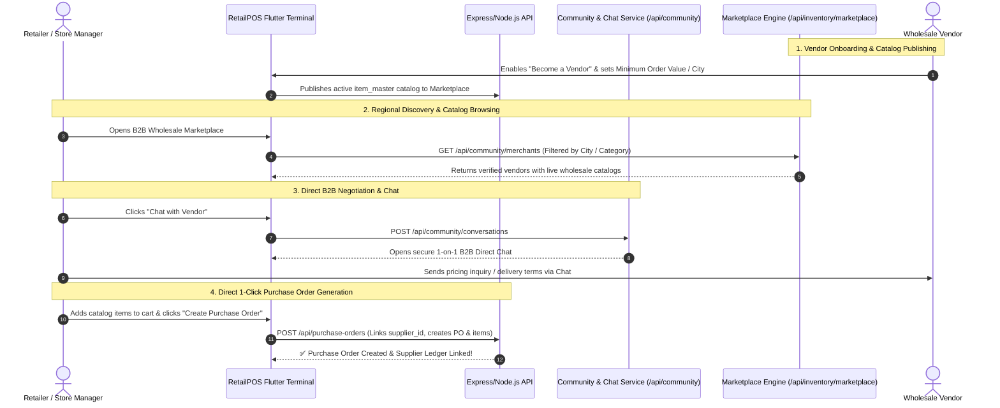

# 🛍️ B2B Marketplace, Vendor Onboarding & Community Chat Architecture

## 📋 Overview

The **B2B Wholesale Marketplace & Community Communication Hub** connects regional retail stores, wholesalers, manufacturers, and suppliers into a unified digital trade network. 

Merchants can discover verified regional vendors, browse real-time inventory catalogs, negotiate pricing via **B2B Community Chat**, and generate direct purchase orders with automated inventory and ledger posting.

---

## 🏛️ Architecture & Interaction Flow

---

## 🌟 Core Functional Modules

### 1. 🏪 Vendor Onboarding & Catalog Publishing
* **Settings View**: [`VendorMarketplaceSettingsView`](file:///d:/inventorynew/RetailSale%20new/RetailSale/lib/screens/settings/vendor_marketplace_settings_screen.dart)
* **Configuration Parameters**:
  * **Vendor Profile**: Legal business name, contact helpline, support email, operating address, and regional hub city.
  * **Wholesale Terms**: Minimum Order Value (MOV), estimated delivery turnaround time, and accepted payment modes (Cash on Delivery, Bank Transfer, Online Payment Gateway).
  * **Catalog Sync**: Automatically publishes verified products from [`item_master`](file:///d:/inventorynew/RetailSale%20new/RetailSale/backend/models/property/itemMaster.model.js) to regional buyers.

---

### 2. 🔍 Multi-City Vendor Discovery & Direct Purchasing
* **Marketplace UI Screen**: [`B2BMarketplaceScreen`](file:///d:/inventorynew/RetailSale%20new/RetailSale/lib/screens/inventory/b2b_marketplace_screen.dart)
* **Controller**: [`MarketplaceController`](file:///d:/inventorynew/RetailSale%20new/RetailSale/lib/controllers/inventory/marketplace_controller.dart)
* **Key Capabilities**:
  * **City-Wise Regional Filtering**: Browse suppliers across major trading hubs (New York, Los Angeles, Chicago, Miami, Dallas, Austin, Seattle, San Francisco, Boston).
  * **Category Filtering**: Filter vendors by trade sector: *Grocery & Staples, Dairy & Frozen, Bakery & Confectionery, Beverages, Personal Care, Household & Cleaning, Electronics*.
  * **Live Catalog & Cart**: Browse product images, wholesale tiered pricing, unit specifications, and add quantities to cart.
  * **1-Click Purchase Order Conversion**: Direct checkout converts cart items into a formal [`purchase_orders`](file:///d:/inventorynew/RetailSale%20new/RetailSale/backend/models/property/purchaseOrder.model.js) entry and registers the vendor in `supplier_master`. *(Note: Goods Receiving Notes / GRN are never auto-created; the store operator must physically inspect goods and manually receive them to update live stock).*

---

### 3. 💬 B2B Community Communication Hub
* **Frontend Screens**: [`CommunityHubScreen`](file:///d:/inventorynew/RetailSale%20new/RetailSale/lib/screens/community/community_hub_screen.dart) & [`ChatConversationScreen`](file:///d:/inventorynew/RetailSale%20new/RetailSale/lib/screens/community/chat_conversation_screen.dart)
* **Backend Service**: [`community.service.ts`](file:///d:/inventorynew/RetailSale%20new/RetailSale/backend/services/community.service.ts) & [`community.controller.ts`](file:///d:/inventorynew/RetailSale%20new/RetailSale/backend/controllers/community.controller.ts)
* **Communication Modes**:
  * **Direct 1-on-1 B2B Chat**: Private retailer-to-vendor communication for price negotiation, order confirmations, invoice attachments, and delivery queries.
  * **Trade Channels & Group Hubs**: Public trading groups, regional merchant associations, and announcement channels.
  * **Enterprise Messaging Features**:
    * Edit sent messages with timestamp tracking.
    * Delete for Everyone / Delete for Me.
    * Block and Unblock unwanted contacts with safety moderation.
    * Unread message counters, typing indicators, and delivery status badges.

---

## 🔌 Community API Endpoint Reference (`/api/community`)

| Method | Endpoint | Description |
| :--- | :--- | :--- |
| `GET` | `/api/community/conversations` | Fetch all active 1-on-1 chats and group channels for current merchant |
| `POST` | `/api/community/conversations` | Create or initiate a new B2B conversation or group channel |
| `GET` | `/api/community/conversations/discover` | Discover public trade groups and regional marketplace channels |
| `GET` | `/api/community/merchants` | List verified active vendors and trading partners |
| `GET` | `/api/community/messages` | Load message history with pagination for a conversation |
| `POST` | `/api/community/messages` | Send a direct text message, price quote, or PO reference |
| `PUT / POST` | `/api/community/messages/edit` | Edit previously sent message content |
| `POST` | `/api/community/messages/delete-for-everyone` | Delete message globally for all participants |
| `POST` | `/api/community/messages/delete-for-me` | Delete message locally from merchant view |
| `POST` | `/api/community/merchants/block` | Block specific merchant / user from sending messages |
| `POST` | `/api/community/merchants/unblock` | Unblock merchant |
| `GET` | `/api/community/merchants/blocked` | List blocked merchants |
| `POST` | `/api/community/channels/join` | Join a public trading channel |
| `POST` | `/api/community/channels/exit` | Exit / leave a channel |
| `POST` | `/api/community/conversations/clear` | Clear message history for a conversation |
