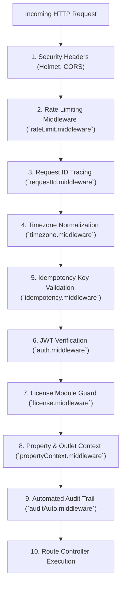

# ⚙️ Complete Backend Developer Guide

This document is the **comprehensive technical manual for the Node.js / Express / TypeScript API server** located in `backend/`.

---

## 🏗️ Backend Stack & Technologies

- **Runtime & Language**: Node.js `18+` / `20+ LTS`, TypeScript `5.x`, ES2022.
- **Web Framework**: Express.js with JSON body parsers, CORS, Helmet security headers, compression.
- **ORM & Database**: Sequelize ORM with PostgreSQL 14+ database driver (`pg`, `pg-hstore`).
- **Authentication & Security**: JSON Web Tokens (`jsonwebtoken`), bcrypt password hashing, AES-256-GCM encryption, rate limiters (`express-rate-limit`).
- **Async Queues & Schedulers**: BullMQ with Redis backing, Node-Cron background workers.
- **Templating & PDF Generation**: PDFKit / Puppeteer vector rendering for thermal receipts, A4 tax invoices, payslips, and financial statements.
- **AI & Integrations**: OpenAI / Gemini API bridges, Meta WhatsApp Cloud API v18+, SMTP nodemailer.

---

## 🚦 HTTP Middleware Pipeline

Every incoming HTTP request traverses an ordered middleware pipeline:



### Middleware Details:
1. `auth.middleware`: Validates bearer tokens, decodes user payload (`userId`, `username`, `role`, `outlet_code`), and injects `req.user`.
2. `license.middleware(moduleName)`: Verifies active store license and checks whether the outlet has unlocked the specified functional module (e.g. `INVENTORY`, `PURCHASE`, `REPORTS`, `RESTAURANT`, `HRMS`, `ADMIN`).
3. `propertyContext.middleware`: Resolves multi-tenant database connection pools for multi-outlet properties.
4. `idempotency.middleware`: Prevents double billing on network retry by caching response payloads under `Idempotency-Key` headers.
5. `auditAuto.middleware`: Intercepts mutating requests (`POST`, `PUT`, `DELETE`) and writes an immutable audit record to `AuditLog`.

---

## 🗄️ Relational Database & Models Architecture

The backend database contains 45+ relational tables managed via Sequelize:

### 1. Core & Auth
- `User`, `Role`, `UserPermission`, `Outlet`, `PropertyInfo`, `AuditLog`, `SystemConfig`.

### 2. Retail & Inventory
- `ItemMaster`, `Category`, `SubCategory`, `Brand`, `UnitOfMeasure`, `Stock`, `StockLedger`, `StockLocation`, `PriceMatrix`, `BarcodeFormat`.
- `PurchaseOrder`, `PurchaseOrderItem`, `GoodsReceiving`, `GoodsReceivingItem`, `Supplier`, `SupplierReturn`, `SupplierRefund`.
- `StockRequest`, `StockDispatch`, `StockReceive`, `DamageItem`.
- `AssemblyBatch`, `BillOfMaterial`, `BomComponent`.

### 3. Sales, POS & Loyalty
- `SaleHeader`, `SaleItem`, `SalePayment`, `Customer`, `LoyaltyPoint`, `LoyaltyTier`, `LoyaltyTransaction`.
- `HappyHourRule`, `BillValuePromo`, `LuckyDrawCampaign`, `LuckyDrawParticipant`, `LuckyDrawWinner`.
- `SubscriptionOrder`, `SubscriptionSchedule`.

### 4. Restaurant & Hospitality
- `RestaurantFloor`, `DiningArea`, `TableType`, `RestaurantTable`, `TableReservation`.
- `KotHeader`, `KotItem`, `KitchenPrinterConfig`, `DeliveryChallan`.

### 5. Accounting & Finance
- `Account` (Chart of Accounts), `AccountingVoucher`, `VoucherEntry`, `BankAccount`, `BankReconciliation`.
- `BusinessLoan`, `LoanEmiPayment`, `CapitalAsset`, `CashLedger`, `ExpenseCategory`, `ExpenseEntry`.

### 6. HRMS & Payroll
- `Employee`, `HrmsDepartment`, `HrmsDesignation`, `HrmsShift`, `HrmsAttendance`, `LeaveType`, `EmployeeLeave`.
- `PayStructure`, `SalaryComponent`, `PayrollPeriod`, `PayrollEntry`.

### 7. Extensibility, AI & Messaging
- `PluginManifest`, `PluginInstallation`, `WorkflowRule`, `WorkflowExecutionLog`.
- `WhatsAppConfig`, `WhatsAppTemplate`, `WhatsAppQueueMessage`, `DeveloperApiKey`, `DeveloperWebhook`.
- `UserNote` (Sticky Notes), `AutonomousProposal`, `AutonomousAuditLog`.

---

## ⏰ Background Jobs & Scheduled Workers

Managed in `backend/jobs/`:

| Job Name | Trigger Frequency | Purpose |
| :--- | :--- | :--- |
| `backupTrackerJob` | Daily at 02:00 AM | Creates encrypted local and cloud database snapshots with rotation. |
| `subscriptionDeliveryJob` | Daily at 06:00 AM | Automatically generates daily delivery slips and invoices for active customer subscriptions. |
| `whatsappQueueJob` | Continuous (BullMQ) | Dispatches pending WhatsApp receipts, POs, and OTPs with automatic retry backoff. |
| `autonomousReplenishmentJob` | Every 6 hours | Evaluates stock runout forecasts and drafts automated PO proposals. |
| `loyaltyExpiryJob` | Monthly on 1st | Expires unredeemed customer loyalty points older than 12 months. |
| `analyticsRefreshJob` | Hourly | Pre-aggregates sales KPIs and brand margins into Redis cache tables for sub-second dashboard loading. |
| `luckyDrawJob` | Configured Campaign Schedule | Automates certified random winner selection and logs draw audit trails. |
| `nightAuditJob` | Midnight (00:00) | Automated end-of-day reconciliation, unbilled KOT validation, and daily ledger locking. |
| `notesReminderJob` | Every 15 minutes | Scans pinned sticky notes for approaching deadlines and dispatches system notifications. |
| `recurringExpensesJob` | Monthly on 1st | Auto-posts scheduled recurring monthly operational expenses (Rent, Internet, Electricity) to General Ledger. |

---

## 📡 Complete Mounted API Route Groups

All routes are mounted under `/api` in `backend/server.ts` (or `server.js`):

```text
/api
├── /auth               -> auth.routes.ts
├── /public             -> public.routes.ts
├── /inventory          -> inventory.routes.ts
├── /purchase-orders    -> purchase.routes.ts
├── /receiving          -> receiving.routes.ts
├── /suppliers          -> supplier.routes.ts
├── /sales              -> sales.routes.ts
├── /restaurant         -> restaurant.routes.ts
├── /accounting         -> accounting.routes.ts
├── /finance            -> finance.routes.ts
├── /hrms               -> hrms.routes.ts
├── /delivery           -> delivery.routes.ts
├── /reports            -> reports.routes.ts
├── /analytics          -> analytics.routes.ts
├── /lucky-draw         -> luckyDraw.routes.ts
├── /night-audit        -> nightAudit.routes.ts
├── /community          -> community.routes.ts
├── /ai-assist          -> ai_assist.routes.ts
├── /v1/agent           -> autonomous_agent.routes.ts
├── /v1/intelligence    -> intelligence.routes.ts
├── /v1/plugins         -> plugin.routes.ts
├── /v1/workflows       -> workflow.routes.ts
├── /v1/developer       -> developer.routes.ts
├── /whatsapp           -> whatsapp.routes.ts
├── /whatsapp-webhook   -> whatsappWebhook.routes.ts
├── /mpesa              -> mpesa.routes.ts
├── /user-notes         -> userNote.routes.ts
├── /tax-groups         -> taxGroup.routes.ts
├── /system             -> systemTime.routes.ts
├── /users              -> user.routes.ts
├── /audit              -> audit.routes.ts
├── /operations         -> operations.routes.ts
└── /notifications      -> notification.routes.ts
```

---

*Document Source: `Docs/Backend-Guide.md`*
