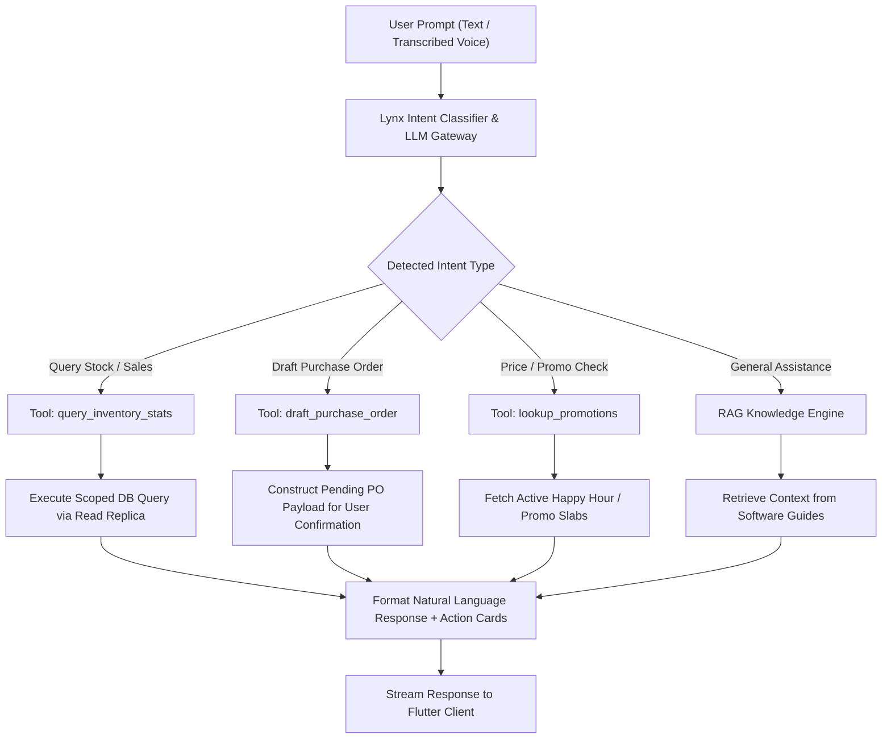
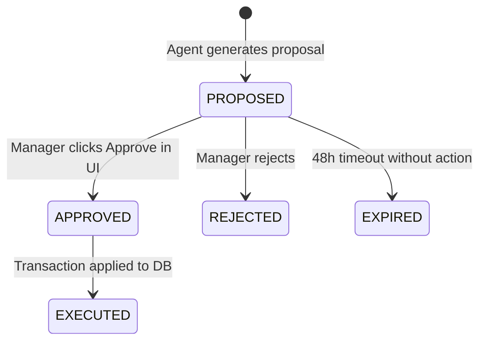

# 🤖 Developer Guide: AI Intelligence & Autonomous Agents

This technical document details the architectural design, LLM tool-calling schemas, autonomous agent scheduler, and machine learning recommendation algorithms powering **Famalth Lynx AI** and the **Autonomous Agent Subsystem**.

---

## 🏗️ AI System Architecture

```text
AI Intelligence Subsystem
├── 💬 Famalth Lynx AI Conversational Engine (`/api/ai-assist`)
├── 🤖 Autonomous Background Agents Engine (`/api/v1/agent`)
├── 🛒 Smart Upsell & Cross-Sell Recommender (`/api/v1/intelligence`)
└── 📊 Natural Language Analytics & Forecasting Engine
```

---

## 💬 Famalth Lynx AI: Tool-Calling & Intent Pipeline

The Lynx AI Assistant leverages a structured tool-calling pipeline that translates plain natural language queries into deterministic database queries and transactional actions:



### Registered AI Tool Schemas:
1. `get_stock_balance(item_query: string, outlet_code: string)`
2. `get_sales_analytics(date_range: string, group_by: string)`
3. `create_purchase_order_intent(supplier_id: int, items: array)`
4. `find_stale_inventory(days_threshold: int)`

---

## 🤖 Autonomous Background Agents Framework

The autonomous agent subsystem (`backend/services/autonomous_agent.service.ts`) runs scheduled background workers that analyze operational data and generate actionable proposals requiring supervisor approval.

### 1. Autonomous Replenishment Agent
- **Trigger**: Every 6 hours via Cron.
- **Logic**: Computes velocity $V = \frac{\text{Sales (last 30 days)}}{30}$. Computes Days of Inventory Remaining $D = \frac{\text{Current Stock}}{V}$.
- If $D < \text{Supplier Lead Time}$, generates a **PO Proposal** with optimal reorder quantity.

### 2. Dead-Stock Clearance Agent
- **Trigger**: Weekly on Monday morning.
- **Logic**: Identifies SKUs with zero movement over the past 60 days having capital value $> \$500$.
- **Action**: Proposes automated clearance markdown (e.g., 25% discount bundle).

### 3. Proposal Lifecycle:


---

## 🛒 Smart Upsell Bar & Recommendation Engine

Mounted at `/api/v1/intelligence/recommendations`:
- Implements Association Rule Mining (Apriori / FP-Growth) on historical basket receipts.
- **Algorithm**:
  - Support: $P(A \cap B)$
  - Confidence: $P(B|A) = \frac{\text{Transactions containing both } A \text{ and } B}{\text{Transactions containing } A}$
  - Lift: $\frac{\text{Confidence}(A \to B)}{\text{Support}(B)}$
- When an item is scanned into the POS cart, the top 3 co-purchased items with Lift $> 1.5$ are rendered instantly on the cashier's **Smart Upsell Bar** to drive counter cross-selling!

---

## 📡 REST API Endpoint Specifications

- `POST /api/ai-assist/chat` — Submit conversational prompt to Lynx AI.
- `POST /api/ai-assist/voice-command` — Dispatch transcribed voice shortcut.
- `GET /api/v1/agent/proposals` — Retrieve pending autonomous agent proposals.
- `POST /api/v1/agent/proposals/:id/approve` — Approve and execute agent proposal.
- `POST /api/v1/agent/proposals/:id/reject` — Reject proposal with feedback reason.
- `GET /api/v1/agent/audit-logs` — Full audit trail of all agent actions.
- `GET /api/v1/intelligence/recommendations` — Fetch live basket recommendations for current POS cart.
- `GET /api/v1/intelligence/customer-insights/:id` — Retrieve RFM (Recency, Frequency, Monetary) analytics for customer.

---

*Document Source: `Docs/Developer-Guide-AI-Autonomous-Agents.md`*
