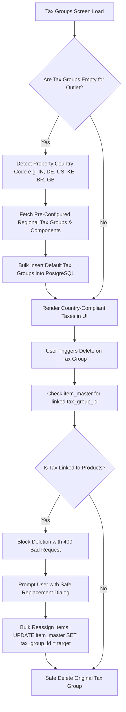

# Developer Guide: Multi-Country Tax Seeding & Tax Group Deletion Integrity

This technical guide documents the automatic multi-country tax seeding engine, international fiscal rule catalogs, relational integrity checks, and replacement workflows.

---

## 📑 Table of Contents
1. [Architecture & System Flow](#1-architecture--system-flow)
2. [Multi-Country Fiscal Catalogs](#2-multi-country-fiscal-catalogs)
3. [Auto-Seeding Engine Implementation](#3-auto-seeding-engine-implementation)
4. [Relational Integrity & Linked Items Validation](#4-relational-integrity--linked-items-validation)
5. [Backend API Endpoints](#5-backend-api-endpoints)
6. [Frontend Client Implementation](#6-frontend-client-implementation)

---

## 1. Architecture & System Flow



---

## 2. Multi-Country Fiscal Catalogs

The backend (`taxGroup.controller.ts`) embeds structured fiscal templates for global deployment:

### Supported Regional Profiles:
1. **India (`IN`)**:
   - **GST 5%**: CGST 2.5% + SGST 2.5%
   - **GST 18%**: CGST 9.0% + SGST 9.0%
   - **IGST 5%**: Integrated GST 5.0%
   - **IGST 18%**: Integrated GST 18.0%
   - **Nil / Exempt**: 0.0%
2. **European Union / Germany (`DE`, `EU`)**:
   - **Standard MwSt (19%)**: Standard VAT
   - **Reduced MwSt (7%)**: Food, books & agricultural goods
   - **Zero-Rated / Export (0%)**: Intra-community supply
3. **United States (`US`, `USA`)**:
   - **Standard Sales Tax (8.25%)**: State + Municipal combined
   - **Reduced Sales Tax (6.0%)**: Groceries & utilities
   - **Tax Exempt (0%)**: Wholesale & non-profit
4. **Kenya (`KE`)**:
   - **Standard VAT (16%)**: Standard taxable supplies
   - **Zero-Rated (0%)**: Exported goods & basic foodstuffs
   - **Exempt (0%)**: Financial & medical supplies
5. **Brazil (`BR`)**:
   - **Standard ICMS (18%)**: Circulation of goods tax
   - **PIS / COFINS (9.25%)**: Social contribution taxes
   - **ISS (5%)**: Services tax
6. **United Kingdom / England (`GB`, `UK`)**:
   - **Standard VAT (20%)**: Standard rate
   - **Reduced VAT (5%)**: Children car seats, home energy
   - **Zero Rate VAT (0%)**: Books, food, children clothes

---

## 3. Auto-Seeding Engine Implementation

### Backend Implementation (`backend/controllers/settings/taxGroup.controller.ts`):
```typescript
exports.seedCountryTaxes = async (req: any, res: any) => {
    const db = req.propertyDb;
    const outlet_id = req.user.outlet_id;
    const { country_code } = req.body;

    const property = await db.models.property_info.findOne({ where: { outlet_id } });
    const targetCountry = (country_code || property?.country || 'IN').toUpperCase().trim();

    const existingGroups = await db.models.tax_groups.count({ where: { outlet_id } });
    if (existingGroups > 0) {
        return res.json({ success: true, message: 'Tax groups already exist for this outlet.' });
    }

    const template = COUNTRY_TAX_TEMPLATES[targetCountry] || COUNTRY_TAX_TEMPLATES['IN'];

    for (const group of template) {
        const createdGroup = await db.models.tax_groups.create({
            outlet_id,
            group_name: group.group_name,
            total_rate: group.total_rate,
            is_active: true
        });

        if (group.components?.length) {
            await db.models.tax_group_components.bulkCreate(
                group.components.map((c: any) => ({
                    tax_group_id: createdGroup.id,
                    component_name: c.component_name,
                    rate: c.rate
                }))
            );
        }
    }

    return res.json({ success: true, message: `Auto-seeded ${template.length} taxes for ${targetCountry}.` });
};
```

---

## 4. Relational Integrity & Linked Items Validation

Deleting a tax group that is assigned to products in `item_master` would orphan items or cause billing calculations to fail with null division errors.

### Safe Deletion Controller Logic (`taxGroup.controller.ts`):
```typescript
exports.deleteTaxGroup = async (req: any, res: any) => {
    const db = req.propertyDb;
    const { id } = req.params;
    const outlet_id = req.user.outlet_id;

    // 1. Check for linked items in item_master
    const linkedItemsCount = await db.models.item_master.count({
        where: { tax_group_id: id, outlet_id }
    });

    if (linkedItemsCount > 0) {
        return res.status(400).json({
            success: false,
            linked_items_count: linkedItemsCount,
            message: `Cannot delete Tax Group: It is currently assigned to ${linkedItemsCount} item(s). Reassign or replace these items before deleting.`
        });
    }

    // 2. Cascade delete components and group
    await db.models.tax_group_components.destroy({ where: { tax_group_id: id } });
    await db.models.tax_groups.destroy({ where: { id, outlet_id } });

    res.json({ success: true, message: 'Tax group deleted successfully.' });
};
```

---

## 5. Backend API Endpoints

| Method | Endpoint | Description |
| :--- | :--- | :--- |
| `GET` | `/api/settings/tax-groups` | List all tax groups and nested components |
| `POST` | `/api/settings/tax-groups` | Create custom tax group with rates |
| `POST` | `/api/settings/tax-groups/seed-country` | Auto-seed country fiscal template |
| `POST` | `/api/settings/tax-groups/replace-and-delete` | Reassign all items to new tax group then delete old group |
| `DELETE`| `/api/settings/tax-groups/:id` | Delete tax group (checks linked items first) |

---

## 6. Frontend Client Implementation (`lib/screens/settings/tax_group_setup_screen.dart`)

- **Auto-Seed Banner**: If an outlet has 0 taxes, an interactive prompt offers 1-click configuration for their country.
- **Dependency Guard Dialog**: When attempting to delete a linked tax group, the UI displays:
  - Error dialog showing exact count of linked items.
  - Option to open the **Replace & Reassign Dialog** to switch all items to another tax group (e.g. from GST 18% to GST 5%) in one transaction before deleting.
