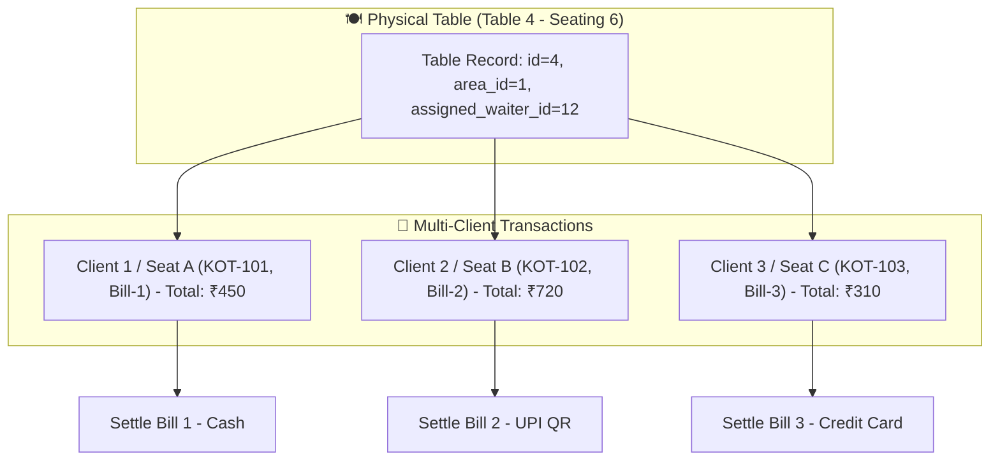

# Developer Guide: Advanced Table Management, Multi-Client Transactions & Excel Import

This technical guide documents the architecture for **Multi-Client Sub-Orders per Table**, **Waiter/Captain Table Assignment**, and **Excel Table Bulk Import**.

---

## 📑 Table of Contents
1. [Architecture & Multi-Client Session Model](#1-architecture--multi-client-session-model)
2. [Multi-Client Separate Billing Subsystem](#2-multi-client-separate-billing-subsystem)
3. [Table Waiter Assignment Engine](#3-table-waiter-assignment-engine)
4. [Bulk Excel Table Import Pipeline](#4-bulk-excel-table-import-pipeline)
5. [Database Schemas & API Specifications](#5-database-schemas--api-specifications)

---

## 1. Architecture & Multi-Client Session Model

When a physical table is occupied by multiple independent guests who want separate checks (e.g. colleagues at Table 4 splitting into Guest A, Guest B, and Guest C), the system treats the physical table as a container holding distinct sub-sessions:



---

## 2. Multi-Client Separate Billing Subsystem

### Sub-Session Identifier:
In `sales_headers` and `kot_headers`, multi-client orders are partitioned using:
- `table_id`: Physical table reference.
- `sub_order_no` / `seat_no`: Integer identifier (`1`, `2`, `3`, ...).
- `client_label`: Optional tag (e.g., *"Guest A"*, *"Order #2"*, *"Seat 3"*).

### Kitchen KOT Aggregation:
The kitchen KOT shows both physical table and client sub-order tag:
```
=================================
KITCHEN ORDER TICKET (KOT) #1042
TABLE: 04 [Client 2 / Seat B]
WAITER: Rahul Sharma
---------------------------------
1x Butter Naan
1x Chicken Tikka Masala (Extra Spicy)
=================================
```

---

## 3. Table Waiter Assignment Engine

Tables can be allocated to specific waiters or captains for shift responsibility, commission tracking, and filtered floor views.

### Database Column in `restaurant_tables`:
```sql
ALTER TABLE restaurant_tables 
  ADD COLUMN IF NOT EXISTS assigned_user_id INTEGER REFERENCES users(id) ON DELETE SET NULL;
```

### Controller Implementation (`table.controller.ts`):
```typescript
exports.assignTable = async (req: any, res: any) => {
    const { table_id, assigned_user_id } = req.body;
    const db = req.propertyDb;

    await db.models.restaurant_tables.update(
        { assigned_user_id: assigned_user_id || null },
        { where: { id: table_id, outlet_id: req.user.outlet_id } }
    );

    res.json({ success: true, message: 'Table assigned successfully' });
};
```

---

## 4. Bulk Excel Table Import Pipeline

The table setup screen allows importing dozens of tables across multiple floor areas in a single `.xlsx` upload.

### Excel Column Specification:
| Column Header | Required | Example | Description |
| :--- | :--- | :--- | :--- |
| `Table Name` | **Yes** | `Table 12` | Display identifier on the floor grid |
| `Area / Zone` | **Yes** | `AC Dining Hall` | Target area (auto-created if not exists) |
| `Capacity` | No | `4` | Number of chairs / seats (default 4) |
| `Shape` | No | `SQUARE` | Geometry (`SQUARE`, `ROUND`, `RECTANGLE`) |
| `Assigned Waiter`| No | `waiter_rahul` | Username of assigned server |

### Ingestion Logic:
1. Validates file header signatures (`exceljs` / `xlsx` package).
2. Auto-resolves or creates `dining_areas` matching the `Area / Zone` text.
3. Inserts tables with duplicate name collision avoidance per outlet.

---

## 5. Database Schemas & API Specifications

| Method | Endpoint | Description |
| :--- | :--- | :--- |
| `GET` | `/api/restaurant/tables` | List all tables with assigned waiters and live sub-sessions |
| `POST` | `/api/restaurant/tables/assign` | Assign table to specific waiter / captain |
| `POST` | `/api/restaurant/tables/import-excel`| Upload `.xlsx` file for bulk floor table ingestion |
| `POST` | `/api/restaurant/tables/split-session`| Create new independent sub-order transaction on occupied table |
| `POST` | `/api/restaurant/tables/settle-sub-bill`| Settle specific sub-client bill while leaving remaining seats active |
