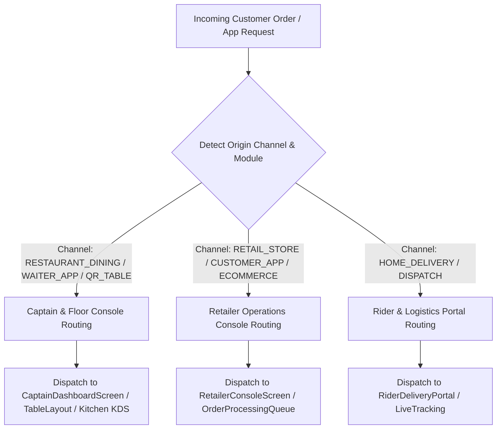

# Developer Guide: Dynamic Console Routing & Multi-Channel Order Dispatching

This technical guide documents the routing protocols, channel identifiers, and automated dispatch workflows that segregate dining orders from retail ecommerce orders across client consoles.

---

## 📑 Table of Contents
1. [Architecture & Channel Dispatch Matrix](#1-architecture--channel-dispatch-matrix)
2. [Order Channel Detection Engine](#2-order-channel-detection-engine)
3. [Console Destination Mapping](#3-console-destination-mapping)
4. [WebSocket & Real-time Notification Push](#4-websocket--real-time-notification-push)
5. [Frontend Navigation & Deep-Link Handlers](#5-frontend-navigation--deep-link-handlers)

---

## 1. Architecture & Channel Dispatch Matrix



---

## 2. Order Channel Detection Engine

The backend evaluates order payloads via `business_module`, `order_source`, and `table_id`:

```typescript
export function resolveOrderChannel(orderPayload: any): 'DINING' | 'RETAIL' | 'RIDER' {
    const { order_source, table_id, outlet_type, business_module } = orderPayload;

    // 1. Restaurant / Dining Floor
    if (table_id || order_source === 'WAITER_APP' || order_source === 'QR_DINING' || outlet_type === 'RESTAURANT') {
        return 'DINING';
    }

    // 2. Rider / Logistics
    if (order_source === 'RIDER_DELIVERY' || orderPayload.delivery_partner) {
        return 'RIDER';
    }

    // 3. Retailer Customer / E-Commerce
    return 'RETAIL';
}
```

---

## 3. Console Destination Mapping

| Channel | Target Role | Primary Frontend Screen | Core Capabilities |
| :--- | :--- | :--- | :--- |
| **Dining / Restaurant** | `CAPTAIN`, `WAITER`, `MANAGER` | `CaptainDashboardScreen` (`lib/screens/restaurant/captain_dashboard_screen.dart`) | Table grid, live KOT dispatch, seat splitting, kitchen alerts |
| **Retailer Ecommerce** | `RETAIL`, `CASHIER`, `STORE` | `RetailerConsoleScreen` (`lib/screens/retail/retailer_console_screen.dart`) | Customer orders, item packing, invoice generation, payment confirmation |
| **Rider Delivery** | `RIDER`, `LOGISTICS` | `RiderPortalScreen` (`lib/screens/delivery/rider_portal_screen.dart`) | Pickup verification, map navigation, customer OTP handover |

---

## 4. WebSocket & Real-time Notification Push

When an order arrives, the event bus broadcasts targeted events to relevant connected clients:

- **Dining Order Created**: `io.to('outlet_' + outletId + '_dining').emit('NEW_DINING_ORDER', { table_no, items, token })`
- **Retail Order Created**: `io.to('outlet_' + outletId + '_retail').emit('NEW_RETAIL_ORDER', { order_no, customer, total })`
- **Delivery Dispatched**: `io.to('outlet_' + outletId + '_riders').emit('ORDER_READY_FOR_PICKUP', { rider_id, order_id })`

---

## 5. Frontend Navigation & Deep-Link Handlers (`lib/core/navigation/home_route_helper.dart`)

```dart
static Future<Widget> resolve() async {
  final user = await TokenStorage.getUser();
  final role = (user?['role'] ?? '').toString().toUpperCase().trim();
  final businessModule = user?['business_module'] ?? 'ALL';

  if (role == 'WAITER' || role == 'CAPTAIN' || role == 'CAPTION') {
    return const CaptainDashboardScreen();
  }

  if (role == 'RETAIL' && businessModule == 'RETAIL') {
    return const RetailerConsoleScreen();
  }

  if (role == 'RIDER') {
    return const RiderPortalScreen();
  }

  return const DashboardScreen();
}
```
