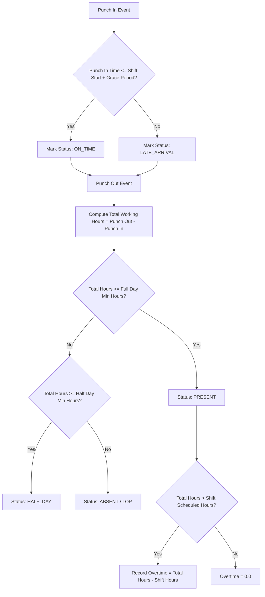

# 👥 Developer Guide: HRMS & Payroll Architecture

This technical document details the data structures, attendance punch algorithms, salary structure computations, and REST endpoints powering the Human Resource Management System (HRMS) and Automated Payroll engine.

---

## 🏛️ System Architecture Overview

The HRMS subsystem is modularized into:
1. **Masters Management**: Departments, Designations, Work Shifts, Leave Quotas, and Salary Components.
2. **Employee Core**: Digital employee directory, KYC records, assigned shifts, and compensation structures.
3. **Attendance Engine**: Punch-in/out timestamps, grace period resolution, late penalty calculation, and overtime tracking.
4. **Payroll Processing**: Monthly gross-to-net salary computation, statutory deductions (PF, ESI, Tax), advance recovery, and payslip generation.

---

## 🗄️ Relational Database Schema & Entities

### 1. `HrmsShift`
- `id` (PK, Integer)
- `name` (String, e.g. "Morning Shift")
- `start_time` (Time, e.g. "09:00:00")
- `end_time` (Time, e.g. "18:00:00")
- `grace_period_mins` (Integer, default 15)
- `half_day_min_hours` (Decimal, default 4.5)
- `full_day_min_hours` (Decimal, default 8.0)
- `is_night_shift` (Boolean)

### 2. `Employee`
- `id` (PK, Integer)
- `employee_code` (String, unique, e.g. "EMP-2026-001")
- `first_name`, `last_name` (String)
- `phone`, `email` (String)
- `department_id` (FK -> `HrmsDepartment`)
- `designation_id` (FK -> `HrmsDesignation`)
- `shift_id` (FK -> `HrmsShift`)
- `pay_structure_id` (FK -> `PayStructure`)
- `base_monthly_salary` (Decimal)
- `bank_name`, `account_number`, `ifsc_code` (String)
- `joining_date` (Date)
- `status` (Enum: `ACTIVE`, `ON_LEAVE`, `PROBATION`, `TERMINATED`)
- `outlet_code` (String)

### 3. `HrmsAttendance`
- `id` (PK, Integer)
- `employee_id` (FK -> `Employee`)
- `attendance_date` (Date)
- `punch_in` (Timestamp)
- `punch_out` (Timestamp, nullable)
- `total_hours` (Decimal)
- `status` (Enum: `PRESENT`, `ABSENT`, `HALF_DAY`, `ON_LEAVE`, `HOLIDAY`)
- `is_late` (Boolean)
- `overtime_hours` (Decimal)

### 4. `PayrollPeriod` & `PayrollEntry`
- `payroll_period_id` (Year, Month, Status: `DRAFT`, `FINALIZED`, `PAID`)
- `gross_earnings` = $\text{Basic} + \text{HRA} + \text{DA} + \text{Overtime Pay} + \text{Bonuses}$
- `total_deductions` = $\text{PF} + \text{ESI} + \text{Professional Tax} + \text{Advance Repayments} + \text{Loss of Pay (LOP)}$
- `net_salary` = $\text{gross_earnings} - \text{total_deductions}$

---

## ⏱️ Attendance Calculation Algorithms

---

## 📡 REST API Endpoint Specifications

Mounted under `/api/hrms` (Requires JWT & Property Context):

### 1. Masters Endpoints
- `GET /api/hrms/salary-components` — Retrieve earning/deduction definitions.
- `POST /api/hrms/salary-components` — Create salary component.
- `GET /api/hrms/shifts` — List configured work shifts.
- `POST /api/hrms/shifts` — Create new shift timing.
- `GET /api/hrms/leave-types` — List configured leave categories & annual quotas.
- `GET /api/hrms/designations` — List company designations.

### 2. Employee Endpoints
- `GET /api/hrms/employees` — List all employees with pagination & department filters.
- `GET /api/hrms/employees/next-code` — Auto-generate next sequential employee ID.
- `GET /api/hrms/employees/:id` — Retrieve full employee profile with compensation history.
- `POST /api/hrms/employees` — Onboard new employee.
- `PUT /api/hrms/employees/:id` — Update employee profile or department transfer.

### 3. Attendance & Payroll Endpoints
- `POST /api/hrms/attendance/punch` — Record punch-in or punch-out event.
- `GET /api/hrms/attendance/daily-grid` — Retrieve daily presence grid for outlet.
- `POST /api/hrms/payroll/calculate` — Execute automated monthly gross-to-net salary run.
- `POST /api/hrms/payroll/finalize` — Finalize payroll and post expense entries to General Ledger.
- `GET /api/hrms/payroll/payslip/:id/pdf` — Render authenticated employee payslip PDF.

---

*Document Source: `Docs/Developer-Guide-HRMS-Payroll.md`*
