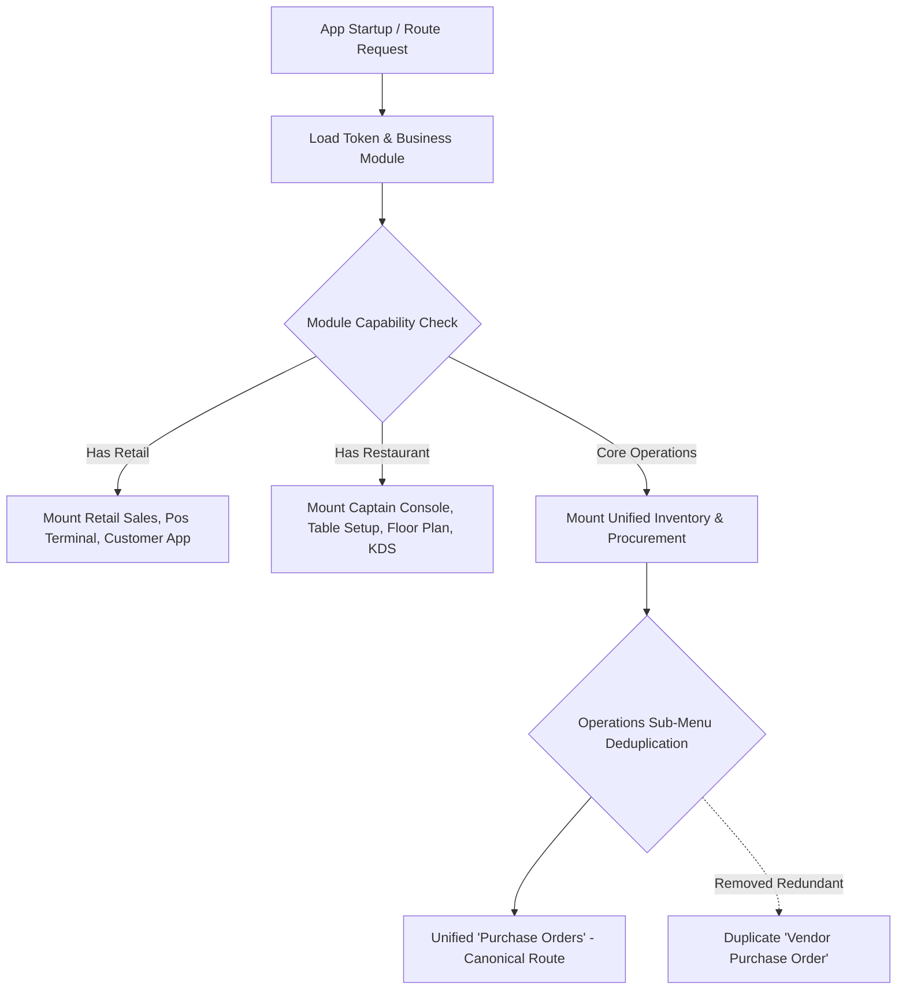

# Developer Guide: Navigation Hierarchy, Menu Layout & Deduplication Architecture

This technical guide documents the modular menu taxonomy, permission-aware navigation routers, and deduplication protocols governing the left drawer and operations menus across all business modules.

---

## 📑 Table of Contents
1. [Navigation Architecture & Module Capability Filtering](#1-navigation-architecture--module-capability-filtering)
2. [Operations Menu Taxonomy & Deduplication](#2-operations-menu-taxonomy--deduplication)
3. [Permission-Aware Dynamic Menu Router](#3-permission-aware-dynamic-menu-router)
4. [Role-Based Module Matrix](#4-role-based-module-matrix)

---

## 1. Navigation Architecture & Module Capability Filtering

The navigation tree is dynamically derived at runtime based on two parameters:
1. `business_module` (`RETAIL`, `RESTAURANT`, `SUPERMARKET`, `ALL`)
2. `user.permissions` (`Set<String>` resolved from JWT token)

---

## 2. Operations Menu Taxonomy & Deduplication

In earlier iterations, both *"Purchase Order"* and *"Vendor Purchase Order"* appeared in the Operations sub-menu. The taxonomy has been unified into a single canonical entry:

### Canonical Operations Menu Map:
| Section | Menu Label | Target Screen | Required Permission |
| :--- | :--- | :--- | :--- |
| **Procurement** | **Purchase Orders** | `PurchaseOrderListScreen` | `PURCHASE_ORDER` |
| **Procurement** | **Goods Receiving (GRN)** | `ReceivingListScreen` | `STOCK_IN` |
| **Procurement** | **Supplier Master** | `SupplierMasterScreen` | `SUPPLIER_MASTER` |
| **Inventory** | **Item Master & Barcodes**| `ItemMasterScreen` | `ITEM_MASTER` |
| **Inventory** | **Stock Taking & Audit** | `StockTakingScreen` | `STOCK_BALANCE` |
| **Inventory** | **Stock Transfers** | `StockTransferScreen` | `STOCK_TRANSFER` |
| **Inventory** | **Modifiers Master** | `ModifierMasterScreen` | `ITEM_MASTER` |

---

## 3. Permission-Aware Dynamic Menu Router

In [`lib/core/navigation/home_route_helper.dart`](../lib/core/navigation/home_route_helper.dart) and `AppDrawer`:
- Single source of truth prevents duplicate routes from being rendered.
- Menu items verify `PermissionService.can(permissionKey)`.
- If an operator lacks procurement rights, the entire **Purchase Orders** group is hidden gracefully.

---

## 4. Role-Based Module Matrix

| Role | Operations Menu | POS Billing | Floor Console | KDS | Reports |
| :--- | :---: | :---: | :---: | :---: | :---: |
| `ADMIN` | ✅ Full | ✅ Full | ✅ Full | ✅ Full | ✅ Full |
| `MANAGER`| ✅ Full | ✅ Full | ✅ Full | ✅ Full | ✅ Full |
| `STORE` | ✅ Inventory & PO | ❌ | ❌ | ❌ | ✅ Stock Reports |
| `RETAIL` | ❌ | ✅ POS | ❌ | ❌ | ✅ Sales Reports |
| `WAITER` | ❌ | ❌ | ✅ Floor Tables | ❌ | ❌ |
| `CAPTAIN`| ❌ | ❌ | ✅ Full Floor | ❌ | ❌ |
| `KDS` | ❌ | ❌ | ❌ | ✅ KDS Live | ❌ |
