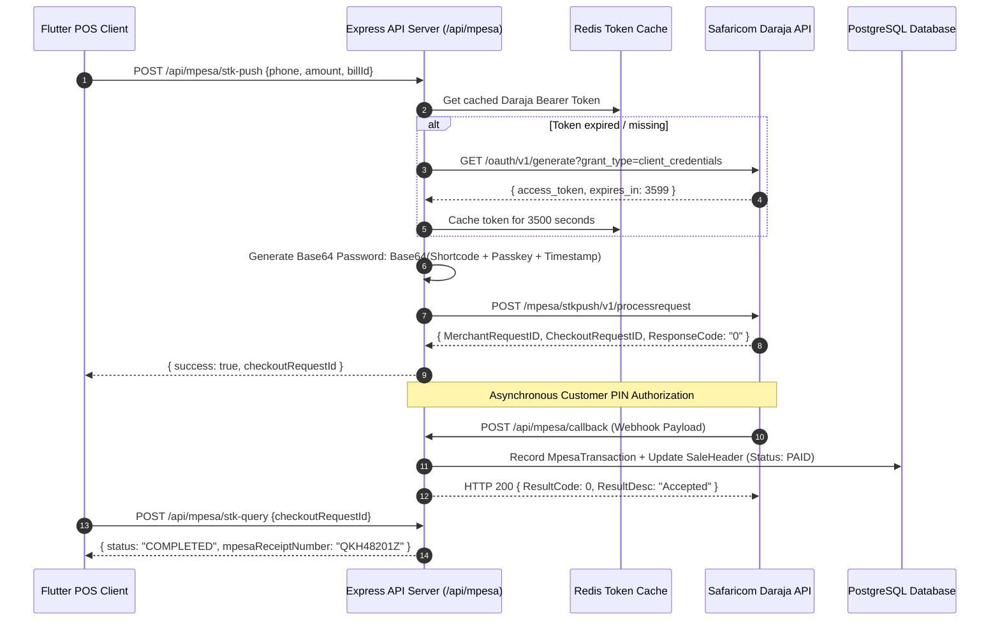

# 📱 Developer Guide: M-Pesa Daraja STK Push Integration Architecture

This technical document details the architecture, cryptographic token caching, STK push initiation, asynchronous callback webhook processing, and transaction reconciliation algorithms for the Safaricom M-Pesa payment subsystem.

---

## 🏗️ Subsystem Architecture & Sequence Flow



---

## 🗄️ Relational Database Schema & Models

### `MpesaConfig` (Per Outlet / Enterprise)
- `id` (PK, Integer)
- `outlet_code` (String, Indexed)
- `enabled` (Boolean, default true)
- `environment` (Enum: `sandbox`, `production`)
- `account_type` (Enum: `till`, `paybill`)
- `shortcode` (String, encrypted in DB)
- `consumer_key` (String, encrypted in DB)
- `consumer_secret` (String, encrypted in DB)
- `passkey` (String, encrypted in DB)
- `callback_url` (String)

### `MpesaTransaction`
- `id` (PK, Integer)
- `merchant_request_id` (String, Indexed)
- `checkout_request_id` (String, Unique, Indexed)
- `sale_id` (FK -> `SaleHeader`, nullable)
- `phone_number` (String, e.g. "254712345678")
- `amount` (Decimal(12,2))
- `mpesa_receipt_number` (String, nullable, e.g. "RKH9283KLS")
- `result_code` (Integer, 0 for Success)
- `result_desc` (String)
- `status` (Enum: `PENDING`, `SUCCESS`, `FAILED`, `CANCELLED`)
- `transaction_date` (Timestamp)

---

## 🔐 Cryptographic Authentication & Password Generation

The Daraja password is generated per request using the formatted timestamp `YYYYMMDDHHmmss`:

```typescript
// backend/controllers/payments/mpesa.controller.ts
function generatePassword(shortcode: string, passkey: string, timestamp: string): string {
  const combined = `${shortcode}${passkey}${timestamp}`;
  return Buffer.from(combined).toString('base64');
}
```

---

## 📡 REST API Endpoint Specifications

Mounted under `/api/mpesa`:

### 1. Webhook Callback (Public Endpoint)
- `POST /api/mpesa/callback`
  - Ingests Daraja JSON callback.
  - Parses `Body.stkCallback.CallbackMetadata.Item`.
  - Extracts `MpesaReceiptNumber`, `Amount`, `PhoneNumber`, `TransactionDate`.
  - Commits atomic transaction updating sale payment method to `MPESA` and balancing ledger.

### 2. Protected Endpoints (Requires JWT)
- `GET /api/mpesa/config` — Retrieve outlet M-Pesa configuration.
- `POST /api/mpesa/config` — Save encrypted Daraja credentials (Admin only).
- `POST /api/mpesa/stk-push` — Dispatch STK Push to customer phone. Body:
  ```json
  {
    "phone": "254712345678",
    "amount": 250.00,
    "accountReference": "INV-2026-0045",
    "transactionDesc": "RetailPOS Checkout"
  }
  ```
- `POST /api/mpesa/stk-query` — Poll STK status by `checkoutRequestId`.

---

*Document Source: `Docs/Developer-Guide-Mpesa-Mobile-Money.md`*
