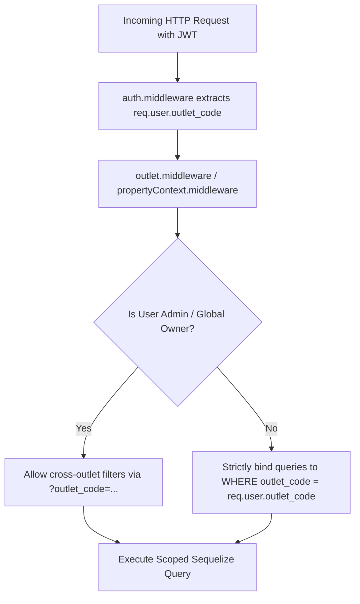
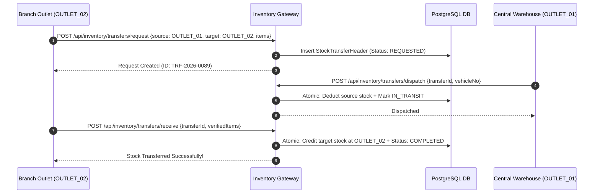

# 🏢 Developer Guide: Multi-Outlet & Warehouse Hierarchy Architecture

This technical document details the multi-tenant outlet scoping middleware, hierarchical warehouse tree data structures, branch-scoped document numbering sequences, and cross-outlet stock transfer state isolation.

---

## 🏗️ Multi-Outlet Scoping & Context Middleware

The system isolates store data while enabling unified enterprise consolidation:

---

## 🗄️ Relational Database Schema & Models

### 1. `Outlet` (Branch Master)
- `id` (PK, Integer)
- `outlet_code` (String, unique, e.g. "OUTLET_01")
- `name` (String, e.g. "Downtown Retail Branch")
- `business_type` (Enum: `RETAIL`, `RESTAURANT`, `SUPERMARKET`, `WAREHOUSE`)
- `parent_outlet_id` (FK -> `Outlet`, nullable for root HQ / Central Warehouse)
- `is_active` (Boolean)
- `tax_number`, `phone`, `email`, `address` (String)

### 2. `StockLocation` (Aisles, Racks, Bins)
- `id` (PK, Integer)
- `outlet_id` (FK -> `Outlet`)
- `location_code` (String, e.g. "RACK-A-BIN-04")
- `zone_type` (Enum: `SALES_FLOOR`, `COLD_STORAGE`, `BACKROOM`, `DAMAGE_HOLD`)
- `is_active` (Boolean)

### 3. `NumberingSetting` (Per-Outlet Document Sequences)
- `id` (PK, Integer)
- `outlet_code` (String)
- `document_type` (Enum: `SALE_INVOICE`, `PURCHASE_ORDER`, `GRN`, `KOT`, `STOCK_TRANSFER`, `VOUCHER`)
- `prefix` (String, e.g. "INV-DT-")
- `suffix` (String, e.g. "/2026")
- `current_number` (Integer, atomic increment)
- `padding_zeros` (Integer, e.g. 5 -> "INV-DT-00042/2026")

---

## 🔄 Cross-Outlet Stock Request & Transfer Protocols

---

## 📡 REST API Endpoint Specifications

- `GET /api/public/outlet` — List registered outlets.
- `POST /api/public/outlet` — Register new outlet terminal.
- `GET /api/inventory/stock-locations` — List warehouse aisles and bin locations.
- `POST /api/inventory/stock-locations` — Create stock storage zone.
- `GET /api/inventory/numbering-settings` — Retrieve sequence formatting for outlet.
- `POST /api/inventory/numbering-settings` — Update sequence rules (Prefix/Suffix/Padding).

---

*Document Source: `Docs/Developer-Guide-Multi-Outlet-Hierarchy.md`*
