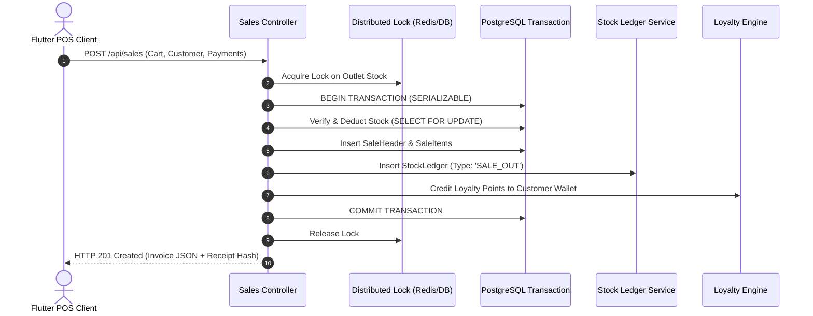
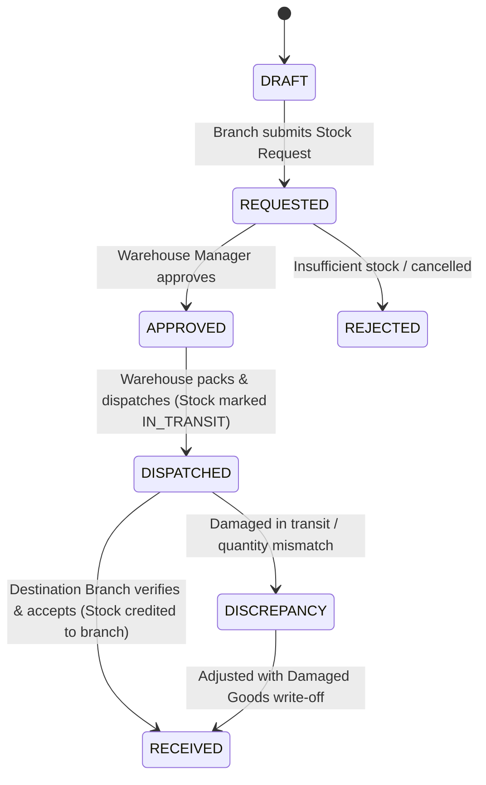

# 🛒 Developer Guide: POS, Inventory & Manufacturing Engine

This technical document details the transactional mechanics, stock ledger calculation algorithms, multi-level Bill of Materials (BOM) assembly processing, custom barcode rendering engine, and multi-outlet stock transfer state machine.

---

## 🏗️ Core Subsystems & Architecture

```text
Inventory Subsystems
├── ⚡ Enterprise POS Transaction Engine (Atomicity & Concurrency)
├── 📦 Stock Ledger & Valuation Engine (FIFO / Weighted Average)
├── 🏭 Manufacturing & Bill of Materials (BOM) Assembly Engine
├── 🏷️ Custom Barcode & QR Code Rendering Pipeline
└── 🚚 Multi-Outlet Stock Transfer & Verification State Machine
```

---

## âš¡ POS Transaction Lifecycle & ACID Guarantees

Every sale checkout executed in `SalesController.createSale` runs inside an isolated PostgreSQL transaction with row-level locks on stock rows:



---

## 🏭 Manufacturing & Bill of Materials (BOM) Engine

The BOM subsystem enables conversion of multiple raw component stocks into single finished sellable units.

### 1. Multi-Component Assembly Transaction
When `AssemblyController.produceBatch` is called:
1. Load the active BOM for `finished_item_code`.
2. For each raw component item $i$:
   $$\text{Required Qty}_i = \text{Batch Size} \times \text{BOM Component Qty}_i$$
3. Verify that $\text{Available Stock}_i \ge \text{Required Qty}_i$. If any component is insufficient, abort with `INSUFFICIENT_RAW_MATERIAL_STOCK`.
4. Deduct raw components:
   - Decrease `Stock.quantity` by $\text{Required Qty}_i$.
   - Insert `StockLedger` record with transaction type `ASSEMBLY_CONSUMPTION`.
5. Credit finished product:
   - Increase `Stock.quantity` of finished item by $\text{Batch Size}$.
   - Insert `StockLedger` record with transaction type `ASSEMBLY_PRODUCTION`.
6. Compute finished unit cost:
   $$\text{Unit Cost} = \sum_{i} (\text{Component Unit Cost}_i \times \text{Component Qty}_i) + \text{Labor/Overhead}$$

---

## 🏷️ Custom Barcode & QR Rendering Pipeline

Barcode generation is handled on the client using the vector layout engine:
- **Code128 / EAN-13 / UPC-A**: Rendered into high-resolution 1D raster buffers.
- **QR Code (2D)**: Supports dynamic GS1 digital link formatting and tax invoice cryptographic signatures.
- **Label Designer Layout Engine**:
  - Dynamically calculates label grid coordinates based on DPI (203 DPI for standard thermal vs 300/600 DPI for laser sheets).
  - Handles column spacing, margins, and label pitch without clipping text or barcodes.

---

## 🚚 Multi-Outlet Stock Transfer State Machine



---

## 📡 REST API Endpoint Specifications

Mounted under `/api/inventory`, `/api/sales`, `/api/receiving`, `/api/purchase-orders`:

- `POST /api/sales` — Atomically commit POS sale transaction.
- `GET /api/sales/:id` — Retrieve sale details with tax splits and payment records.
- `POST /api/inventory/assembly/produce` — Execute BOM assembly batch.
- `POST /api/inventory/transfers/request` — Create multi-branch stock request.
- `POST /api/inventory/transfers/dispatch` — Dispatch stock transfer (locks goods in transit).
- `POST /api/inventory/transfers/receive` — Accept stock transfer at destination outlet.
- `POST /api/purchase-orders` — Create purchase order to vendor.
- `POST /api/receiving` — Commit Goods Receiving Note (GRN) against vendor PO.
- `POST /api/inventory/damages` — Record damaged inventory write-off.

---

*Document Source: `Docs/Developer-Guide-POS-Inventory-Manufacturing.md`*
