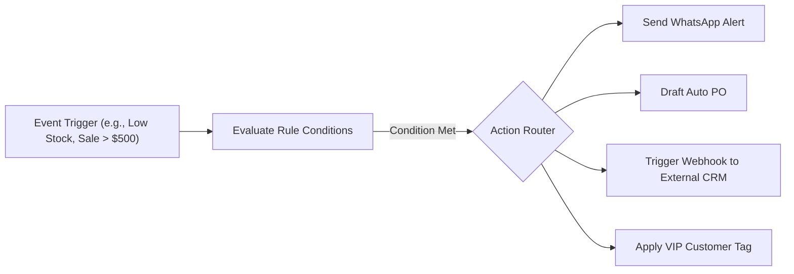
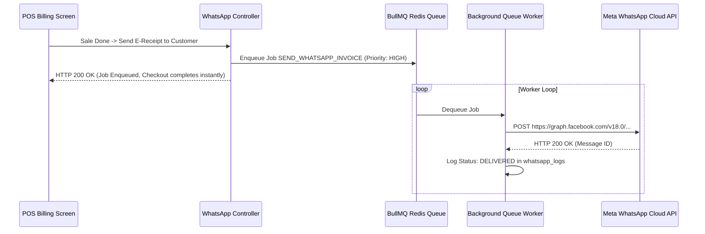

# 🔌 Developer Guide: Plugins, Workflows & Automation Architecture

This technical document details the plugin sandboxing framework, event-driven workflow automation engine, WhatsApp BullMQ queue worker, and developer ecosystem API key architecture.

---

## 🏗️ System Architecture Overview

```text
Extensibility & Automation Layer
├── 🧩 Plugin Marketplace & Sandboxed Execution Engine (`/api/v1/plugins`)
├── ⚡ Event-Driven Workflow Automation Engine (`/api/v1/workflows`)
├── 📱 WhatsApp Cloud API & Async BullMQ Queue (`/api/whatsapp`)
└── 🔑 Developer API Token & Outbound Webhook Subsystem (`/api/v1/developer`)
```

---

## 🧩 Plugin Marketplace & Sandbox Lifecycle

The plugin subsystem (`backend/services/plugin_manager.service.ts`) enables third-party developers to extend the POS with custom integrations (payment gateways, accounting exports, loyalty providers):

### 1. Plugin Manifest Schema (`manifest.json`)
```json
{
  "id": "com.famalth.tally-export",
  "name": "Tally XML Exporter",
  "version": "1.2.0",
  "author": "Famalth Developer Network",
  "entry": "dist/index.js",
  "permissions": ["READ_SALES", "READ_PURCHASE", "WRITE_EXPORT"],
  "hooks": ["ON_SALE_COMPLETED", "ON_DAY_CLOSE"]
}
```

### 2. Sandbox Execution & Security Isolation
- Plugins execute inside isolated Node.js `VM2` or isolated worker threads.
- Direct filesystem access, network sockets to unauthorized IPs, and raw database connections are strictly blocked.
- Plugins access system resources only via the authenticated `PluginSDK` bridge.

---

## âš¡ Event-Driven Workflow Automation Engine

The workflow engine executes user-defined **Trigger âž” Condition âž” Action** rules:



### Supported Triggers:
- `EVENT_SALE_COMPLETED`: Fired after a sale is committed.
- `EVENT_STOCK_BELOW_MIN`: Fired when an item reaches reorder level.
- `EVENT_NIGHT_AUDIT_COMPLETED`: Fired at end of day closing.
- `EVENT_NEW_CUSTOMER_REGISTERED`: Fired on new CRM signup.

---

## 📱 WhatsApp Cloud API & Async BullMQ Queue

Transactional messages (e-invoices, POs, OTPs, promotional campaigns) are dispatched asynchronously to guarantee sub-millisecond POS checkout without waiting for HTTP network calls:



---

## 🔑 Developer Ecosystem: API Keys & Webhooks

External systems (custom eCommerce websites, ERPs, mobile apps) can integrate using scoped Developer API Keys:

### 1. Registering Webhooks
`POST /api/v1/developer/webhooks`
```json
{
  "target_url": "https://my-store.com/api/webhooks/pos-events",
  "events": ["sale.created", "inventory.updated", "customer.created"],
  "secret_token": "whsec_9938482018384029"
}
```

### 2. HMAC-SHA256 Webhook Verification
Every outgoing webhook payload includes an `X-Famalth-Signature` header computed as:
$$\text{Signature} = \text{HMAC-SHA256}(\text{payload\_json}, \text{secret\_token})$$
Receiving servers can verify this signature to guarantee authenticity.

---

## 📡 REST API Endpoint Specifications

- `GET /api/v1/plugins/marketplace` — Fetch available plugin directory.
- `POST /api/v1/plugins/install` — Download and register plugin sandbox.
- `POST /api/v1/plugins/:id/toggle` — Enable or disable installed plugin.
- `GET /api/v1/workflows/rules` — List configured automation rules.
- `POST /api/v1/workflows/rules/:id/toggle` — Activate/deactivate rule.
- `POST /api/v1/workflows/trigger` — Emit event into workflow pipeline.
- `GET /api/whatsapp/config` — Retrieve WhatsApp API setup.
- `POST /api/whatsapp/config` — Update Meta Cloud API tokens & phone number ID.
- `GET /api/v1/developer/api-keys` — List generated developer integration keys.
- `POST /api/v1/developer/api-keys` — Generate new scoped developer API key.

---

*Document Source: `Docs/Developer-Guide-Plugins-Workflows-Automation.md`*
