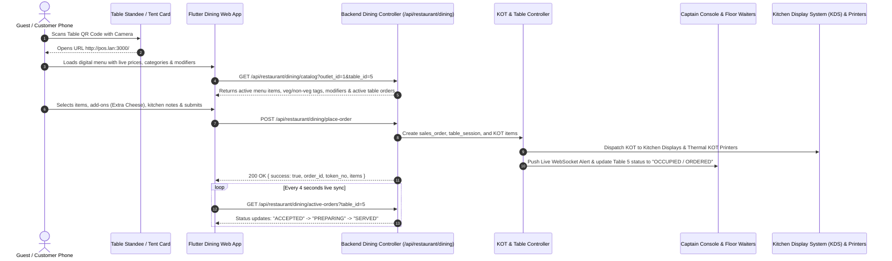
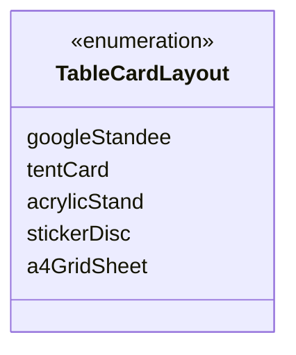
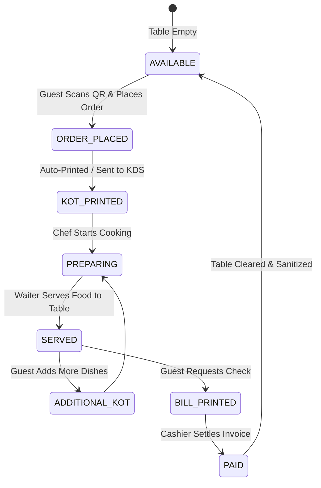

# Developer Guide: Contactless QR Table Ordering & Digital Dining System

This technical guide documents the architectural design, QR code generator pipelines, customer-facing mobile web ordering engine, real-time KOT dispatching, and table state reconciliation protocols.

---

## 📑 Table of Contents
1. [System Architecture & End-to-End Flow](#1-system-architecture--end-to-end-flow)
2. [QR Code Generation & Print Geometry Engine](#2-qr-code-generation--print-geometry-engine)
3. [Customer Digital Dining Client (`table_dining_screen.dart`)](#3-customer-digital-dining-client-table_dining_screendart)
4. [Backend Dining & KOT Dispatch API](#4-backend-dining--kot-dispatch-api)
5. [Real-time Kitchen & Table Order State Machine](#5-real-time-kitchen--table-order-state-machine)
6. [Data Models & PostgreSQL Schema](#6-data-models--postgresql-schema)

---

## 1. System Architecture & End-to-End Flow



---

## 2. QR Code Generation & Print Geometry Engine

The Table QR Designer (`lib/screens/restaurant/table_qr_designer_screen.dart`) provides a vector-based layout engine with 5 printable physical formats:



### Supported Layout Specifications:
1. **Google Business Standee (`googleStandee`)**:
   - Modern Google-style card ($105 \times 148\text{ mm}$, A6 portrait).
   - Features central QR code with restaurant logo overlay, dynamic Wi-Fi credentials badge, table identifier, and cut guides.
2. **Tabletop Tent Card (`tentCard`)**:
   - Foldable $4 \times 6\text{ inch}$ dual-sided tabletop stand.
   - Symmetric top/bottom fold line for self-standing presentation.
3. **Acrylic Vertical Stand (`acrylicStand`)**:
   - Standard $4 \times 6\text{ inch}$ or A6 acrylic menu holder insert.
4. **Sticker Disc (`stickerDisc`)**:
   - Compact $3 \times 3\text{ inch}$ circular / rounded square coaster and table corner sticker.
5. **A4 Multi-Table Grid (`a4GridSheet`)**:
   - Bulk printing sheet containing 4 to 6 table QR codes on a single A4 page with boundary cutting guides.

### QR Code Payload Structure:
$$\text{Payload URL} = \text{Base URL} + \text{`/#/dining?outlet\_id=`} + \text{outletId} + \text{`&table\_id=`} + \text{tableId} + \text{`&t=`} + \text{timestamp}$$

---

## 3. Customer Digital Dining Client (`lib/screens/dining/table_dining_screen.dart`)

The customer-facing dining interface is built for zero-friction mobile browsing without requiring app installation:

### Core Client Subsystems:
- **Instant Menu Filtering**:
  - Live category pills (Starters, Main Course, Beverages, Desserts).
  - Dietary switch: **ALL**, **PURE VEG (🟢)**, **NON-VEG (🔴)**.
  - Sub-second fuzzy search across titles, descriptions, and ingredients.
- **Modifier & Add-on Modal**:
  - Lets guests customize portion sizes, toppings, preparation requests, and spice levels.
- **Live Order Tracking**:
  - Polls `/api/restaurant/dining/active-orders` every 4 seconds.
  - Real-time kitchen progress badges: `PLACED` $\rightarrow$ `ACCEPTED` $\rightarrow$ `COOKING` $\rightarrow$ `SERVED` $\rightarrow$ `BILLED`.
- **Bill Request & Digital Checkout**:
  - Guests can view their running table subtotal, taxes, and service charge, or call the captain with a single tap.

---

## 4. Backend Dining & KOT Dispatch API

Implemented in [`backend/controllers/restaurant/dining.controller.ts`](../backend/controllers/restaurant/dining.controller.ts):

### 1. `GET /api/restaurant/dining/catalog`
Fetches public menu, categories, and table metadata for guest devices.
- **Params**: `outlet_id`, `table_id`
- **Security**: Public / Pre-authenticated guest access with outlet validation.

### 2. `POST /api/restaurant/dining/place-order`
Submits a table order and generates kitchen KOT tickets atomically.

- **Request Payload**:
```json
{
  "outlet_id": 1,
  "table_id": 5,
  "customer_name": "John Doe",
  "customer_phone": "9876543210",
  "special_instructions": "Less spicy, extra napkins",
  "payment_method": "PAY_LATER",
  "items": [
    {
      "item_id": 101,
      "item_name": "Paneer Butter Masala",
      "qty": 2,
      "rate": 280.00,
      "modifier_details": [
        { "modifier_name": "Extra Butter", "price": 30.00 }
      ],
      "item_remark": "Make it spicy"
    }
  ]
}
```

- **Backend Transaction Workflow**:
  1. Opens a database transaction.
  2. Creates or attaches to active `restaurant_table_sessions` for Table 5.
  3. Inserts records into `kot_headers` and `kot_items`.
  4. Updates table status to `OCCUPIED`.
  5. Pushes WebSocket notification to `outlet_1_dining` room for captain and kitchen screens.
  6. Commits transaction and returns `order_id` and formatted token number.

---

## 5. Real-time Kitchen & Table Order State Machine



---

## 6. Data Models & PostgreSQL Schema

### 1. `restaurant_tables`
Stores physical table geometry, QR identifiers, and live session IDs.
- `id` (`SERIAL PRIMARY KEY`)
- `outlet_id` (`INTEGER NOT NULL`)
- `table_name` (`VARCHAR(100)`)
- `seating_capacity` (`INTEGER DEFAULT 4`)
- `area_id` (`INTEGER REFERENCES dining_areas(id)`)
- `current_status` (`VARCHAR(50) DEFAULT 'AVAILABLE'`)
- `active_session_id` (`INTEGER NULL`)

### 2. `kot_headers` & `kot_items`
Stores kitchen production orders generated from QR ordering and captain terminals.
- `id` (`SERIAL PRIMARY KEY`)
- `kot_number` (`VARCHAR(50)`)
- `outlet_id` (`INTEGER NOT NULL`)
- `table_id` (`INTEGER REFERENCES restaurant_tables(id)`)
- `order_source` (`VARCHAR(50) DEFAULT 'QR_DINING'`)
- `status` (`'PENDING' | 'ACCEPTED' | 'COOKING' | 'SERVED' | 'CANCELLED'`)
- `modifier_details` (`JSONB DEFAULT '[]'::jsonb`)
- `special_notes` (`TEXT`)
