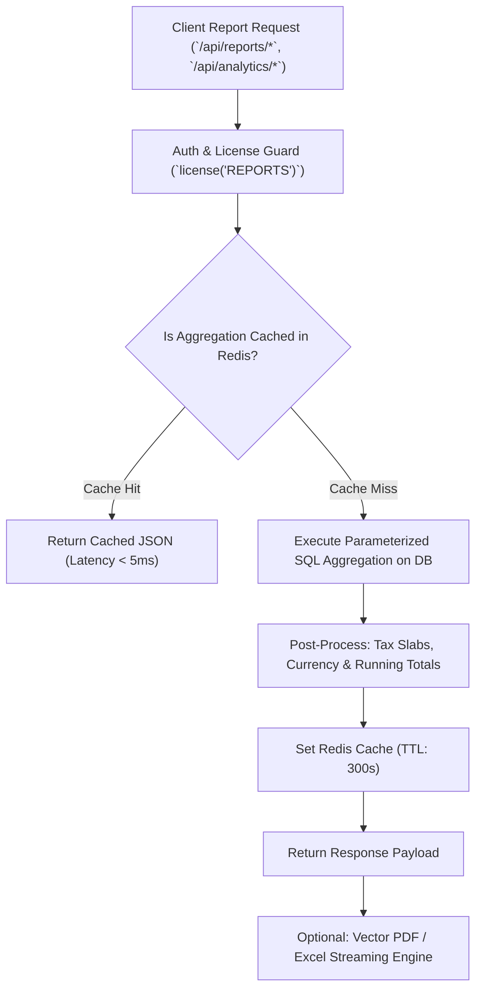

# 📊 Developer Guide: Reports, Analytics & Business Intelligence Engine

This technical document details the SQL aggregation queries, indexing architectures, read-replica offloading, vector PDF rendering pipelines, and background cache warming workers governing the Reports and Analytics subsystem.

---

## 🏗️ Analytics Architecture & Data Flow



---

## 🗄️ Core SQL Aggregations & Query Performance

All reports use parameterized date ranges (`start_date`, `end_date`), outlet scoping (`outlet_code`), and composite database indexes:

### 1. Sales & Tax Aggregation
```sql
SELECT 
  DATE(s.created_at) as sale_date,
  COUNT(s.id) as total_bills,
  SUM(s.subtotal) as gross_amount,
  SUM(s.discount_amount) as total_discounts,
  SUM(s.tax_amount) as total_tax,
  SUM(s.total_amount) as net_revenue
FROM sales_headers s
WHERE s.outlet_code = $1 
  AND s.created_at BETWEEN $2 AND $3
  AND s.status = 'COMPLETED'
GROUP BY DATE(s.created_at)
ORDER BY sale_date DESC;
```

### 2. Stock Balance & Valuation
```sql
SELECT 
  i.item_code,
  i.item_name,
  i.unit,
  i.purchase_price,
  i.selling_price,
  s.quantity as current_stock,
  (s.quantity * i.purchase_price) as cost_valuation,
  (s.quantity * i.selling_price) as retail_valuation
FROM items i
JOIN stocks s ON i.item_code = s.item_code
WHERE s.outlet_code = $1 AND i.is_active = true
ORDER BY s.quantity ASC;
```

---

## ⏰ Background Analytics Refresh Worker (`analyticsRefreshJob.ts`)

- **Trigger**: Hourly via Node-Cron.
- **Function**: Pre-computes heavy weekly and monthly sales summaries, brand margin distributions, and customer RFM analytics into `analytics_cache` tables to guarantee instant dashboard load times on POS startup.

---

## 📡 REST API Endpoint Specifications

Mounted under `/api/reports` and `/api/analytics`:

- `GET /api/reports/sales` — Detailed sales summary with tax and discount splits.
- `GET /api/reports/stock-balance` — Real-time inventory balance and stock valuation.
- `GET /api/reports/stock-ledger` — Item-level chronological transaction ledger.
- `GET /api/reports/payment-analysis` — Revenue distribution by payment mode.
- `GET /api/reports/credit-report` — Customer credit aging and outstanding balances.
- `GET /api/reports/cashier-handover` — Shift handover cash drawer reconciliation.
- `GET /api/reports/night-audit` — Night audit history and discrepancy logs.
- `GET /api/reports/brand-analysis` — Brand-wise revenue and margin share.
- `GET /api/reports/commission-report` — Staff sales commissions and payouts.
- `GET /api/analytics/dashboard-summary` — Real-time executive KPIs (Sales, Revenue, Average Order Value).

---

*Document Source: `Docs/Developer-Guide-Reports-And-Analytics.md`*
