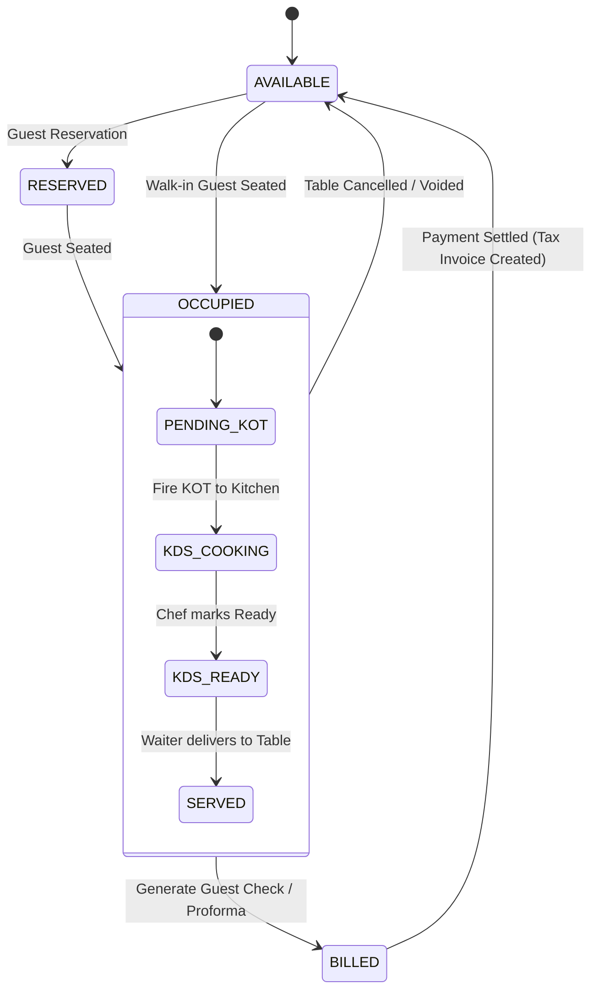

# 🍽️ Developer Guide: Restaurant & Hospitality Architecture

This technical document details the architecture, data models, state machines, and API endpoints governing the Restaurant, Table Management, KOT (Kitchen Order Ticket), and KDS (Kitchen Display System) subsystems.

---

## 🏗️ System Architecture Overview

The restaurant subsystem is split across:
1. **Frontend (`lib/screens/restaurant/`)**: Floor Plan Canvas, Captain Ordering Terminal, Live KDS Screen, Running Orders Manager, and Delivery Challan Dispatch.
2. **Backend Controller & Service Layer (`backend/controllers/restaurant/`, `backend/services/`)**: Table lifecycle state machine, KOT generation & dispatch, print routing, and sales conversion.
3. **Database Layer (`backend/models/`)**: PostgreSQL relational tables mapping floors, dining areas, table types, tables, reservations, KOT headers, KOT line items, and delivery challans.

---

## 📊 Relational Database Schema & Entities

### 1. `RestaurantFloor` & `DiningArea`
- `id` (UUID/Integer, PK)
- `name` (String, e.g., "Ground Floor", "Rooftop AC")
- `outlet_code` (String, Indexed)
- `sort_order` (Integer)

### 2. `RestaurantTable`
- `id` (PK)
- `table_number` (String, unique per outlet)
- `dining_area_id` (FK -> `DiningArea`)
- `seating_capacity` (Integer)
- `shape` (Enum: `ROUND`, `SQUARE`, `RECTANGLE`)
- `coord_x`, `coord_y` (Float, floor plan layout coordinates)
- `width`, `height` (Float, visual bounds)
- `status` (Enum: `AVAILABLE`, `OCCUPIED`, `RESERVED`, `BILLED`, `CLEANING`)
- `active_kot_id` (FK -> `KotHeader`, nullable)
- `merged_into_table_id` (FK -> `RestaurantTable`, nullable)

### 3. `KotHeader` (Kitchen Order Ticket)
- `id` (PK)
- `kot_number` (String, sequential per outlet / financial year)
- `table_id` (FK -> `RestaurantTable`)
- `captain_id` / `created_by` (FK -> `User`)
- `status` (Enum: `PENDING`, `PREPARING`, `READY`, `SERVED`, `BILLED`, `CANCELLED`)
- `order_type` (Enum: `DINE_IN`, `TAKEAWAY`, `DELIVERY`)
- `guest_count` (Integer)
- `notes` (Text, special kitchen instructions)
- `created_at`, `updated_at` (Timestamps)

### 4. `KotItem` (Line Items)
- `id` (PK)
- `kot_id` (FK -> `KotHeader`)
- `item_code` (FK -> `ItemMaster`)
- `quantity` (Decimal)
- `unit_price` (Decimal)
- `modifiers` (JSONB, e.g. `[{"name": "No Onion", "extra_cost": 0}, {"name": "Extra Cheese", "extra_cost": 1.50}]`)
- `item_status` (Enum: `PENDING`, `COOKING`, `DONE`, `CANCELLED`)
- `started_cooking_at`, `completed_at` (Timestamps for KDS performance metrics)

---

## 🔄 Table & KOT Lifecycle State Machine



---

## 📡 REST API Endpoint Specifications

Mounted under `/api/restaurant` (Requires JWT Authentication):

### 1. Floors & Dining Areas
- `GET /api/restaurant/floors` — Retrieve all floors with attached dining areas.
- `POST /api/restaurant/floors` — Create a new floor. Body: `{ "name": "Rooftop" }`.
- `PUT /api/restaurant/floors/:id` — Update floor name/order.
- `DELETE /api/restaurant/floors/:id` — Remove floor (checks for active tables).
- `GET /api/restaurant/dining-areas` — List dining areas with table counts.
- `POST /api/restaurant/dining-areas` — Create dining area. Body: `{ "name": "Family AC", "floor_id": 1 }`.

### 2. Tables & Floor Plan
- `GET /api/restaurant/tables` — Fetch table list with live status and active KOT summary.
- `POST /api/restaurant/tables` — Create new table. Body: `{ "table_number": "T-10", "dining_area_id": 1, "seating_capacity": 4, "shape": "SQUARE", "coord_x": 120, "coord_y": 250 }`.
- `PUT /api/restaurant/tables/:id` — Update coordinates, capacity, or shape.
- `PUT /api/restaurant/tables/:id/status` — Manual override of table status.
- `POST /api/restaurant/tables/transfer` — Transfer active order between tables. Body: `{ "source_table_id": 2, "target_table_id": 5 }`.
- `POST /api/restaurant/tables/merge` — Merge multiple tables for group dining. Body: `{ "primary_table_id": 3, "secondary_table_ids": [4, 5] }`.

### 3. KOTs & Kitchen Display System (KDS)
- `GET /api/restaurant/kots/active` — Real-time list of all cooking/pending KOTs for KDS.
- `POST /api/restaurant/kots` — Create & dispatch new KOT. Body:
```json
{
  "table_id": 4,
  "order_type": "DINE_IN",
  "guest_count": 2,
  "items": [
    {
      "item_code": "BURGER_01",
      "quantity": 2,
      "unit_price": 8.50,
      "modifiers": [{"name": "Extra Bacon", "extra_cost": 2.00}],
      "notes": "Crispy bacon please"
    }
  ]
}
```
- `PUT /api/restaurant/kots/:id/items/:itemId/status` — Chef bump-bar action (`COOKING` -> `DONE`).
- `POST /api/restaurant/kots/:id/settle` — Convert completed KOT into final POS sales invoice with tax split and payment ledger integration.

---

## 🖨️ Printer Routing & Network Dispatch

The restaurant module supports multi-kitchen printer routing:
- **Bar Printer**: Filter items where `category = 'BEVERAGE'`.
- **Main Kitchen (Hot Line)**: Filter items where `category = 'MAIN_COURSE'`.
- **Pantry / Dessert Printer**: Filter items where `category = 'DESSERT'`.
- Routing configuration is loaded dynamically via `PrinterConfig` and dispatched using ESC/POS socket streams over local network LAN or USB thermal drivers.

---

*Document Source: `Docs/Developer-Guide-Restaurant-Hospitality.md`*
