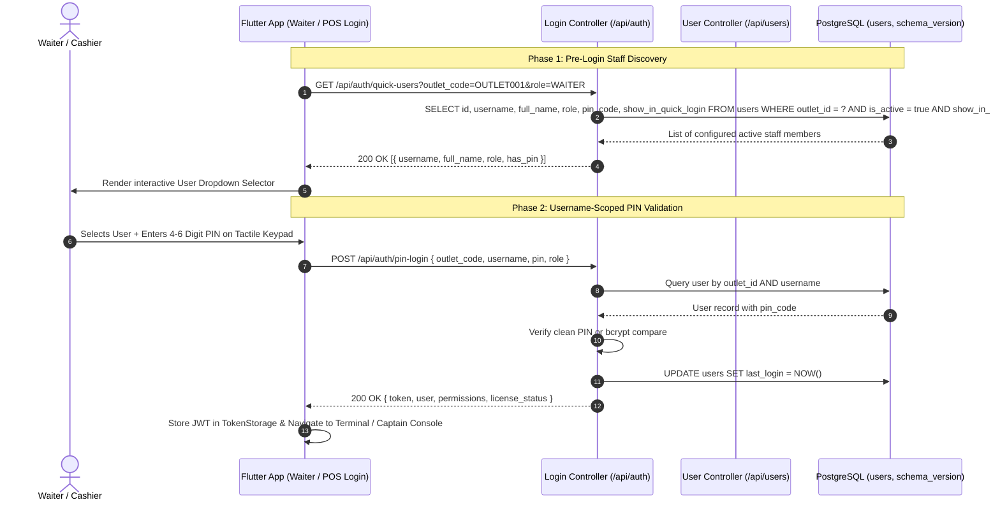

# Developer Guide: Staff PIN Authentication & Quick User Selector Dropdown

This technical guide documents the architectural design, database schemas, REST APIs, and client implementations for the **Staff Quick PIN Authentication** and **Quick User Selection** subsystem.

---

## 📑 Table of Contents
1. [Architecture & System Design](#1-architecture--system-design)
2. [Database Schema & Migration (Version 113)](#2-database-schema--migration-version-113)
3. [Backend API Endpoints](#3-backend-api-endpoints)
4. [Scoped Multi-User Authentication Engine](#4-scoped-multi-user-authentication-engine)
5. [Frontend Client Implementation](#5-frontend-client-implementation)
   - [Waiter & Floor Console (`waiter_auth_screen.dart`)](#waiter--floor-console)
   - [Desktop POS Sign-In (`login_screen.dart`)](#desktop-pos-sign-in)
   - [User Management Administration (`user_management_screen.dart`)](#user-management-administration)
6. [Security & Hashing Protocol](#6-security--hashing-protocol)

---

## 1. Architecture & System Design



---

## 2. Database Schema & Migration (Version 113)

### Migration Definition (`backend/utils/migrations.ts` & `backend/utils/migrations.js`)
```sql
-- Migration Version: 113
BEGIN;
ALTER TABLE users 
  ADD COLUMN IF NOT EXISTS pin_code VARCHAR(100) DEFAULT NULL,
  ADD COLUMN IF NOT EXISTS show_in_quick_login BOOLEAN DEFAULT TRUE;
COMMIT;
```

### Table Structure: `users`
| Column | Type | Nullable | Default | Description |
| :--- | :--- | :--- | :--- | :--- |
| `id` | `SERIAL PRIMARY KEY` | No | Auto | Unique User ID |
| `outlet_id` | `INTEGER` | No | - | Foreign key to `outlets.id` |
| `username` | `VARCHAR(50)` | No | - | Unique username within outlet |
| `password_hash`| `TEXT` | Yes | NULL | Bcrypt encrypted login password |
| `pin_code` | `VARCHAR(100)` | Yes | NULL | 4–6 digit PIN (plaintext or bcrypt hash) |
| `show_in_quick_login` | `BOOLEAN` | No | `TRUE` | Controls visibility in pre-login quick user dropdown |
| `full_name` | `VARCHAR(255)` | Yes | NULL | Staff full legal/display name |
| `role` | `VARCHAR(50)` | No | `'STORE'` | Assigned role (`ADMIN`, `MANAGER`, `WAITER`, `CAPTAIN`, etc.) |
| `is_active` | `BOOLEAN` | No | `TRUE` | Account active state |

---

## 3. Backend API Endpoints

### 1. `GET /api/auth/quick-users`
Retrieves pre-login staff members configured for fast dropdown selection.

- **Access**: Public / Pre-login (Rate Limited)
- **Query Parameters**:
  - `outlet_code` (Required, string): Target outlet code (e.g. `OUTLET001`).
  - `role` (Optional, string): Role filter (e.g. `WAITER`, `CAPTAIN`, `CASHIER`).
- **Response**:
```json
{
  "success": true,
  "data": [
    {
      "id": 4,
      "username": "waiter_rahul",
      "full_name": "Rahul Sharma",
      "role": "WAITER",
      "has_pin": true
    },
    {
      "id": 7,
      "username": "captain_anita",
      "full_name": "Anita Verma",
      "role": "CAPTAIN",
      "has_pin": true
    }
  ]
}
```

### 2. `POST /api/auth/pin-login`
Authenticates a staff member using their PIN code.

- **Request Payload**:
```json
{
  "outlet_code": "OUTLET001",
  "username": "waiter_rahul",
  "pin": "1234",
  "role": "WAITER"
}
```
- **Response**:
```json
{
  "success": true,
  "license_status": "VALID",
  "days_remaining": 999,
  "token": "eyJhbGciOiJIUzI1NiIsInR5cCI6IkpXVCJ9...",
  "user": {
    "username": "waiter_rahul",
    "name": "Rahul Sharma",
    "role": "WAITER",
    "outlet_id": 1,
    "outlet_code": "OUTLET001",
    "permissions": ["RETAIL_SALES"]
  }
}
```

---

## 4. Scoped Multi-User Authentication Engine

### The Problem Solved
In busy retail and dining outlets with 10–20 staff members, staff frequently use convenient default PINs (e.g., `1234` or `0000`). If PIN login only looked up by `pin`, entering `1234` created an ambiguous collision.

### The Solution: Scoped Tuple Validation
Authentication is strictly evaluated as a 3-tuple:
$$\text{Authentication} = \langle \text{Outlet Code}, \text{Username}, \text{PIN} \rangle$$

1. When `username` is provided (from the dropdown or input), the backend queries:
   $$\sigma_{\text{outlet\_id} = \text{target} \land \text{username} = \text{selected} \land \text{is\_active} = \text{true}}(\text{Users})$$
2. Validates the matched user's `pin_code`.
3. Allows all staff members in the same outlet to have the same default PIN (`1234`) or distinct PINs without collision.

---

## 5. Frontend Client Implementation

### Waiter & Floor Console (`lib/screens/auth/waiter_auth_screen.dart`)
- Modern segmented role switcher (`Waiter Floor` vs `Captain Console`).
- Interactive user dropdown selector displaying avatar initials, Full Name, `@username`, and role badge.
- Tactile numeric keypad with haptic feedback (`HapticFeedback.lightImpact()`).
- Auto-triggers submission upon entering the 6th digit.

### Desktop POS Sign-In (`lib/screens/auth/login_screen.dart`)
- Dual-mode segmented selector (`Password` vs `Quick PIN`).
- Dynamic Dropdown picker loaded via `UserController.fetchQuickUsers(outletCode: _selectedOutlet)`.
- Fallback text field for custom operator typing.

### User Management (`lib/screens/auth/user_management_screen.dart`)
- `SwitchListTile` in Create & Edit user modals:
  - Label: *"Show in Quick Login Dropdown"*
  - Subtitle: *"Staff can pick this username on PIN login screen"*
- Passes `showInQuickLogin: bool` to `UserController.create()` and `UserController.update()`.

---

## 6. Security & Hashing Protocol
1. **Plaintext & Bcrypt Dual Support**: Supports both fast numeric PIN comparison and bcrypt hashes for enterprise compliance.
2. **Audit Logging**: Every PIN login event is logged into the `audit_logs` table with `action: 'PIN_LOGIN'`, `recordId: user.id`, and client IP.
3. **Session Invalidation**: Role verification enforces that non-waiter roles cannot access floor console endpoints without supervisor authorization.
