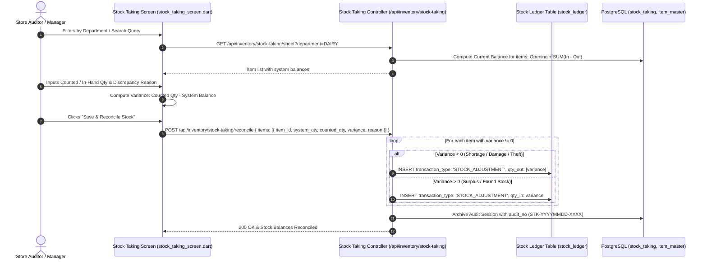

# Developer Guide: Physical Stock Taking, Modifiers Engine & Manual GRN Receiving Protocol

This technical guide documents the **Physical Inventory Audit & Stock Taking Subsystem**, **Item Modifiers & Recipe Deductions**, **Dietary Food Tagging**, and the **Strict Manual Goods Receiving Note (GRN) Protocol**.

---

## 📑 Table of Contents
1. [Physical Stock Taking & Inventory Variance Architecture](#1-physical-stock-taking--inventory-variance-architecture)
2. [Item Modifiers & Recipe Stock Deduction Engine](#2-item-modifiers--recipe-stock-deduction-engine)
3. [Dietary Tagging in Item Master (`food_type`, `is_veg`)](#3-dietary-tagging-in-item-master-food_type-is_veg)
4. [Waiter & Captain Floor App Kitchen KOT Pipeline](#4-waiter--captain-floor-app-kitchen-kot-pipeline)
5. [⚠️ Critical Protocol Correction: Manual GRN Receiving Rule](#5-️-critical-protocol-correction-manual-grn-receiving-rule)

---

## 1. Physical Stock Taking & Inventory Variance Architecture



### Table Grid Schema:
| Column Key | Display Label | Type | Calculation / Source |
| :--- | :--- | :--- | :--- |
| `item_name` | Item Name & Code | String | `item_master.item_name` |
| `unit` | Unit of Measure | String | `item_master.unit` (e.g. PCS, KG, LTR) |
| `system_qty` | Current Balance | Decimal | Live stock ledger calculation |
| `counted_qty` | Counted / In Hand | Decimal | Editable auditor input |
| `variance` | Variance | Decimal | $\text{Counted Qty} - \text{System Balance}$ |
| `reason` | Reason / Remarks | String | Standardized enum reason code |

---

## 2. Item Modifiers & Recipe Stock Deduction Engine

Modifiers allow configurable add-ons and preparation variations (e.g. *Extra Cheese*, *Almond Milk*, *Double Patty*).

### Database Schema in `item_master`:
```sql
ALTER TABLE item_master 
  ADD COLUMN IF NOT EXISTS is_modifier BOOLEAN DEFAULT FALSE,
  ADD COLUMN IF NOT EXISTS applicable_item_ids TEXT,
  ADD COLUMN IF NOT EXISTS deduct_raw_item_id INTEGER REFERENCES item_master(id),
  ADD COLUMN IF NOT EXISTS deduct_qty DECIMAL(12, 4) DEFAULT 0;
```

### Raw Material Deduction on Sale:
When an item with modifier *"Extra Cheese"* (`deduct_raw_item_id = 45 [Processed Cheese Block]`, `deduct_qty = 0.05 KG`) is sold:
```typescript
if (modifier.deduct_raw_item_id && modifier.deduct_qty > 0) {
    await db.models.stock_ledger.create({
        outlet_id,
        item_id: modifier.deduct_raw_item_id,
        transaction_type: 'SALE_MODIFIER_CONSUMPTION',
        qty_out: modifier.deduct_qty * salesItem.qty,
        reference_id: `SALE-${saleId}`
    });
}
```

---

## 3. Dietary Tagging in Item Master (`food_type`, `is_veg`)

Menu items support standardized dietary indicators across Floor Apps, QR Menus, and KDS:

```sql
ALTER TABLE item_master 
  ADD COLUMN IF NOT EXISTS food_type VARCHAR(20) DEFAULT 'VEG',
  ADD COLUMN IF NOT EXISTS dietary_type VARCHAR(20) DEFAULT 'VEG',
  ADD COLUMN IF NOT EXISTS is_veg BOOLEAN DEFAULT TRUE;
```

- `VEG` / `is_veg = true`: Rendered with Green Veg emblem (🟢).
- `NON_VEG` / `is_veg = false`: Rendered with Red Non-Veg emblem (🔴).
- `EGG`: Rendered with Yellow Egg emblem (🟡).

---

## 4. Waiter & Captain Floor App Kitchen KOT Pipeline

The mobile Floor App ([`waiter_auth_screen.dart`](../lib/screens/auth/waiter_auth_screen.dart) and [`captain_dashboard_screen.dart`](../lib/screens/restaurant/captain_dashboard_screen.dart)) enables floor servers to post orders directly to the kitchen:
1. Select active table $\rightarrow$ Pick dishes with modifier add-ons $\rightarrow$ Tap **Send KOT**.
2. Atomic KOT insertion into `kot_headers` and `kot_items`.
3. Kitchen Display Screens (KDS) update live via WebSocket event `NEW_KOT_ORDER`.
4. Thermal kitchen printers automatically spool KOT chits.

---

## 5. ⚠️ Critical Protocol Correction: Manual GRN Receiving Rule

> [!IMPORTANT]
> **CORRECTION TO PREVIOUS DOCUMENTATION:**
> Previous draft documentation incorrectly stated that Goods Receiving Notes (GRN) are automatically generated when Purchase Orders are placed or when items are purchased on the B2B Marketplace.
>
> **THE REALITY & ENFORCED RULE:**
> **Goods Receiving Notes (GRN) / Receiving are NEVER created automatically.**
> In enterprise retail and inventory governance:
> 1. Placing a Purchase Order (PO) only creates a purchase contract (`status: 'PENDING'`).
> 2. Inventory balances in `stock_ledger` and `item_master` **MUST NOT** increase until physical goods actually arrive at the store.
> 3. The store operator / warehouse receiver must open **Purchases $\rightarrow$ Goods Receiving (GRN)**, physically count and inspect delivered packages, verify batch/expiry dates, enter actual accepted quantities, and manually click **Save & Receive Stock**.
> 4. Only after this manual operator action is the formal `GRN-` record generated and inventory debited to the stock ledger.
