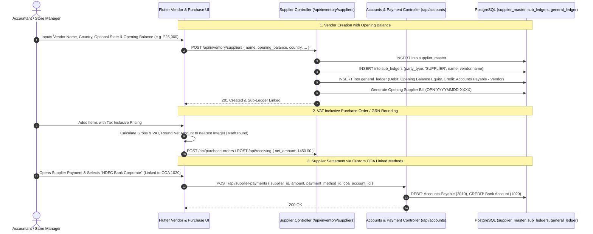

# Developer Guide: Vendor Management, COA Sub-Ledger Sync, VAT Rounding & Payment Accounts

This technical guide documents the integration between **Vendor Master Data**, **Chart of Accounts (COA) Double-Entry Accounting**, **VAT Inclusive Integer Rounding**, and **Dynamic Payment Method Ledger Linkage**.

---

## 📑 Table of Contents
1. [Architecture & Accounting Integration Flow](#1-architecture--accounting-integration-flow)
2. [Vendor Opening Balance & Automatic COA Posting](#2-vendor-opening-balance--automatic-coa-posting)
3. [International Vendor Flexibility (Optional State Field)](#3-international-vendor-flexibility-optional-state-field)
4. [VAT Inclusive Integer Rounding in PO & GRN](#4-vat-inclusive-integer-rounding-in-po--grn)
5. [Dynamic Custom Payment Methods & COA Account Binding](#5-dynamic-custom-payment-methods--coa-account-binding)
6. [API Reference](#6-api-reference)

---

## 1. Architecture & Accounting Integration Flow



---

## 2. Vendor Opening Balance & Automatic COA Posting

When a vendor is created with an existing payable balance:
1. **Accounts Payable Sub-Ledger**: A dedicated sub-ledger card is established under group `2010 - Accounts Payable (Creditors)`.
2. **Double-Entry Journal Entry**:
   $$\text{Debit: } 3000\text{ - Opening Balance Equity / Capital Adjustment} \quad (\text{Amount})$$
   $$\text{Credit: } 2010\text{ - Accounts Payable (Vendor: ABC Wholesalers)} \quad (\text{Amount})$$
3. **Tracking Bill**: A virtual bill `OPN-{SUPPLIER_ID}` is registered in `supplier_bills` with status `'PENDING'` so partial and full settlements can be reconciled seamlessly.

---

## 3. International Vendor Flexibility (Optional State Field)

For international deployments (USA, Kenya, Germany, UK, UAE, Brazil), state/province taxonomies differ or are not applicable.
- **Frontend Validation**: `state` field is non-mandatory (`validator: null`).
- **Backend Schema**: `supplier_master.state` is marked `allowNull: true` and defaults to `NULL` or empty string.

---

## 4. VAT Inclusive Integer Rounding in PO & GRN

In wholesale transactions where unit prices contain fractional taxes (e.g. item cost ₹123.456 + VAT 16%), fractional cent discrepancies cause supplier bill disputes.

### Mathematical Formulation:
When `is_tax_inclusive` is `TRUE`:
$$\text{Base Amount} = \sum \left( \frac{\text{Rate} \times \text{Qty}}{1 + \text{Tax Rate}} \right)$$
$$\text{Total Tax} = \sum (\text{Rate} \times \text{Qty}) - \text{Base Amount}$$
$$\text{Net Amount} = \text{round}(\text{Base Amount} + \text{Total Tax})$$

In JavaScript/TypeScript:
```typescript
const netAmount = isTaxInclusive 
    ? Math.round(computedGross + computedTax - discount)
    : parseFloat((computedGross + computedTax - discount).toFixed(2));
```

---

## 5. Dynamic Custom Payment Methods & COA Account Binding

Payment methods created under **Settings** $\rightarrow$ **Payment Methods** (e.g., *Petty Cash*, *HDFC Current A/c*, *Chase Business Checking*, *M-Pesa Till*) are dynamically bound to a specific asset account in the Chart of Accounts.

### Schema (`payment_methods`):
```sql
ALTER TABLE payment_methods 
  ADD COLUMN IF NOT EXISTS coa_account_id INTEGER REFERENCES coa_accounts(id) ON DELETE SET NULL;
```

### Settlement Posting:
When paying a supplier via payment method `M`:
```typescript
const paymentMethod = await db.models.payment_methods.findByPk(payment_method_id);
const targetCashOrBankAccountId = paymentMethod.coa_account_id || DEFAULT_CASH_ACCOUNT_ID;

// Post double-entry journal
await postJournalEntry({
    debitAccountId: vendorSubLedgerAccountId, // Accounts Payable
    creditAccountId: targetCashOrBankAccountId, // Target Bank/Cash Account
    amount: paymentAmount,
    reference: `SUP-PAY-${supplierBillId}`
});
```

---

## 6. API Reference

- `GET /api/inventory/suppliers`: Lists vendors with opening balance, current payable ledger balance, and contact details.
- `POST /api/inventory/suppliers`: Creates vendor with optional state and automatic COA opening balance posting.
- `GET /api/settings/payment-methods`: Returns all active payment methods with linked COA account metadata.
- `POST /api/supplier-payments`: Processes vendor payout using dynamic payment methods.
