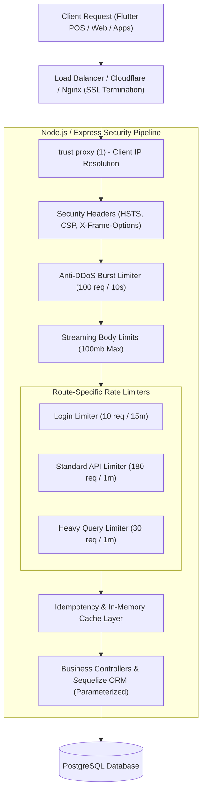

# 🛡️ Developer Guide: Security, Rate Limiting, Anti-DDoS, Caching & Load Balancers

This document provides a comprehensive technical overview of the production **Security Hardening**, **Multi-Tier Rate Limiting**, **Anti-DDoS Shielding**, **Caching / Idempotency**, and **Load Balancer Integration** built into the backend architecture.

---

## 🏗️ Architecture Overview



---

## 🚦 1. Multi-Tier Rate Limiting Matrix

Implemented in [`backend/middlewares/rateLimit.middleware.ts`](file:///d:/inventorynew/RetailSale%20new/RetailSale/backend/middlewares/rateLimit.middleware.ts):

| Limiter Name | Target Routes | Window (Time) | Max Requests | Behavior on Exceeded |
| :--- | :--- | :--- | :--- | :--- |
| **`ddosBurstLimiter`** | Global (`app.use(ddosBurstLimiter)`) | 10 seconds | 100 req / IP | Drops sudden bot burst floods immediately with HTTP 429 |
| **`loginLimiter`** | `/api/auth/login`, `/api/auth/pin` | 15 minutes | 10 attempts / IP | Mitigates credential stuffing and brute-force attacks |
| **`apiLimiter`** | `/api/*` (General POS APIs) | 1 minute | 180 req / IP | Standard operational throughput (3 req/sec continuous) |
| **`reportQueryLimiter`**| `/api/reports/*` (Aggregations) | 1 minute | 30 req / IP | Prevents database CPU starvation from heavy analytical joins |

### Implementation Snippet:
```typescript
import rateLimit from 'express-rate-limit';

export const ddosBurstLimiter = rateLimit({
  windowMs: 10 * 1000,
  max: 100,
  standardHeaders: true,
  legacyHeaders: false,
  message: { success: false, message: 'DDoS protection triggered. Request dropped.' }
});

export const loginLimiter = rateLimit({
  windowMs: 15 * 60 * 1000,
  max: 10,
  message: { success: false, message: 'Too many login attempts. Account temporarily locked for 15 minutes.' }
});
```

---

## 🛡️ 2. Anti-DDoS Slowloris Socket Protection

To prevent **Slowloris** and **Slow POST** attacks where malicious actors open hundreds of HTTP connections and transmit data agonizingly slowly to exhaust server socket descriptors:

Configured in [`backend/server.ts`](file:///d:/inventorynew/RetailSale%20new/RetailSale/backend/server.ts):

```typescript
// Anti-DDoS Slowloris Socket Protection
server.keepAliveTimeout = 65000;  // 65s: Synchronized with standard Cloudflare / AWS ALB timeouts
server.headersTimeout = 66000;    // 66s: Must exceed keepAliveTimeout
server.requestTimeout = 30000;    // 30s: Drops inactive / hanging requests
```

---

## ⚖️ 3. Load Balancer & Reverse Proxy Topology

When running in cloud environments (e.g., Render, AWS ALB, Nginx, or Kubernetes):

1. **Proxy Trust**:
   ```typescript
   app.set('trust proxy', 1);
   ```
   Ensures that `req.ip` and rate limiters evaluate the true client IP via `X-Forwarded-For`, rather than the internal load balancer loopback address (`10.x.x.x` or `127.0.0.1`).

2. **Liveness / Readiness Health Check Probes**:
   - `GET /health` endpoint responds with `200 OK` and status JSON for automated load balancer traffic routing and auto-scaling health checks.

---

## ⚡ 4. In-Memory Caching & Idempotency Layer

Implemented in [`backend/utils/cache.util.ts`](file:///d:/inventorynew/RetailSale%20new/RetailSale/backend/utils/cache.util.ts) and [`backend/middlewares/idempotency.middleware.ts`](file:///d:/inventorynew/RetailSale%20new/RetailSale/backend/middlewares/idempotency.middleware.ts):

- **Idempotency Safeguard**: In-flight and completed financial write transactions (Sales, Purchase Orders, Vouchers) cache their idempotency key (`idempotency:{outletId}:{key}`) for 120 seconds.
- **Duplicate Prevention**: If network latency causes the Flutter client to retry a submission, the backend returns the cached HTTP response instantly without double-charging or deducting stock twice.

---

## 🔒 5. Production Security Headers & XSS/Clickjacking Mitigation

Implemented in [`backend/middlewares/security.middleware.ts`](file:///d:/inventorynew/RetailSale%20new/RetailSale/backend/middlewares/security.middleware.ts):

| Header | Value | Vulnerability Mitigated |
| :--- | :--- | :--- |
| **`X-Frame-Options`** | `SAMEORIGIN` | Mitigates UI redress and **Clickjacking** attacks |
| **`X-Content-Type-Options`** | `nosniff` | Prevents browsers from executing non-executable MIME types |
| **`X-XSS-Protection`** | `1; mode=block` | Enables browser reflected cross-site scripting filters |
| **`Strict-Transport-Security`** | `max-age=31536000; includeSubDomains; preload` | Enforces mandatory **HTTPS (HSTS)** across all subdomains |
| **`Referrer-Policy`** | `strict-origin-when-cross-origin` | Strips sensitive path data from outbound referrer headers |
| **`Cross-Origin-Resource-Policy`** | `cross-origin` | Protects assets from unauthorized third-party site embedding |

---

## 🗄️ 6. Database Parameterization & SQL Injection Defense

- All SQL operations in the system execute via **Sequelize ORM** using native parameterized prepared statements:
  ```typescript
  // Safe parameterized query
  await db.query('SELECT * FROM item_master WHERE outlet_id = :outletId AND item_name ILIKE :search', {
    replacements: { outletId, search: `%${query}%` },
    type: QueryTypes.SELECT
  });
  ```
- Eliminates risk of SQL Injection attacks via raw string concatenations.

---

## 🔄 7. Graceful Process Shutdown & Zero-Downtime Lifecycle

```typescript
function gracefulShutdown(signal: string): void {
    console.log(`🛑 [SYSTEM] Received ${signal}. Starting graceful shutdown...`);
    server.close(async () => {
        if (propertyDb && typeof propertyDb.close === 'function') {
            await propertyDb.close();
            console.log('💾 PostgreSQL connection pool drained cleanly.');
        }
        process.exit(0);
    });

    // Forced timeout after 10s if active sockets stall
    setTimeout(() => process.exit(1), 10000);
}

process.on('SIGTERM', () => gracefulShutdown('SIGTERM'));
process.on('SIGINT', () => gracefulShutdown('SIGINT'));
```
- Guarantees seamless container rolling updates and blue-green deployments with zero in-flight transaction corruption.
