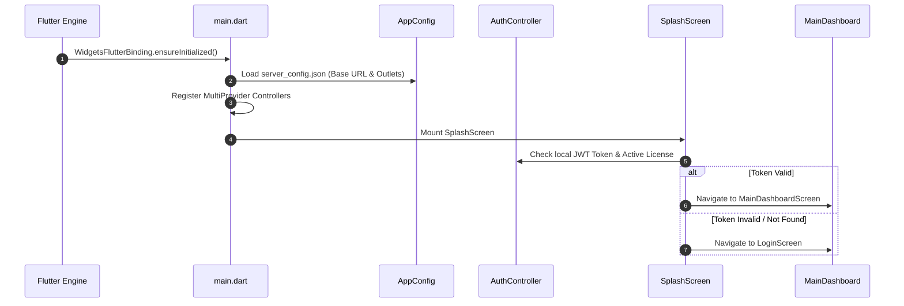

# 📱 Complete Frontend Developer Guide

This document is the **comprehensive technical architecture and development manual for the Flutter client** located in `lib/`.

---

## 🏗️ Frontend Architecture & Tech Stack

- **Framework**: Flutter SDK compatible with Dart `>= 3.4.0`.
- **Supported Targets**: Windows Desktop (`windows`), Web Browser (`web`), Android (`android`), iOS (`ios`), Linux (`linux`), macOS (`macos`).
- **State Management**: Reactive Controller Pattern powered by `Provider` (`ChangeNotifierProvider`, `MultiProvider`).
- **Persistence & Local Cache**: `shared_preferences`, secure encrypted storage, and local file storage via `path_provider`.
- **Thermal & Hardware Printing Engine**: `printing`, `pdf`, ESC/POS raster generation for 80mm and 58mm roll receipt printers, label sheet laser printers.
- **Hardware Integration**: USB / Bluetooth barcode scanners, cash drawer kick pulse drivers (RJ11/RJ12), customer second-screen displays.

---

## 📂 Source Code Directory Structure (`lib/`)

```text
lib/
├── main.dart                              # Application bootstrap & Provider registrations
│
├── core/                                  # Core architectural utilities & configs
│   ├── config/app_config.dart             # API base URL, active outlet & client configuration
│   ├── theme/                             # Material 3 typography, palettes & dark/light themes
│   └── constants/                         # Colors, dimensions, asset paths, API endpoints
│
├── controllers/                           # Reactive state management controllers
│   ├── auth_controller.dart               # User authentication & session state
│   ├── cart_controller.dart               # Active POS billing cart, taxes, and promos
│   ├── inventory_controller.dart          # Item catalog, stock balances, categories
│   ├── restaurant_controller.dart         # Tables, floor plan, KOTs, and KDS live streams
│   ├── accounting_controller.dart         # Vouchers, COA tree, bank reconciliation
│   ├── hrms_controller.dart               # Employees, attendance punch, payroll
│   ├── lynx_ai_controller.dart            # AI conversational chat state & tools
│   ├── sticky_notes_controller.dart       # User notes, pinning, and trash bin state
│   └── notification_controller.dart       # System alerts & background sync pings
│
├── models/                                # Dart data serialization models (from/to JSON)
│   ├── item_model.dart, sale_model.dart, customer_model.dart
│   ├── table_model.dart, kot_model.dart, voucher_model.dart
│   └── employee_model.dart, attendance_model.dart, note_model.dart
│
├── screens/                               # 75+ Domain-organized Flutter screens
│   ├── splash_screen.dart                 # App initialization & license check
│   ├── accounting/                        # Chart of Accounts, Vouchers, Balance Sheet, Loans
│   ├── auth/                              # Login, User Management, Customer/Rider Portals
│   ├── community/                         # B2B Marketplace Hub & Chat Channels
│   ├── dashboard/                         # Main POS, Autonomous Agent, Cloud Migration
│   ├── hrms/                              # Attendance, Employee Directory, Payroll
│   ├── inventory/                         # POS, Barcode Manager, Assembly, GRN, Transfers
│   ├── modify/                            # Sales reprint/modify, PO & GRN modifications
│   ├── recovery/                          # Disaster recovery, auto reinstall, backup
│   ├── reports/                           # 26+ Analytical, financial, tax & stock reports
│   ├── restaurant/                        # Floor Plan, KDS, Captain Tablet, Running Orders
│   ├── settings/                          # Printer Designer, Tax Groups, WhatsApp, Plugins
│   └── system/                            # Server error & offline fallback screens
│
├── services/                              # Platform & Hardware Services
│   ├── api_service.dart                   # Authenticated HTTP client with token refresh
│   ├── printing_service.dart              # ESC/POS & PDF thermal print dispatch
│   ├── backup_service.dart                # Local DB snapshot & encrypted export
│   └── notification_service.dart          # Local OS push notifications
│
├── utils/                                 # Formatting, date queries, sound effects, dialogs
└── widgets/                               # Reusable UI widgets & smart upsell bars
```

---

## 🚀 App Lifecycle & Initialization Sequence



---

## 🖨️ Thermal Printing & Vector Receipt Pipeline

The client features a flexible vector rendering engine capable of targeting any receipt printer:

```dart
// Printing Pipeline Overview
Future<void> printReceipt({
  required SaleModel sale,
  required ReceiptTemplate template,
}) async {
  // 1. Generate printable PDF document matching receipt width (80mm / 58mm)
  final doc = pw.Document();
  doc.addPage(
    pw.Page(
      pageFormat: PdfPageFormat(template.widthMm * PdfPageFormat.mm, double.infinity),
      build: (pw.Context context) => buildReceiptWidget(sale, template),
    ),
  );
  
  // 2. Direct print via OS print spooler or raw ESC/POS network socket
  await Printing.directPrintPdf(
    printer: selectedPrinter,
    onLayout: (format) async => doc.save(),
  );
}
```

---

## 🔄 Dynamic Server Configuration (`server_config.json`)

To configure the client for local, LAN, or Cloud servers, place `server_config.json` next to the executable:

```json
{
  "baseUrl": "http://127.0.0.1:3000",
  "outlets": ["OUTLET202604212159"],
  "enableOfflineSync": true,
  "defaultPrinter": "XP-80C",
  "enableSoundAlerts": true
}
```

---

*Document Source: `Docs/Frontend-Guide.md`*
