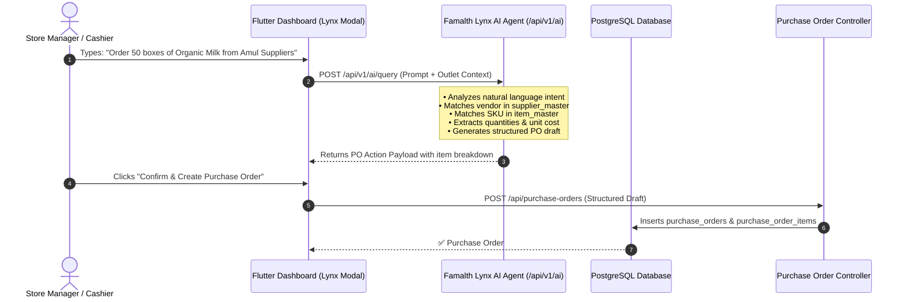

# 🧠 Famalth Lynx AI Assistant, Sticky Notes, Multi-Currency & Multi-Tax Engine Guide

## 📋 Overview

This guide details the advanced intelligence, productivity, internationalization, and taxation capabilities built into **RetailPOS ERP & POS Suite**:

1. **Famalth Lynx AI Assistant**: Autonomous conversational agent capable of natural language queries, universal dashboard search, and **direct 1-click Purchase Order creation from chat conversations**.
2. **Sticky Notes System**: Color-coded, draggable desktop notes and collaborative reminders for cashiers, store managers, and accountants.
3. **Multi-Currency Engine**: Global currency configuration supporting ISO currencies (USD, EUR, GBP, KES, INR, AED, CAD, AUD, etc.) with custom symbol positioning and decimal precision.
4. **Multi-Tax & Custom Tax Matrix**: Dynamic tax engine supporting **GST (CGST/SGST/IGST), CTL (Commercial Tax Levy), VAT, CESS**, and customizable multi-tier compound or flat tax groups.

---

## 🏛️ Famalth Lynx AI Assistant Architecture



---

## 🌟 Detailed Feature Specifications

### 1. 🤖 Famalth Lynx AI Assistant (`lib/widgets/lynx_assist_modal.dart`)
* **Natural Language POS & ERP Assistant**:
  * Powered by configurable AI providers (Gemini, OpenAI, Anthropic, or local Ollama) with API key and model selection.
  * Context-aware: understands active outlet metrics, low-stock alerts, daily revenue, and vendor records.
* **Direct Purchase Order Creation via Chat**:
  * Store managers can type conversational commands (e.g. *"Create a PO for 100 kg sugar and 50 liters milk from Metro Wholesalers"*).
  * The agent parses items, finds existing supplier IDs, calculates line totals and taxes, and provides an immediate **"Create PO"** button in chat.
* **Universal Search & Feature Navigation**:
  * Instant search across products, customer ledgers, historical invoices, and screen shortcuts directly from the chat interface.

---

### 2. 📝 Sticky Notes & Reminder System (`lib/widgets/notes/sticky_notes_modal.dart`)
* **Architecture**:
  * Frontend: [`StickyNotesModal`](file:///d:/inventorynew/RetailSale%20new/RetailSale/lib/widgets/notes/sticky_notes_modal.dart), [`UserNotesController`](file:///d:/inventorynew/RetailSale%20new/RetailSale/lib/controllers/notes/user_notes_controller.dart), [`UserNote`](file:///d:/inventorynew/RetailSale%20new/RetailSale/lib/models/notes/user_note_model.dart).
  * Backend: [`userNote.routes.ts`](file:///d:/inventorynew/RetailSale%20new/RetailSale/backend/routes/userNote.routes.ts) & [`userNote.model.js`](file:///d:/inventorynew/RetailSale%20new/RetailSale/backend/models/property/userNote.model.js).
* **Capabilities**:
  * **Color-Coded Organization**: Assign pastel colors (Yellow, Blue, Green, Pink, Purple, Orange) for priority categorization.
  * **Pin to Dashboard**: Pin critical shift notes, supplier delivery reminders, or cash drawer handover checklists.
  * **Per-User & Outlet Scoping**: Notes can be private to a cashier or shared outlet-wide with shift supervisors.
  * **Quick Hotkey Access**: Open notes modal from any billing or backoffice screen without interrupting active checkouts.

---

### 3. 💱 Global Multi-Currency Engine (`lib/core/currency/currency_service.dart`)
* **System Settings Schema**:
  ```sql
  ALTER TABLE system_settings 
  ADD COLUMN IF NOT EXISTS base_currency_code VARCHAR(20) DEFAULT 'USD',
  ADD COLUMN IF NOT EXISTS base_currency_symbol VARCHAR(20) DEFAULT '$',
  ADD COLUMN IF NOT EXISTS currency_symbol_position VARCHAR(20) DEFAULT 'BEFORE',
  ADD COLUMN IF NOT EXISTS currency_decimals INTEGER DEFAULT 2;
  ```
* **Formatting Features**:
  * **Symbol Positioning**: Prefix (`$100.00`, `₹500.00`, `KSh 1,200`) or Suffix (`100.00 €`, `500.00 CHF`).
  * **Dynamic Decimals**: 0 to 4 decimal precision (e.g. 0 decimals for JPY, 2 for USD/INR/KES, 3 for BHD/KWD).
  * **Thermal Receipt & A4 Template Alignment**: Seamlessly renders configured currency symbols across thermal POS slips, delivery challans, and tax invoices.

---

### 4. 🧾 Multi-Tax & Custom Tax Matrix (`lib/screens/settings/tax_group_setup_screen.dart`)
* **Supported Tax Regimes**:
  * **GST (Goods and Services Tax)**: Dual split (CGST + SGST for intra-state, IGST for inter-state transactions).
  * **VAT (Value Added Tax)**: Standard, reduced, and zero-rated VAT with tax invoice reporting.
  * **CTL (Commercial Tax Levy)**: Regional state commercial levies applied on wholesale or retail totals.
  * **CESS**: Compensation cess and luxury tax additions.
  * **Custom Compound & Multi-Tier Taxes**: Create custom tax groups with multiple component percentages (e.g. *VAT 16% + Tourism Levy 2% + Service Charge 5%*).

```mermaid
graph LR
    subgraph Tax_Engine["Multi-Tax Calculation Engine"]
        TG["Tax Group: E.g. 'Standard Food VAT + Levy'"]
        C1["Component 1: VAT (16%)"]
        C2["Component 2: CTL / Levy (2%)"]
        C3["Component 3: Service Tax (5%)"]
    end

    TG --> C1
    TG --> C2
    TG --> C3

    subgraph Output["Invoice Tax Breakdown"]
        B1["Taxable Amount: $100.00"]
        B2["VAT Amount: $16.00"]
        B3["CTL Amount: $2.00"]
        B4["Service Tax: $5.00"]
        B5["Net Invoice Total: $123.00"]
    end

    C1 --> B2
    C2 --> B3
    C3 --> B4
    B1 --> B5
```



* **Tax Management API Endpoints**:
  * `GET /api/settings/tax-groups` — Fetch all configured tax groups and component splits.
  * `POST /api/settings/tax-groups` — Create custom multi-component tax group.
  * `PUT /api/settings/tax-groups/:id` — Update tax rates and calculation modes.
  * `DELETE /api/settings/tax-groups/:id` — Safely remove unused tax group.

---

## 🔌 API Endpoint Reference

| Category | Method | Endpoint | Description |
| :--- | :--- | :--- | :--- |
| **Famalth Lynx AI** | `POST` | `/api/v1/ai/query` | Natural language queries, dashboard search, and PO drafting |
| | `POST` | `/api/v1/ai/parse-po` | Extracts vendor, items, and quantities into structured PO JSON |
| | `POST` | `/api/v1/agent/action` | Autonomous agent task execution |
| **Sticky Notes** | `GET` | `/api/notes` | Load user and outlet sticky notes |
| | `POST` | `/api/notes` | Create a new color-coded sticky note |
| | `PUT` | `/api/notes/:id` | Update note content, color, or pin status |
| | `DELETE` | `/api/notes/:id` | Delete sticky note |
| **Tax Groups** | `GET` | `/api/settings/tax-groups` | List tax groups with breakdown components |
| | `POST` | `/api/settings/tax-groups` | Create custom tax profile (GST, VAT, CTL, CESS) |
| | `PUT` | `/api/settings/tax-groups/:id` | Modify tax group components |
| | `DELETE` | `/api/settings/tax-groups/:id` | Delete tax group |
