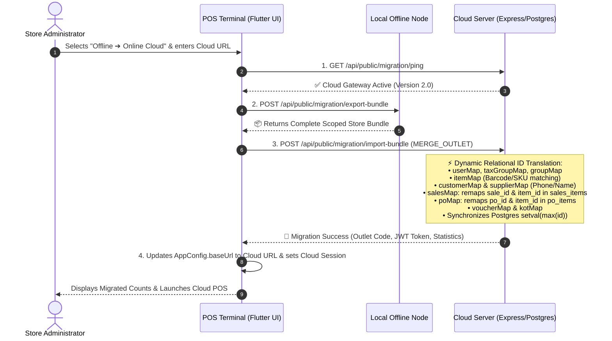
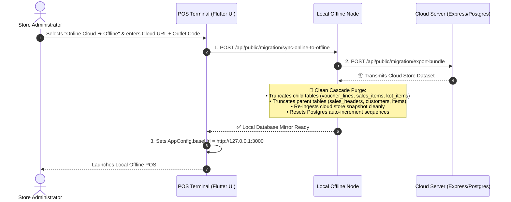
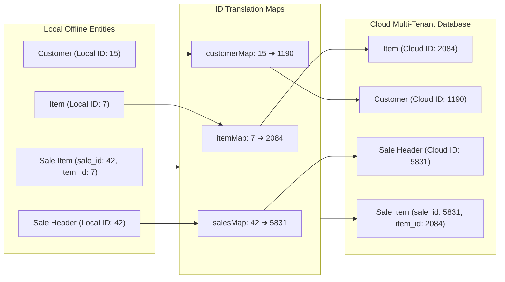

# 🚀 1-Click Bi-Directional Cloud & Offline Migration Guide

## 📋 Overview

The **1-Click Store Migration System** provides an enterprise-grade, bi-directional data synchronization pipeline between **Local Offline POS Terminals** and **Multi-Tenant Online Cloud Servers**.

It solves the fundamental challenge of **multi-tenant row ID collisions**: when migrating an offline store into a shared cloud server where other merchants already occupy database IDs (`id = 1, 2, 3...`), the system executes a **Dynamic Relational ID Translation Engine** to remap all primary and foreign keys on the fly without any data loss or constraint violations.

---

## 🏛️ Architecture & Migration Workflows

### 1. Offline ➔ Online Cloud Migration (Dynamic Relational ID Translation)



---

### 2. Online Cloud ➔ Offline Station Migration (Clean Cascade Purge & Fresh Restore)



---

## 🗺️ Relational ID Translation Engine

When inserting local rows into a shared cloud database, IDs cannot be hardcoded. The engine builds in-memory translation hash maps during ingestion:



---

## 📊 Full Table Compatibility Matrix

The migration engine guarantees 100% data integrity across all 11 enterprise domains:

| Domain | Database Tables | Foreign Key Translation in Offline $\to$ Online | Online $\to$ Offline Clean Restore |
| :--- | :--- | :--- | :--- |
| **1. Core & Tenant** | `outlets`, `users`, `user_permissions`, `user_notes` | Remapped to `targetOutletId` and `userMap[oldUserId] = newCloudUserId` | Recreates outlet tenant and admin credentials |
| **2. Settings & Branding** | `system_settings`, `app_branding`, `property_info`, `numbering_settings` | Scoped by `outlet_id`, sequence numbers continue after highest existing bill | Cleanly overwrites with cloud store branding & sequences |
| **3. Taxes & Master Data** | `tax_groups`, `tax_group_components`, `taxes_master`, `tax_profiles` | Matches by name or inserts new $\to$ `taxGroupMap[oldId] = newId` | Replaces local tax configurations |
| **4. Catalog & Inventory** | `item_groups`, `subcategories`, `brands`, `item_master`, `product_templates`, `stock_locations`, `stock_ledger` | Products remapped with `group_id`, `tax_group_id`, `brand_id`. Matched by barcode/SKU $\to$ `itemMap`. Stock remapped with `locationMap` | Clean truncate & reload of master catalog & inventory ledger |
| **5. CRM & Parties** | `customers`, `customer_advances`, `customer_repayments`, `supplier_master`, `supplier_bills`, `supplier_payments` | Matched per outlet by phone/name $\to$ `customerMap` and `supplierMap` | Cleanly mirrors customer credit & vendor ledgers |
| **6. Sales & Billing** | `sales_headers`, `sales_items`, `payment_methods`, `sale_sources` | `sales_headers` inserted $\to$ `salesMap`. `sales_items` inserted with `sale_id = salesMap[oldId]` & `item_id = itemMap[oldId]` | Clean truncate of past bills, restores all cloud invoices |
| **7. Purchases & GRN** | `purchase_orders`, `purchase_order_items`, `goods_receipts`, `goods_receipt_items` | `purchase_orders` remapped with `supplier_id = supplierMap[oldId]` $\to$ `poMap`. `items` remapped with `po_id` & `item_id` | Cleanly syncs purchase orders and vendor receipts |
| **8. Finance & Accounting** | `chart_of_accounts`, `bank_accounts`, `accounting_vouchers`, `voucher_lines`, `expenses`, `expense_categories` | `bank_account_id = bankMap`, `voucher_id = voucherMap`, `account_id = accountMap`, `category_id = expenseCatMap` | Mirrors chart of accounts, bank balances, and vouchers |
| **9. Restaurant & Dining** | `floors`, `dining_areas`, `restaurant_tables`, `kitchen_stations`, `kot_headers`, `kot_items` | `floor_id = floorMap`, `area_id = areaMap`, `table_id = tableMap`, `kot_id = kotMap` | Recreates floor layouts, table grids, and KOT logs |
| **10. Subscriptions & Delivery** | `milk_subscriptions`, `delivery_customers`, `delivery_partners` | `customer_id = customerMap[oldId]`, `outlet_id = targetOutletId` | Restores delivery routes and recurring milk subscriptions |
| **11. HRMS & Payroll** | `hr_employees`, `hr_designations`, `hr_shifts` | Scoped by `outlet_id = targetOutletId` | Restores staff profiles, shifts, and designation tiers |

---

## 🔒 Post-Migration Sequence Auto-Increment Synchronization

After inserting records with new primary keys, PostgreSQL auto-increment sequence counters must be aligned with the highest ID to prevent future collision:

```sql
DO $$
DECLARE
    r RECORD;
BEGIN
    FOR r IN (
        SELECT c.table_name, c.column_name, pg_get_serial_sequence(c.table_name, c.column_name) AS seq_name
        FROM information_schema.columns c
        WHERE c.table_schema = 'public' AND pg_get_serial_sequence(c.table_name, c.column_name) IS NOT NULL
    ) LOOP
        EXECUTE format('SELECT setval(''%s'', COALESCE((SELECT MAX(%I) FROM %I), 1), true)', r.seq_name, r.column_name, r.table_name);
    END LOOP;
END $$;
```

---

## 📱 User Interface & Navigation

### 1. Launching from Server Configuration
* Navigate to **Server Configuration Screen** (`ServerConfigScreen`).
* Click **"Launch 1-Click Migration Wizard"**.

### 2. Launching from Settings
* Open **Settings $\to$ Data & Security**.
* Under **1-Click Migrate Store to Cloud**, click **"Start Migration Wizard"**.

### 3. Launching from Cloud Feature Gate
* Open any cloud feature (e.g. B2B Chat, Rider Portal, Customer App, Vendor Marketplace).
* In offline mode, click **"1-Click Migrate Store to Cloud"**.

---

## 🔌 API Endpoint Reference

| Method | Endpoint | Description |
| :--- | :--- | :--- |
| `GET / POST` | `/api/public/migration/ping` | Health check and compatibility test |
| `POST` | `/api/public/migration/export-bundle` | Exports local store bundle and `.enc` snapshot |
| `POST` | `/api/public/migration/import-bundle` | Ingests store bundle on Cloud with relational ID translation |
| `POST` | `/api/public/migration/sync-online-to-offline` | Cleanly purges local database and pulls down cloud store |
