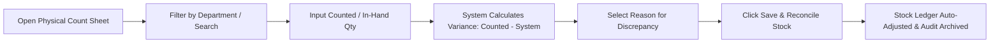
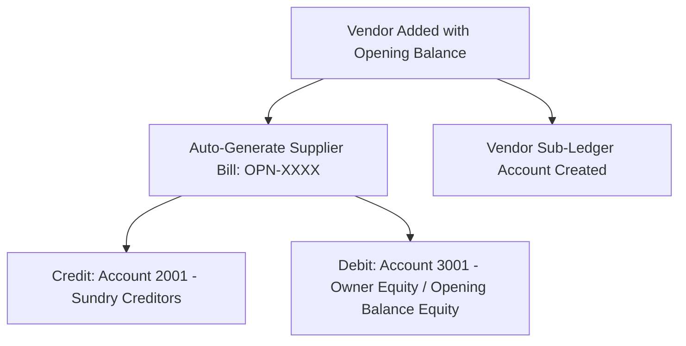

# GitHub Wiki: Stock Taking, Modifiers Master & Vendor COA Sync

This guide provides complete technical and operational documentation for the **Stock Taking Audit**, **Item Modifiers & Add-ons**, and **Vendor Opening Balance & Chart of Accounts (COA) Integration** modules.

---

## 📑 Table of Contents
1. [Module Overview](#1-module-overview)
2. [Stock Taking & Physical Inventory Audit](#2-stock-taking--physical-inventory-audit)
   - [Workflow & Screen Layout](#workflow--screen-layout)
   - [Variance Calculation & Stock Ledger Reconciliation](#variance-calculation--stock-ledger-reconciliation)
   - [Historical Audit Reports](#historical-audit-reports)
3. [Item Modifiers & Add-ons Management](#3-item-modifiers--add-ons-management)
   - [High-Performance Search for 5,000+ Items](#high-performance-search-for-5000-items)
   - [Dynamic Tax Auto-Pickup](#dynamic-tax-auto-pickup)
   - [Raw Material Inventory Deduction](#raw-material-inventory-deduction)
4. [Vendor Opening Balance & Chart of Accounts Integration](#4-vendor-opening-balance--chart-of-accounts-integration)
   - [Accounting Principle & Double-Entry Flow](#accounting-principle--double-entry-flow)
   - [Automatic Sub-Ledger & Bill Sync](#automatic-sub-ledger--bill-sync)
5. [API & Data Reference](#5-api--data-reference)
6. [Troubleshooting & Best Practices](#6-troubleshooting--best-practices)

---

## 1. Module Overview

| Feature | Key Capabilities | Frontend Screen | Backend Controller |
| :--- | :--- | :--- | :--- |
| **Physical Stock Take** | Count sheet, live variance calculation, reason tracking, one-click inventory ledger reconciliation | `StockTakingScreen` (`lib/screens/inventory/stock_taking_screen.dart`) | `stockTaking.controller.ts` / `.js` |
| **Stock Audit Reports** | Filter by date range, department, audit number, and variance-only toggle | `StockTakingScreen` (Tab 2) | `stockTaking.controller.ts` / `.js` |
| **Item Modifiers** | Searchable dropdown (5,000+ items), portion price, auto-tax rate sync, raw stock deduction | `ModifierMasterScreen` (`lib/screens/inventory/modifier_master_screen.dart`) | `itemModifier.controller.ts` / `.js` |
| **Vendor Opening Balance** | Form input on create/edit, automatic ledger posting, `OPN-` supplier bill generation | `SupplierMasterScreen` (`lib/screens/inventory/supplier_master_screen.dart`) | `supplierMaster.controller.ts` / `.js` |

---

## 2. Stock Taking & Physical Inventory Audit

### Workflow & Screen Layout
The Physical Count Sheet allows warehouse and store managers to conduct periodic stock audits directly against system balances.



#### Grid Columns:
1. **Item Name & Code**: Displays master item details.
2. **Department / Item Group**: For categorized filtering.
3. **Unit**: Standard unit of measure (e.g., PCS, KG, LTR).
4. **System Balance**: Current ledger balance calculated as:
   $$\text{Current Balance} = \text{Opening Balance} + \sum (\text{Qty In} - \text{Qty Out})$$
5. **Counted / In Hand (Editable)**: Real-time user input.
6. **Variance**: Auto-calculated ($\text{Counted} - \text{System Balance}$).
   - **Surplus ($> 0$)**: Highlighted in **Green**.
   - **Shortage ($< 0$)**: Highlighted in **Red**.
7. **Reason / Remarks**: Standardized drop-down reasons:
   - *Physical Stock Count*
   - *Damage / Spoilage*
   - *Theft / Pilferage*
   - *Unrecorded Sales / Usage*
   - *Unrecorded Purchase / GRN*
   - *Data Entry Correction*
   - *Supplier Short Supply*

### Variance Calculation & Stock Ledger Reconciliation
When clicking **Save & Reconcile Stock**:
- A confirmation dialog displays total items audited and items with discrepancies.
- A unique audit number is generated: `STK-YYYYMMDD-XXXX`.
- For each variance item:
  - If **Shortage** ($\text{variance} < 0$): An adjustment entry is inserted into `stock_ledger` with `qty_out = |variance|` and `transaction_type = 'STOCK_ADJUSTMENT'`.
  - If **Surplus** ($\text{variance} > 0$): An adjustment entry is inserted into `stock_ledger` with `qty_in = variance` and `transaction_type = 'STOCK_ADJUSTMENT'`.
- All line items are saved in the `stock_taking` audit table.

### Historical Audit Reports
- Switch to the **Stock Take Reports & History** tab to view all past reconciliation sessions.
- Supports **Date Range Filtering**, **Department Filtering**, and **Variances Only** filter.

---

## 3. Item Modifiers & Add-ons Management

Item Modifiers allow configurable add-ons and variations (e.g., *Extra Cheese*, *Almond Milk*, *Gift Wrap*) linked to menu items and raw inventory.

### High-Performance Search for 5,000+ Items
Plain dropdown pickers fail with large catalogs. The screen uses `DropdownSearch<Map<String, dynamic>>`:
- Instant fuzzy search across **Item Name**, **Item Code**, and **Barcode**.
- Virtualized list rendering for smooth 60 FPS performance even with 10,000+ items.

```dart
DropdownSearch<Map<String, dynamic>>(
  popupProps: const PopupProps.menu(
    showSearchBox: true,
    searchFieldProps: TextFieldProps(
      decoration: InputDecoration(
        hintText: 'Search by item name or code...',
        prefixIcon: Icon(Icons.search),
      ),
    ),
  ),
  itemAsString: (item) => '${item['item_name']} (${item['item_code']})',
  onChanged: (selected) => _onMenuItemSelected(selected),
)
```

### Dynamic Tax Auto-Pickup
- When an applicable menu item is selected, the system automatically fetches its configured Tax Group / Tax Rate (`tax_percent`) from `item_master` and sets it in the modifier record.
- Users can override the tax percentage manually if specific add-ons have separate tax rules.

### Raw Material Inventory Deduction
- Modifiers can be linked to raw stock items via `inventory_item_id`.
- **Deduct Qty per Portion** specifies how much raw inventory to deduct automatically when this modifier is selected on POS bills or kitchen orders.

---

## 4. Vendor Opening Balance & Chart of Accounts Integration

### Accounting Principle & Double-Entry Flow
When setting up vendors in `SupplierMasterScreen`, entering an initial opening balance creates correct double-entry ledger entries:



1. **Balance Sheet Position**:
   - **Credit**: Account `2001` (Sundry Creditors / Accounts Payable) represents money owed to the vendor.
   - **Debit**: Account `3001` (Owner Equity / Opening Balance Equity) maintains balanced accounting books without distorting the current year's Profit & Loss statements.
2. **Supplier Outstanding Tracking**:
   - Automatically inserts a record into `supplier_bills` with bill number `OPN-<SupplierCode>` and status `UNPAID`.
   - Displays directly under Vendor Ledger and aging reports.

---

## 5. API & Data Reference

### Stock Taking Endpoints

#### 1. Fetch Catalog Items & Current Balance
- **Endpoint**: `GET /api/inventory/stock-taking/items`
- **Query Params**: `outlet_id`, `department` (optional), `search` (optional)
- **Response**:
```json
{
  "success": true,
  "data": [
    {
      "id": 101,
      "item_code": "ITM-001",
      "item_name": "Arabica Coffee Beans",
      "unit": "KG",
      "department": "BEVERAGE",
      "rate": 850.00,
      "current_balance": 15.5,
      "counted_qty": 15.5,
      "variance": 0,
      "reason": "Physical Stock Count"
    }
  ],
  "departments": ["BEVERAGE", "FOOD", "RETAIL"]
}
```

#### 2. Save Physical Audit & Reconcile
- **Endpoint**: `POST /api/inventory/stock-taking/save`
- **Payload**:
```json
{
  "audit_date": "2026-10-02",
  "reconcile_ledger": true,
  "items": [
    {
      "item_code": "ITM-001",
      "item_name": "Arabica Coffee Beans",
      "unit": "KG",
      "department": "BEVERAGE",
      "current_balance": 15.5,
      "counted_qty": 14.0,
      "variance": -1.5,
      "reason": "Damage / Spoilage"
    }
  ]
}
```

#### 3. Stock Take Audit Reports
- **Endpoint**: `GET /api/inventory/stock-taking/reports`
- **Query Params**: `start_date`, `end_date`, `department`, `audit_no`, `variance_only`

---

## 6. Troubleshooting & Best Practices

| Issue | Root Cause | Solution |
| :--- | :--- | :--- |
| `type 'String' is not a subtype of type 'num?'` | PostgreSQL driver returns `NUMERIC` / `DECIMAL` aggregates as string values. | Use `_toDouble(val)` helper with `double.tryParse()` rather than direct `as num?` casts. |
| Dropdown lags with 5,000+ items | Rendering too many standard `DropdownMenuItem` widgets in memory. | Use `DropdownSearch` with popup search box and lazy builder. |
| Vendor opening balance not showing in Daybook | Daybook filters by active payment vouchers (Cash/Bank). Opening balances reside in balance sheet accounts (`2001` & `3001`). | Check Vendor Outstanding Ledger and Chart of Accounts rather than Daybook. |
| Multi-outlet scope isolation | Direct SQL queries bypassing user outlet permissions. | Always wrap query replacements using `resolveOutletScope(req)`. |
