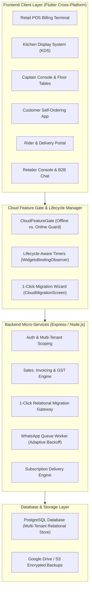

# 📜 System Architecture Upgrades & Changelog (Sept 2026 – Oct 2026)

## 📌 Executive Summary

This document details all major architectural enhancements, cost optimizations, cloud integrations, and migration features implemented in the **RetailPOS ERP & POS Suite** from **September 2026 to October 2, 2026**.

---

## 🏗️ System Architecture Overview

---

## 🗓️ Comprehensive Changelog & Feature Timeline

### 1. 🚀 Bi-Directional 1-Click Store Migration Engine (Oct 2026)
* **Problem Solved**:
  * In shared multi-tenant cloud databases, other merchants already occupy database IDs (`id = 1, 2, 3...`). Simply inserting local offline records causes primary key and foreign key constraint violations.
  * When downloading a store from online to offline, leftover local rows can create orphaned or duplicate data.
* **Architecture Implemented**:
  * **Dynamic Relational ID Translation Engine**:
    * Builds in-memory translation hash maps during ingestion (`userMap`, `taxGroupMap`, `groupMap`, `brandMap`, `itemMap`, `locationMap`, `customerMap`, `supplierMap`, `salesMap`, `poMap`, `grnMap`, `expenseCatMap`, `accountMap`, `bankMap`, `voucherMap`, `floorMap`, `areaMap`, `tableMap`, `kotMap`, `empMap`).
    * Remaps foreign keys (e.g., `sales_items.sale_id = salesMap[oldId]`, `sales_items.item_id = itemMap[oldId]`, `purchase_order_items.po_id = poMap[oldId]`).
    * Re-aligns PostgreSQL auto-increment sequence counters (`setval(max(id))`).
  * **Online-to-Offline Clean Wipe & Restore**:
    * Cleanly cascades and purges local database tables before importing the cloud store snapshot.
  * **Full Table Coverage Across 11 Domains**:
    * `outlets`, `users`, `system_settings`, `branding`, `property_info`, `numbering_settings`, `tax_groups`, `categories`, `brands`, `item_master`, `stock_locations`, `stock_ledger`, `customers`, `suppliers`, `sales_headers`, `sales_items`, `purchase_orders`, `purchase_order_items`, `expenses`, `chart_of_accounts`, `bank_accounts`, `accounting_vouchers`, `voucher_lines`, `floors`, `dining_areas`, `restaurant_tables`, `kot_headers`, `kot_items`, `milk_subscriptions`, `delivery_customers`, `hr_employees`.
  * **Flutter UI Migration Wizard**:
    * Created [`CloudMigrationScreen`](file:///d:/inventorynew/RetailSale%20new/RetailSale/lib/screens/dashboard/cloud_migration_screen.dart) & [`CloudMigrationService`](file:///d:/inventorynew/RetailSale%20new/RetailSale/lib/core/services/cloud_migration_service.dart).
    * Provides 2-way toggle: `Offline ➔ Online Cloud` and `Online Cloud ➔ Offline`.
    * Step-by-step visual tracker and statistical summary cards (Products, Customers, Bills).

---

### 2. 🛡️ Cloud Feature Gating & Server Configuration Routing (Oct 2026)
* **Cloud-Exclusive Modules Guarded**:
  * **B2B Wholesale Marketplace**, **Marketplace Vendor Portal & Catalog Publisher**, **B2B Messaging & Communication Center**, **Customer Self-Ordering App**, **Retailer Console**, **Delivery Rider App**, and **Online Payment Gateways (Razorpay, Stripe, Paytm, UPI)**.
* **Behavior by Mode**:
  * **Online Hosted Mode (`!AppConfig.isLocalServer`)**: Features load and connect directly.
  * **Local Offline Mode (`AppConfig.isLocalServer`)**: Displays the [`CloudFeatureGate`](file:///d:/inventorynew/RetailSale%20new/RetailSale/lib/widgets/cloud_feature_gate.dart) notice explaining self-hosted VPS vs. managed Famalth cloud options.
* **Direct Server Configuration Link**:
  * Replaced generic settings redirects with direct navigation to [`ServerConfigScreen`](file:///d:/inventorynew/RetailSale%20new/RetailSale/lib/screens/dashboard/server_config_screen.dart) for quick cloud server URL configuration and outlet verification.
* **Settings Tab Cloud Notices**:
  * Added cloud notice banners with a 1-click **"Configure Cloud URL"** button inside [`SettingsScreen`](file:///d:/inventorynew/RetailSale%20new/RetailSale/lib/screens/settings/settings_screen.dart) (Payment Gateway & UPI) and [`VendorMarketplaceSettingsScreen`](file:///d:/inventorynew/RetailSale%20new/RetailSale/lib/screens/settings/vendor_marketplace_settings_screen.dart).

---

### 3. ⚡ Infrastructure Cost & API Polling Optimizations (Sept–Oct 2026)
* **WhatsApp Queue Worker Adaptive Backoff**:
  * Replaced aggressive 2-second polling with an **adaptive idle backoff** (sleeps 30 seconds when queue is empty).
  * Added event-driven **`wakeWhatsappQueue()`** trigger so new invoice notifications process instantly with 0 idle database load (97%+ reduction in idle DB queries).
* **Subscription Delivery Job Active Count Pre-Check**:
  * Added global active subscription pre-checks (`milk_subscriptions.count()`) to skip unnecessary multi-tenant iterations when no active recurring deliveries exist for the day.
* **Lifecycle-Aware Screen Timers (`WidgetsBindingObserver`)**:
  * Implemented across [`KdsScreen`](file:///d:/inventorynew/RetailSale%20new/RetailSale/lib/screens/restaurant/kds_screen.dart), [`CaptainDashboardScreen`](file:///d:/inventorynew/RetailSale%20new/RetailSale/lib/screens/restaurant/captain_dashboard_screen.dart), [`RetailerConsoleScreen`](file:///d:/inventorynew/RetailSale%20new/RetailSale/lib/screens/dashboard/retailer_console_screen.dart), and [`MainDashboardScreen`](file:///d:/inventorynew/RetailSale%20new/RetailSale/lib/screens/dashboard/main_dashboard_screen.dart).
  * Automatically **pauses periodic timers and API polling** when the application is minimized, inactive, or running in the background, and resumes only upon returning to foreground.
* **Business Module Polling Gates**:
  * Gated KDS and live dining table polling so retail and grocery businesses never hit restaurant endpoints.

---

### 4. 🎨 Design Standardization & High-Entropy Security (Sept 2026)
* **Design & Color Palette Synchronization**:
  * Aligned design tokens, gradients, and elevation styling across Login, Self-Registration, Billing POS, and Settings screens.
### 5. 🛠️ Backend JavaScript to TypeScript (JS ➔ TS) Migration (Sept–Oct 2026)
* **Full-Stack Type Safety**:
  * Migrated backend from legacy CommonJS JavaScript to strong **TypeScript (`.ts`)** with modular `tsconfig.json` architecture.
  * Converted all controllers (`controllers/public/`, `controllers/auth/`, `controllers/settings/`, `controllers/inventory/`, `controllers/sales/`), route files (`routes/*.routes.ts`), services (`services/*.service.ts`), jobs (`jobs/*.ts`), and utility modules (`utils/*.ts`).
* **Dual Runtime Resilience**:
  * Implemented dual-compatibility exporting (`module.exports = ...; export default ...;`) ensuring seamless support for direct TypeScript execution (`ts-node / tsx`) and bundled CommonJS production execution.
* **Type-Safe Database Schema Modeling**:
  * Integrated Sequelize TypeScript typings across models in `backend/db/models/index.ts` and `backend/models/property/`.

---

### 6. 🛍️ B2B Wholesale Marketplace & Vendor Onboarding (Sept–Oct 2026)
* **Vendor Self-Onboarding & Catalog Publishing**:
  * Merchants can toggle "Become a Marketplace Vendor", configure Minimum Order Value (MOV), operational regional hub, and accepted payment modes.
  * Automated synchronization of active [`item_master`](file:///d:/inventorynew/RetailSale%20new/RetailSale/backend/models/property/itemMaster.model.js) catalog into the regional marketplace.
* **Regional Multi-City Vendor Discovery**:
  * Integrated multi-city filtering (New York, Los Angeles, Chicago, Miami, Dallas, Austin, Seattle, San Francisco, Boston).
  * Category-based trade sector filters: *Grocery & Staples, Dairy & Frozen, Bakery & Confectionery, Beverages, Personal Care, Household & Cleaning, Electronics*.

---

### 7. 💬 B2B Direct Trade Chat & Community Hub (Sept–Oct 2026)
* **Direct Supplier-to-Retailer Messaging**:
  * Integrated private 1-on-1 chat (`/api/community/*`) for instant price quotes, bulk discounts, invoice exchanges, and delivery schedules.
* **Community Trade Groups & Public Channels**:
  * Public trade channels, merchant associations, and broadcast announcement feeds.
* **Enterprise Chat Operations**:
  * Message editing, Delete for Everyone / Delete for Me, Block/Unblock user moderation, channel join/exit, and real-time unread badges.

---

### 8. 📦 1-Click Purchase Order Generation from Vendor Catalog (Sept–Oct 2026)
* **Direct Catalog-to-PO Conversion**:
  * Retailers can browse a vendor's live wholesale catalog in [`B2BMarketplaceScreen`](file:///d:/inventorynew/RetailSale%20new/RetailSale/lib/screens/inventory/b2b_marketplace_screen.dart), add required quantities to cart, and convert directly into a formal [`purchase_orders`](file:///d:/inventorynew/RetailSale%20new/RetailSale/backend/models/property/purchaseOrder.model.js) entry.
* **Automated Vendor Linkage**:
  * Automatically creates/links the vendor in [`supplier_master`](file:///d:/inventorynew/RetailSale%20new/RetailSale/backend/models/property/supplierMaster.model.js) and sets up Goods Receiving Note (GRN) tracking with 1 click.

---

### 9. 🤖 Famalth Lynx AI Assistant & Natural Language PO Generation (Sept–Oct 2026)
* **Natural Language Store Intelligence**:
  * Integrated Lynx AI conversational assistant in [`LynxAssistDialog`](file:///d:/inventorynew/RetailSale%20new/RetailSale/lib/widgets/lynx_assist_dialog.dart) and [`ai_assist.controller.ts`](file:///d:/inventorynew/RetailSale%20new/RetailSale/backend/controllers/ai_assist.controller.ts).
  * Real-time intent detection for revenue analysis, low stock alerts, top-selling items, customer balance lookups, and fast POS voice shortcuts.
* **Direct PO Generation via Natural Language**:
  * Users can converse with Lynx (e.g., *"Order 50 units of Organic Milk 1L from Amul Dairy"*).
  * Lynx parses quantities, matches supplier records, extracts item IDs, and drafts structured purchase order intents directly from chat.
* **Universal Dashboard Search Bar**:
  * Integrated persistent search header in [`MainDashboardScreen`](file:///d:/inventorynew/RetailSale%20new/RetailSale/lib/screens/dashboard/main_dashboard_screen.dart) supporting quick navigation, customer lookup, and Lynx AI query shortcuts.

---

### 10. 📝 Sticky Notes Collaboration System (Sept–Oct 2026)
* **Digital Shift Sticky Notes**:
  * Floating widget in [`StickyNoteWidget`](file:///d:/inventorynew/RetailSale%20new/RetailSale/lib/widgets/sticky_note_widget.dart) and management via [`userNote.controller.ts`](file:///d:/inventorynew/RetailSale%20new/RetailSale/backend/controllers/notes/userNote.controller.ts).
  * Color-coded note cards (Yellow, Green, Blue, Purple, Orange, Pink, Teal).
  * Pinned shift notes, copy/duplicate notes, archive workflows, and recycling trash bin management.
  * User-scoped storage guaranteeing confidentiality between shift cashiers and managers.

---

### 11. 🌍 Global Multi-Currency & Multi-Tax Matrix (Sept–Oct 2026)
* **Multi-Currency Engine**:
  * Configurable currency symbols, ISO codes (USD, EUR, GBP, KES, INR, AED, CAD, AUD), symbol placement (before/after amount), and customizable decimal precision.
  * Centralized formatting via [`CurrencyFormat`](file:///d:/inventorynew/RetailSale%20new/RetailSale/lib/core/utils/currency_format.dart) and [`SystemSetting`](file:///d:/inventorynew/RetailSale%20new/RetailSale/backend/models/property/systemSetting.model.js).
* **Flexible Multi-Tax Matrix (GST, CTL, VAT, CESS, Custom)**:
  * Unified Tax Group system configured via [`taxGroup.controller.ts`](file:///d:/inventorynew/RetailSale%20new/RetailSale/backend/controllers/settings/taxGroup.controller.ts) and [`TaxGroupMaster`](file:///d:/inventorynew/RetailSale%20new/RetailSale/backend/models/property/taxGroupMaster.model.js).
  * Support for Single Flat Taxes (VAT, Sales Tax), Split Destination Taxes (Indian GST: CGST + SGST / IGST), Compound Multi-Tier Taxes (CTL + VAT + CESS), and custom enterprise tax schedules.
  * Automated tax calculation in sales orders, purchase orders, invoices, thermal receipts, and financial tax liability ledgers.

---

## 📁 Key File Map

| File Path | Role / Description |
| :--- | :--- |
| `backend/controllers/public/migration.controller.ts` & `.js` | Bi-directional migration controller with Relational ID Translation & sequence syncing |
| `backend/routes/public.routes.ts` & `.js` | Mounts migration endpoints (`ping`, `export-bundle`, `import-bundle`, `sync-online-to-offline`) |
| `backend/controllers/community.controller.ts` & `.js` | B2B Community chat, group channels, direct merchant messaging |
| `backend/routes/community.routes.ts` & `.js` | Mounts community & chat endpoints (`conversations`, `messages`, `merchants`, `channels`) |
| `backend/services/community.service.ts` & `.js` | Business logic for B2B chat, moderation, and channel routing |
| `backend/controllers/ai_assist.controller.ts` & `.js` | Lynx AI engine handling NLP store queries and chat PO intent drafting |
| `backend/controllers/notes/userNote.controller.ts` & `.js` | Sticky notes controller supporting color codes, pinning, trash & restore |
| `backend/controllers/settings/taxGroup.controller.ts` & `.js` | Multi-Tax group manager for GST, VAT, CTL, CESS & custom taxes |
| `backend/jobs/whatsappQueueJob.ts` & `.service.ts` | WhatsApp queue worker with adaptive backoff & instant wake event |
| `backend/jobs/subscriptionDeliveryJob.ts` | Daily recurring subscription generator with active count pre-check |
| `lib/core/services/cloud_migration_service.dart` | Client-side migration service for export, upload, pull, and configuration switch |
| `lib/screens/dashboard/cloud_migration_screen.dart` | Interactive 1-Click Migration Wizard with bi-directional toggle & live stats |
| `lib/screens/community/community_hub_screen.dart` | B2B Community hub and channel directory |
| `lib/screens/community/chat_conversation_screen.dart` | Real-time direct chat with vendors & retailers |
| `lib/screens/inventory/b2b_marketplace_screen.dart` | B2B Wholesale Marketplace with vendor discovery & direct PO cart |
| `lib/controllers/inventory/marketplace_controller.dart` | Marketplace state management & direct PO generation |
| `lib/widgets/lynx_assist_dialog.dart` | Famalth Lynx AI assistant voice & chat interface |
| `lib/widgets/sticky_note_widget.dart` | Color-coded draggable and pinnable sticky notes widget |
| `lib/widgets/cloud_feature_gate.dart` | Cloud feature gate with direct server config & migration wizard actions |
| `lib/screens/dashboard/server_config_screen.dart` | Dedicated server configuration & migration launcher screen |
| `lib/screens/settings/settings_screen.dart` | Settings screen with cloud banners and 1-Click Migration launcher |
| `Docs/One-Click-Cloud-Migration-Guide.md` | Architectural guide and table mapping reference for migrations |
| `Docs/B2B-Marketplace-And-Community-Guide.md` | Architecture guide for Marketplace, Vendor Onboarding, Chat & POs |
| `Docs/Lynx-AI-StickyNotes-Currency-Tax-Guide.md` | Architecture guide for Lynx AI, Sticky Notes, Multi-Currency & Tax Matrix |
| `Docs/System-Architecture-And-Changelog.md` | Comprehensive system architecture and chronological upgrades changelog |
