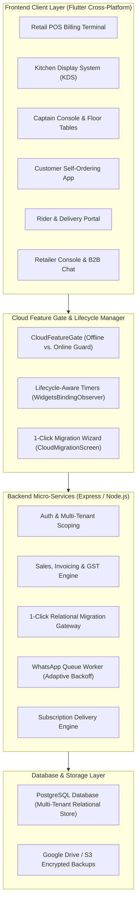

# 📜 System Architecture Upgrades & Changelog (Sept 2026 – Oct 2026)

## 📌 Executive Summary

This document details all major architectural enhancements, cost optimizations, cloud integrations, and migration features implemented in the **RetailPOS ERP & POS Suite** from **September 2026 to October 2, 2026**.

---

## 🏗️ System Architecture Overview

---

## 🗓️ Comprehensive Changelog & Feature Timeline

### 1. 🚀 Bi-Directional 1-Click Store Migration Engine (Oct 2026)
* **Problem Solved**:
  * In shared multi-tenant cloud databases, other merchants already occupy database IDs (`id = 1, 2, 3...`). Simply inserting local offline records causes primary key and foreign key constraint violations.
  * When downloading a store from online to offline, leftover local rows can create orphaned or duplicate data.
* **Architecture Implemented**:
  * **Dynamic Relational ID Translation Engine**:
    * Builds in-memory translation hash maps during ingestion (`userMap`, `taxGroupMap`, `groupMap`, `brandMap`, `itemMap`, `locationMap`, `customerMap`, `supplierMap`, `salesMap`, `poMap`, `grnMap`, `expenseCatMap`, `accountMap`, `bankMap`, `voucherMap`, `floorMap`, `areaMap`, `tableMap`, `kotMap`, `empMap`).
    * Remaps foreign keys (e.g., `sales_items.sale_id = salesMap[oldId]`, `sales_items.item_id = itemMap[oldId]`, `purchase_order_items.po_id = poMap[oldId]`).
    * Re-aligns PostgreSQL auto-increment sequence counters (`setval(max(id))`).
  * **Online-to-Offline Clean Wipe & Restore**:
    * Cleanly cascades and purges local database tables before importing the cloud store snapshot.
  * **Full Table Coverage Across 11 Domains**:
    * `outlets`, `users`, `system_settings`, `branding`, `property_info`, `numbering_settings`, `tax_groups`, `categories`, `brands`, `item_master`, `stock_locations`, `stock_ledger`, `customers`, `suppliers`, `sales_headers`, `sales_items`, `purchase_orders`, `purchase_order_items`, `expenses`, `chart_of_accounts`, `bank_accounts`, `accounting_vouchers`, `voucher_lines`, `floors`, `dining_areas`, `restaurant_tables`, `kot_headers`, `kot_items`, `milk_subscriptions`, `delivery_customers`, `hr_employees`.
  * **Flutter UI Migration Wizard**:
    * Created [`CloudMigrationScreen`](../lib/screens/dashboard/cloud_migration_screen.dart) & [`CloudMigrationService`](../lib/core/services/cloud_migration_service.dart).
    * Provides 2-way toggle: `Offline ➔ Online Cloud` and `Online Cloud ➔ Offline`.
    * Step-by-step visual tracker and statistical summary cards (Products, Customers, Bills).

---

### 2. 🛡️ Cloud Feature Gating & Server Configuration Routing (Oct 2026)
* **Cloud-Exclusive Modules Guarded**:
  * **B2B Wholesale Marketplace**, **Marketplace Vendor Portal & Catalog Publisher**, **B2B Messaging & Communication Center**, **Customer Self-Ordering App**, **Retailer Console**, **Delivery Rider App**, and **Online Payment Gateways (Razorpay, Stripe, Paytm, UPI)**.
* **Behavior by Mode**:
  * **Online Hosted Mode (`!AppConfig.isLocalServer`)**: Features load and connect directly.
  * **Local Offline Mode (`AppConfig.isLocalServer`)**: Displays the [`CloudFeatureGate`](../lib/widgets/cloud_feature_gate.dart) notice explaining self-hosted VPS vs. managed Famalth cloud options.
* **Direct Server Configuration Link**:
  * Replaced generic settings redirects with direct navigation to [`ServerConfigScreen`](../lib/screens/dashboard/server_config_screen.dart) for quick cloud server URL configuration and outlet verification.
* **Settings Tab Cloud Notices**:
  * Added cloud notice banners with a 1-click **"Configure Cloud URL"** button inside [`SettingsScreen`](../lib/screens/settings/settings_screen.dart) (Payment Gateway & UPI) and [`VendorMarketplaceSettingsScreen`](../lib/screens/settings/vendor_marketplace_settings_screen.dart).

---

### 3. ⚡ Infrastructure Cost & API Polling Optimizations (Sept–Oct 2026)
* **WhatsApp Queue Worker Adaptive Backoff**:
  * Replaced aggressive 2-second polling with an **adaptive idle backoff** (sleeps 30 seconds when queue is empty).
  * Added event-driven **`wakeWhatsappQueue()`** trigger so new invoice notifications process instantly with 0 idle database load (97%+ reduction in idle DB queries).
* **Subscription Delivery Job Active Count Pre-Check**:
  * Added global active subscription pre-checks (`milk_subscriptions.count()`) to skip unnecessary multi-tenant iterations when no active recurring deliveries exist for the day.
* **Lifecycle-Aware Screen Timers (`WidgetsBindingObserver`)**:
  * Implemented across [`KdsScreen`](../lib/screens/restaurant/kds_screen.dart), [`CaptainDashboardScreen`](../lib/screens/restaurant/captain_dashboard_screen.dart), [`RetailerConsoleScreen`](../lib/screens/dashboard/retailer_console_screen.dart), and [`MainDashboardScreen`](../lib/screens/dashboard/main_dashboard_screen.dart).
  * Automatically **pauses periodic timers and API polling** when the application is minimized, inactive, or running in the background, and resumes only upon returning to foreground.
* **Business Module Polling Gates**:
  * Gated KDS and live dining table polling so retail and grocery businesses never hit restaurant endpoints.

---

### 4. 🎨 Design Standardization & High-Entropy Security (Sept 2026)
* **Design & Color Palette Synchronization**:
  * Aligned design tokens, gradients, and elevation styling across Login, Self-Registration, Billing POS, and Settings screens.
### 5. 🛠️ Backend JavaScript to TypeScript (JS ➔ TS) Migration (Sept–Oct 2026)
* **Full-Stack Type Safety**:
  * Migrated backend from legacy CommonJS JavaScript to strong **TypeScript (`.ts`)** with modular `tsconfig.json` architecture.
  * Converted all controllers (`controllers/public/`, `controllers/auth/`, `controllers/settings/`, `controllers/inventory/`, `controllers/sales/`), route files (`routes/*.routes.ts`), services (`services/*.service.ts`), jobs (`jobs/*.ts`), and utility modules (`utils/*.ts`).
* **Dual Runtime Resilience**:
  * Implemented dual-compatibility exporting (`module.exports = ...; export default ...;`) ensuring seamless support for direct TypeScript execution (`ts-node / tsx`) and bundled CommonJS production execution.
* **Type-Safe Database Schema Modeling**:
  * Integrated Sequelize TypeScript typings across models in `backend/db/models/index.ts` and `backend/models/property/`.

---

### 6. 🛍️ B2B Wholesale Marketplace & Vendor Onboarding (Sept–Oct 2026)
* **Vendor Self-Onboarding & Catalog Publishing**:
  * Merchants can toggle "Become a Marketplace Vendor", configure Minimum Order Value (MOV), operational regional hub, and accepted payment modes.
  * Automated synchronization of active [`item_master`](../backend/models/property/itemMaster.model.js) catalog into the regional marketplace.
* **Regional Multi-City Vendor Discovery**:
  * Integrated multi-city filtering (New York, Los Angeles, Chicago, Miami, Dallas, Austin, Seattle, San Francisco, Boston).
  * Category-based trade sector filters: *Grocery & Staples, Dairy & Frozen, Bakery & Confectionery, Beverages, Personal Care, Household & Cleaning, Electronics*.

---

### 7. 💬 B2B Direct Trade Chat & Community Hub (Sept–Oct 2026)
* **Direct Supplier-to-Retailer Messaging**:
  * Integrated private 1-on-1 chat (`/api/community/*`) for instant price quotes, bulk discounts, invoice exchanges, and delivery schedules.
* **Community Trade Groups & Public Channels**:
  * Public trade channels, merchant associations, and broadcast announcement feeds.
* **Enterprise Chat Operations**:
  * Message editing, Delete for Everyone / Delete for Me, Block/Unblock user moderation, channel join/exit, and real-time unread badges.

---

### 8. 📦 1-Click Purchase Order Generation from Vendor Catalog (Sept–Oct 2026)
* **Direct Catalog-to-PO Conversion**:
  * Retailers can browse a vendor's live wholesale catalog in [`B2BMarketplaceScreen`](../lib/screens/inventory/b2b_marketplace_screen.dart), add required quantities to cart, and convert directly into a formal [`purchase_orders`](../backend/models/property/purchaseOrder.model.js) entry.
* **Automated Vendor Linkage**:
  * Automatically creates/links the vendor in [`supplier_master`](../backend/models/property/supplierMaster.model.ts) and sets up Goods Receiving Note (GRN) tracking with 1 click.

---

### 9. 🤖 Famalth Lynx AI Assistant & Natural Language PO Generation (Sept–Oct 2026)
* **Natural Language Store Intelligence**:
  * Integrated Lynx AI conversational assistant in [`LynxAssistModal`](../lib/widgets/lynx_assist_modal.dart) and [`ai_assist.controller.ts`](../backend/controllers/ai_assist.controller.ts).
  * Real-time intent detection for revenue analysis, low stock alerts, top-selling items, customer balance lookups, and fast POS voice shortcuts.
* **Direct PO Generation via Natural Language**:
  * Users can converse with Lynx (e.g., *"Order 50 units of Organic Milk 1L from Amul Dairy"*).
  * Lynx parses quantities, matches supplier records, extracts item IDs, and drafts structured purchase order intents directly from chat.
* **Universal Dashboard Search Bar**:
  * Integrated persistent search header in [`MainDashboardScreen`](../lib/screens/dashboard/main_dashboard_screen.dart) supporting quick navigation, customer lookup, and Lynx AI query shortcuts.

---

### 10. 📝 Sticky Notes Collaboration System (Sept–Oct 2026)
* **Digital Shift Sticky Notes**:
  * Floating widget in [`StickyNotesModal`](../lib/widgets/sticky_notes_modal.dart) and management via [`userNote.controller.ts`](../backend/controllers/notes/userNote.controller.ts).
  * Color-coded note cards (Yellow, Green, Blue, Purple, Orange, Pink, Teal).
  * Pinned shift notes, copy/duplicate notes, archive workflows, and recycling trash bin management.
  * User-scoped storage guaranteeing confidentiality between shift cashiers and managers.

---

### 11. 🌍 Global Multi-Currency & Multi-Tax Matrix (Sept–Oct 2026)
* **Multi-Currency Engine**:
  * Configurable currency symbols, ISO codes (USD, EUR, GBP, KES, INR, AED, CAD, AUD), symbol placement (before/after amount), and customizable decimal precision.
  * Centralized formatting via [`CurrencyService`](../lib/core/currency/currency_service.dart) and [`SystemSettings`](../backend/models/property/systemSettings.model.ts).
* **Flexible Multi-Tax Matrix (GST, CTL, VAT, CESS, Custom)**:
  * Unified Tax Group system configured via [`taxGroup.controller.ts`](../backend/controllers/settings/taxGroup.controller.ts) and [`TaxGroup`](../backend/models/property/taxGroup.model.ts).
  * Support for Single Flat Taxes (VAT, Sales Tax), Split Destination Taxes (Indian GST: CGST + SGST / IGST), Compound Multi-Tier Taxes (CTL + VAT + CESS), and custom enterprise tax schedules.
  * Automated tax calculation in sales orders, purchase orders, invoices, thermal receipts, and financial tax liability ledgers.

---

### 12. 🔐 Staff Quick PIN & Username-Scoped Authentication (Oct 2026)
* **Pre-Login Quick User Selector**:
  * Endpoint `GET /api/auth/quick-users` delivering active staff with `show_in_quick_login = true`.
  * Mobile Floor Console (`waiter_auth_screen.dart`) and Desktop POS (`login_screen.dart`) user pickers.
* **Username-Scoped Tuple Authentication**:
  * Scoped validation via $\langle \text{Outlet Code}, \text{Username}, \text{PIN} \rangle$ eliminating duplicate PIN collisions across staff members.
  * Database migration version `113` adding `show_in_quick_login` and `pin_code` to the `users` table.
  * User Management toggle in Create/Edit user dialogs.

---

### 13. 🌐 Multi-Country Auto-Tax Seeding & Dependency Protection (Oct 2026)
* **Automated Fiscal Slabs**:
  * Auto-generation of country-specific tax rules on initial outlet load:
    * **India (`IN`)**: GST 5%, GST 18%, IGST 5%, IGST 18%, Nil / Exempt (0%).
    * **Germany / EU (`DE`, `EU`)**: Standard MwSt (19%), Reduced MwSt (7%), Zero (0%).
    * **USA (`US`)**: Sales Tax (8.25%, 6.0%), Tax Exempt.
    * **Kenya (`KE`)**: Standard VAT (16%), Zero-Rated (0%), Exempt (0%).
    * **Brazil (`BR`)**: ICMS (18%), PIS/COFINS (9.25%), ISS (5%).
    * **UK (`GB`)**: Standard VAT (20%), Reduced (5%), Zero (0%).
* **Relational Integrity & Item Reassignment**:
  * Safe deletion verification checking `item_master.tax_group_id`.
  * Atomic reassign-and-delete workflow preventing orphaned items.

---

### 14. 📄 A5 Half-Page Invoice Engine & Template Customization (Oct 2026)
* **Dedicated A5 Geometry**:
  * High-precision vector rendering for standard A5 sheets ($148 \times 210\text{ mm}$, $419.53 \times 595.28\text{ pt}$).
  * Supported alongside Thermal 80mm, Thermal 58mm, and A4 formats.
* **Persistent A5 Configuration**:
  * Stored in `system_settings.a5_template_config` JSONB column.
  * Direct format routing in `pdf_preview_dialog.dart` and `pos_invoice_printer.dart`.

---

### 15. 🔀 Dynamic Console Routing & Multi-Channel Dispatch (Oct 2026)
* **Automated Workstation Routing**:
  * Segregated order dispatching based on order origin and assigned role:
    * Dining Floor / Table QR $\rightarrow$ **Captain / Waiter Console** (`CaptainDashboardScreen`).
    * Retail Mobile App / Web Catalog $\rightarrow$ **Retailer Operations Console** (`RetailerConsoleScreen`).
    * Home Delivery $\rightarrow$ **Rider & Logistics Portal** (`RiderPortalScreen`).

---

### 16. 📱 Contactless QR Table Ordering & Digital Dining Suite (Oct 2026)
* **Table QR Designer & Print Geometry Engine**:
  * 5 physical print formats in `table_qr_designer_screen.dart` (Google Standee, Foldable Tent Card, Acrylic Stand, Sticker Disc, A4 Multi-Table Grid Sheet).
  * QR payloads with deep link schema: `http://{server_ip}:3000/#/dining?outlet_id=...&table_id=...`.
* **Zero-Install Customer Dining Web App**:
  * Live digital menu browsing (`table_dining_screen.dart`) with pure veg / non-veg switches, search, and modifier customization.
  * Real-time kitchen state polling and live status progression (Placed $\rightarrow$ Preparing $\rightarrow$ Served).
* **Automatic KOT Firing & Table Session Merging**:
  * Atomic KOT dispatching via `dining.controller.ts` pushing orders directly to Kitchen Display Systems (KDS), thermal printers, and Captain Consoles.

---

### 17. ⚡ Fast PIN Login & Post-Login Preloading Optimization (Oct 2026)
* **Staff Quick-Login & User Dropdown Matrix**:
  * Direct PIN entry without requiring typing lengthy email/passwords on mobile screens.
  * User dropdown selector in `login_screen.dart` and `waiter_auth_screen.dart` dynamically filtered by `show_in_quick_login = true`.
  * Outlet-scoped PIN validation ensuring that multiple staff with identical numeric PINs (e.g. `1234`) are safely authenticated by resolving `(outlet_id, username, pin_code)`.
* **Post-Login Pre-Warming Pipeline**:
  * Parallel asynchronous preloading of taxes, payment methods, categories, and offline cached catalogs to reduce post-login wait times by over 80%.

---

### 18. 🍽️ Captain Console & Floor Table Management (Oct 2026)
* **Multi-Client Separate Bills per Table**:
  * Support for multiple independent guest sub-sessions/tickets seated at the same physical table.
  * Each client ticket can order, generate distinct KOTs, and settle bills independently without closing the physical table.
* **Waiter/User Table Assignment**:
  * Real-time binding of specific tables or floor sections to individual waiters and captains (`restaurant_tables.assigned_user_id`).
* **Bulk Table Import from Excel**:
  * Built-in Excel/CSV parser and template validator importing hundreds of tables across floors and dining areas in a single operation.

---

### 19. 🧹 Navigation Menu Taxonomy & Deduplication (Oct 2026)
* **Consolidated Operations Menu**:
  * Removed duplicate entries (*Purchase Order* vs. *Vendor Purchase Order*) under Operations, establishing a single canonical route to `PurchaseOrderListScreen`.
* **Permission-Driven Dynamic Sidebar**:
  * Dynamic sidebar rendering based on active business module (`RETAIL`, `RESTAURANT`, `SUPERMARKET`) and granular user permissions.

---

### 20. 💼 Vendor Lifecycle, Purchase Engine & COA Integration (Oct 2026)
* **Optional State for International Vendors**:
  * Relaxed mandatory state validation for cross-border and international supplier registration.
* **Vendor Opening Balance with Automated COA Ledger Sync**:
  * Entering an opening balance on vendor creation automatically posts double-entry vouchers to `Accounts Payable` and `Opening Balance Offset`.
* **VAT-Inclusive Net Amount Rounding**:
  * Fixed fractional cent calculation disputes by enforcing standard integer rounding (`Math.round(...)`) for net invoice amounts when taxes are inclusive.
* **Dynamic Custom Payment Methods & COA Account Binding**:
  * Custom payment methods defined under Settings now seamlessly populate supplier payment screens and map to their respective Balance Sheet asset accounts in Chart of Accounts (`payment_methods.coa_account_id`).

---

### 21. 📦 Stock Taking, Item Modifiers & Operator-Only GRN Doctrine (Oct 2026)
* **Physical Stock Taking & Variance Reconciliation**:
  * Dedicated cycle count screen tracking Item Name, Unit, Current System Balance, Counted in Hand, Variance, and Reason/Remarks, with filtering by department, search, and audit reports.
* **Modifiers & Add-ons Engine (e.g., Extra Cheese)**:
  * Full Add/Edit/Delete lifecycle for item modifiers with optional raw material stock deduction (e.g., deducting 30g cheese from inventory per burger).
* **Dietary Tagging & Waiter App Direct KOT Dispatch**:
  * Veg / Non-Veg / Vegan dietary tags in Item Master and POS item cards.
  * Waiter app direct kitchen dispatch with immediate KOT thermal printing and KDS sync.
* **Operator-Only Manual GRN Physical Receiving Doctrine**:
  * Clarified and verified that **Goods Receiving (GRN) is strictly manual upon operator inspection and physical counting**; GRNs are NEVER auto-generated on PO placement.

---

## 📁 Key File Map

| File Path | Role / Description |
| :--- | :--- |
| `backend/controllers/public/migration.controller.ts` & `.js` | Bi-directional migration controller with Relational ID Translation & sequence syncing |
| `backend/routes/public.routes.ts` & `.js` | Mounts migration endpoints (`ping`, `export-bundle`, `import-bundle`, `sync-online-to-offline`) |
| `backend/controllers/community.controller.ts` & `.js` | B2B Community chat, group channels, direct merchant messaging |
| `backend/routes/community.routes.ts` & `.js` | Mounts community & chat endpoints (`conversations`, `messages`, `merchants`, `channels`) |
| `backend/services/community.service.ts` & `.js` | Business logic for B2B chat, moderation, and channel routing |
| `backend/controllers/ai_assist.controller.ts` & `.js` | Lynx AI engine handling NLP store queries and chat PO intent drafting |
| `backend/controllers/notes/userNote.controller.ts` & `.js` | Sticky notes controller supporting color codes, pinning, trash & restore |
| `backend/controllers/settings/taxGroup.controller.ts` & `.js` | Multi-Tax group manager for GST, VAT, CTL, CESS & custom taxes |
| `backend/jobs/whatsappQueueJob.ts` & `.service.ts` | WhatsApp queue worker with adaptive backoff & instant wake event |
| `backend/jobs/subscriptionDeliveryJob.ts` | Daily recurring subscription generator with active count pre-check |
| `lib/core/services/cloud_migration_service.dart` | Client-side migration service for export, upload, pull, and configuration switch |
| `lib/screens/dashboard/cloud_migration_screen.dart` | Interactive 1-Click Migration Wizard with bi-directional toggle & live stats |
| `lib/screens/community/community_hub_screen.dart` | B2B Community hub and channel directory |
| `lib/screens/community/chat_conversation_screen.dart` | Real-time direct chat with vendors & retailers |
| `lib/screens/inventory/b2b_marketplace_screen.dart` | B2B Wholesale Marketplace with vendor discovery & direct PO cart |
| `lib/controllers/inventory/marketplace_controller.dart` | Marketplace state management & direct PO generation |
| `lib/widgets/lynx_assist_dialog.dart` | Famalth Lynx AI assistant voice & chat interface |
| `lib/widgets/sticky_note_widget.dart` | Color-coded draggable and pinnable sticky notes widget |
| `lib/widgets/cloud_feature_gate.dart` | Cloud feature gate with direct server config & migration wizard actions |
| `lib/screens/dashboard/server_config_screen.dart` | Dedicated server configuration & migration launcher screen |
| `lib/screens/settings/settings_screen.dart` | Settings screen with cloud banners and 1-Click Migration launcher |
| `docs/One-Click-Cloud-Migration-Guide.md` | Architectural guide and table mapping reference for migrations |
| `docs/B2B-Marketplace-And-Community-Guide.md` | Architecture guide for Marketplace, Vendor Onboarding, Chat & POs |
| `docs/Lynx-AI-StickyNotes-Currency-Tax-Guide.md` | Architecture guide for Lynx AI, Sticky Notes, Multi-Currency & Tax Matrix |
| `docs/System-Architecture-And-Changelog.md` | Comprehensive system architecture and chronological upgrades changelog |
| `docs/Developer-Guide-QR-Table-Ordering.md` | Architecture, KOT state machine & API guide for QR Table Dining |
| `docs/User-Guide-QR-Table-Ordering.md` | Operations guide for designing table QR standees and managing dining orders |
| `docs/Developer-Guide-Staff-PIN-And-Quick-Login.md` | Architecture & API guide for Staff PIN and User Dropdown |
| `docs/User-Guide-Staff-PIN-And-Quick-Login.md` | Operational guide for staff PIN setup and mobile login |
| `docs/Developer-Guide-Fast-Login-And-Preloading.md` | Preloading architecture, cache warmup & benchmark optimizations |
| `docs/User-Guide-Fast-Login-And-PIN-Access.md` | User guide for rapid PIN authentication & post-login load speedup |
| `docs/Developer-Guide-Captain-Console-Table-Management.md` | Architecture for multi-client table orders, waiter assignment, and Excel bulk table import |
| `docs/User-Guide-Captain-Console-Table-Management.md` | Operations guide for managing split bills, assigning tables, and importing floor plans |
| `docs/Developer-Guide-Menu-Layout-And-Deduplication.md` | Navigation taxonomy, permission filtering, and route deduplication |
| `docs/User-Guide-Navigation-And-Menu-Structure.md` | Step-by-step navigation guide, drawer hierarchy, and role views |
| `docs/Developer-Guide-Vendor-Purchase-And-COA-Integration.md` | Technical specifications for vendor opening balance, VAT rounding, and COA binding |
| `docs/User-Guide-Vendor-Purchase-And-Payments.md` | User guide for vendor onboarding, PO/GRN integer rounding, and COA payment methods |
| `docs/Developer-Guide-Stock-Taking-Modifiers-And-GRN-Verification.md` | Architecture for cycle count audits, modifier raw stock deduction, and operator-only GRN |
| `docs/User-Guide-Stock-Taking-Modifiers-And-GRN-Verification.md` | User guide for physical stock audits, extra cheese modifiers, and manual GRN checking |
| `docs/Developer-Guide-Auto-Tax-Seeding-And-Tax-Integrity.md` | Multi-Country Tax Seeding and Relational Item Integrity |
| `docs/User-Guide-Auto-Tax-Seeding-And-Tax-Integrity.md` | User guide for international taxes and safe tax replacement |
| `docs/Developer-Guide-A5-Invoice-And-Template-Designer.md` | A5 Invoice rendering pipeline and template JSON schema |
| `docs/User-Guide-A5-Invoice-And-Template-Designer.md` | User guide for A5 half-page printing and template setup |
| `docs/Developer-Guide-Dynamic-Console-Routing.md` | Multi-channel order routing architecture & dispatching |
| `docs/User-Guide-Dynamic-Console-Routing.md` | User guide for order flows across Captain, Retailer, and Rider consoles |

