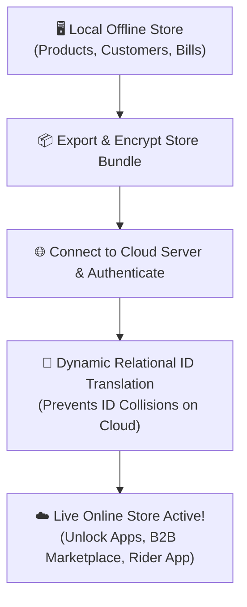
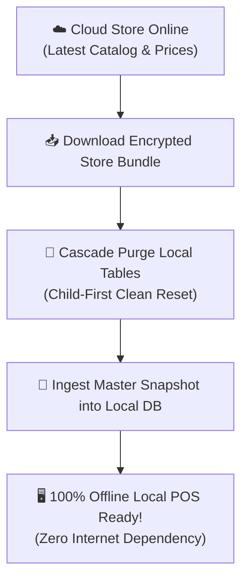

# 🚀 User Guide: 1-Click Store Cloud Migration

This guide explains how to move your store data between a **Local Offline Computer** and the **Online Cloud Server** with a single click, with zero coding required.

---

## 🎯 What is 1-Click Migration?

- **Offline ➔ Online (Move to Cloud)**: When you are ready to access your store from anywhere, use mobile apps (Rider App, Customer App), connect to the B2B Marketplace, and access multi-device cloud sync.
- **Online ➔ Offline (Download to Local)**: When you want to take a complete copy of your cloud store to run locally on your shop computer without depending on an active internet connection.

---

## 📍 How to Open the Migration Wizard

You can access the Migration Screen in three easy ways:
1. **From Settings**: Go to **Settings ⚙️ ➔ Data & Security** tab ➔ Click **"1-Click Cloud Migration"**.
2. **From Server Config**: Go to **Server Config 🌐** ➔ Click **"🚀 Launch 1-Click Migration Wizard"**.
3. **From Cloud Feature Notice**: If you are in offline mode and try to open Marketplace or B2B Chat, click the **"Migrate Store to Cloud"** button on the screen.

---

## 💻 Method 1: Moving from Local Offline to Online Cloud

Follow these simple steps when switching your shop to the Cloud:

### Step-by-step Instructions:
1. Open the **1-Click Cloud Migration** screen.
2. Select the **"Offline ➔ Online Cloud"** tab at the top.
3. Review your **Local Store Data Summary** (the screen shows how many Products, Customers, Bills, and Settings will be moved).
4. Enter your **Cloud Server URL** (e.g., `https://yourstore.onrender.com` or your company cloud link).
5. Enter your Cloud **Admin Username & Password**.
6. Click the **"Test Connection"** button to ensure the cloud server is reachable.
7. Click the green **"Start 1-Click Cloud Migration"** button.
8. Watch the progress bar as the system safely uploads your store:
   - ✅ Packaging Local Catalog & Customers
   - ✅ Transferring Sales & Purchase History
   - ✅ Syncing Floor Tables & Room Settings
   - ✅ Verifying Cloud Records
9. When finished, a success message will appear. Your app will automatically switch to Cloud mode!

---

## 🌐 Method 2: Downloading from Online Cloud to Local Offline

Follow these steps when you want to run your Cloud store on a local shop computer for fast, internet-free offline billing:

### Step-by-step Instructions:
1. Open the **1-Click Cloud Migration** screen.
2. Select the **"Online Cloud ➔ Offline"** tab at the top.
3. Enter your **Cloud Server URL** and your Cloud **Admin Credentials**.
4. Select your **Target Outlet Name**.
5. > [!WARNING]
   > Downloading from Cloud to Local will replace the existing local store data with the fresh cloud snapshot. Make sure any previous offline bills are already uploaded.
6. Click the green **"Pull Data & Set as Offline Local"** button.
7. The system will download your latest cloud store items, stock balances, customers, and pricing onto your local computer.
8. Once complete, you can disconnect from the internet and continue billing offline smoothly.

---

## 📋 What Gets Migrated Automatically?

You don't need to configure anything manually. The migration engine automatically transfers:

| Data Category | What is Included |
| :--- | :--- |
| **Store Setup** | Store name, logo, phone, address, print header/footer, invoice numbering rules |
| **Inventory & Items** | Product names, barcodes, categories, brands, selling price, wholesale price, tax rates, batch numbers, stock balances |
| **Customers & CRM** | Customer names, phone numbers, addresses, credit balances, loyalty points |
| **Suppliers & Vendors** | Vendor contact directory, pending credit ledgers, purchase history |
| **Sales & Bills** | Past counter sales, invoice numbers, discounts, payment modes (Cash, Card, UPI) |
| **Accounting** | Double-entry journal vouchers, Chart of Accounts, Cash/Bank ledgers, expense entries |
| **Restaurant & Dining** | Floors, dining areas, table numbers, active KOT tickets (for restaurants) |
| **Daily Deliveries** | Recurring milk/newspaper delivery customer lists & schedules |

---

## ❓ Frequently Asked Questions (FAQ)

**Q: Will my existing bill numbers or invoice series get messed up?**  
*A: No. The system copies your exact invoice prefix, current sequence count, and past bills safely without any gaps.*

**Q: What happens if the internet drops while migrating to cloud?**  
*A: The system uses a secure bundle transfer. If the connection drops before completion, no corrupted data is saved on the cloud. You can simply click "Start Migration" again when your connection resumes.*

**Q: Can multiple cashier counters use the cloud once migrated?**  
*A: Yes! Once your store is on the cloud, you can connect multiple Windows PCs, Android tablets, or web browsers simultaneously to the same cloud URL.*
