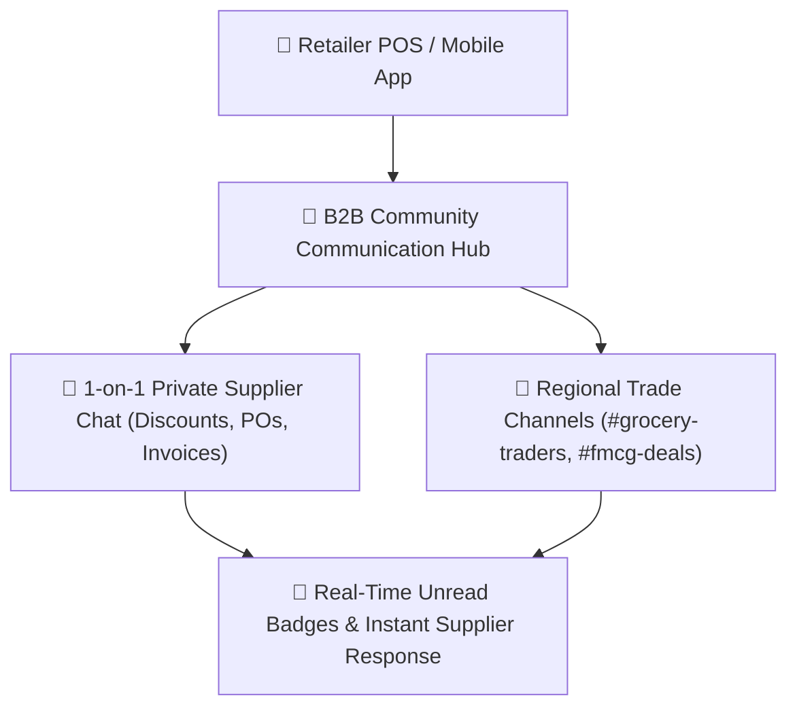

# 💬 User Guide: B2B Community Hub & Direct Trade Chat

This guide explains how to use the built-in **B2B Chat & Community Hub** to communicate directly with wholesale suppliers, negotiate pricing, share invoices, join regional trade channels, and manage messages.

---

## 📱 What is the B2B Community Hub?

Instead of relying on personal WhatsApp chats or phone calls where order records get lost, the **B2B Community Hub** is an integrated messaging system built directly inside your POS:
- **Direct 1-on-1 Vendor Chat**: Message suppliers privately, negotiate bulk discounts, and track delivery updates.
- **Trade Channels**: Join public merchant discussion rooms for your region or industry.
- **PO & Invoice Context**: Send messages linked directly to your Purchase Orders or Bills.

---

## 🚀 How to Access B2B Chat

1. Click on **"Community Hub"** or **"B2B Chat 💬"** from the main sidebar or dashboard quick links.
2. You can also start a chat directly from any vendor card inside the **B2B Marketplace** by clicking **"Message Supplier"**.

---

## 💬 1. Starting a 1-on-1 Chat with a Supplier

### Steps:
1. Inside Community Hub, click the **"Chats"** tab.
2. Click the **"+ New Chat"** button or select any merchant from the **"Verified Merchants"** list.
3. Type your message in the chat bar at the bottom.
4. Press **Enter** or click the **Send** button.
5. When the supplier replies, an unread notification badge will appear on your Community icon.

---

## 📢 2. Joining Regional Trade Channels

Trade channels are group discussion rooms where shop owners and distributors in your area share market news, surplus stock deals, and wholesale announcements.

### How to Join a Channel:
1. In the Community Hub, click the **"Channels & Groups"** tab.
2. Browse available public channels (e.g., `#new-york-grocery-traders`, `#bakery-distributors-hub`, `#fmcg-bulk-deals`).
3. Click **"Join Channel"**.
4. You can now read announcements, ask for emergency stock availability from fellow retailers, or post surplus deals.
5. To leave a channel at any time, click the options menu (`...`) at the top right of the chat and select **"Exit Channel"**.

---

## 🛠️ 3. Managing Messages (Edit, Delete & Moderation)

You have full control over your chat messages:

### A. Editing a Sent Message
1. Hover or long-press on a message you sent.
2. Click the **Edit ✏️** icon.
3. Update your text or quantity and click **Save**. The message will display an `(edited)` indicator.

### B. Deleting Messages
1. Hover or long-press on any message.
2. Click the **Delete 🗑️** icon.
3. Choose one of two options:
   - **Delete for Everyone**: Permanently removes the message for you and the other party (only available on your own messages).
   - **Delete for Me**: Hides the message from your screen while keeping it visible for the other person.

### C. Blocking Spam or Unverified Merchants
If someone sends unwanted spam or solicitations:
1. Open the conversation with that merchant.
2. Click the **Options Menu (`⋮`)** in the top right corner.
3. Select **"Block Merchant"**.
4. Blocked merchants cannot message you or see your online status.
5. To unblock later, go to **Settings ➔ Blocked Merchants** and click **Unblock**.

---

## 🔒 Privacy & Data Safety

- Your direct messages are private between your store and the vendor.
- Messages are safely stored on the cloud server and backed up with your daily store data.
