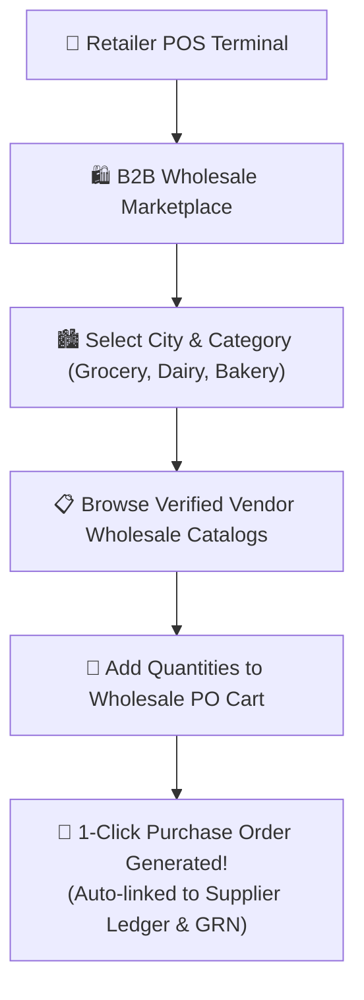
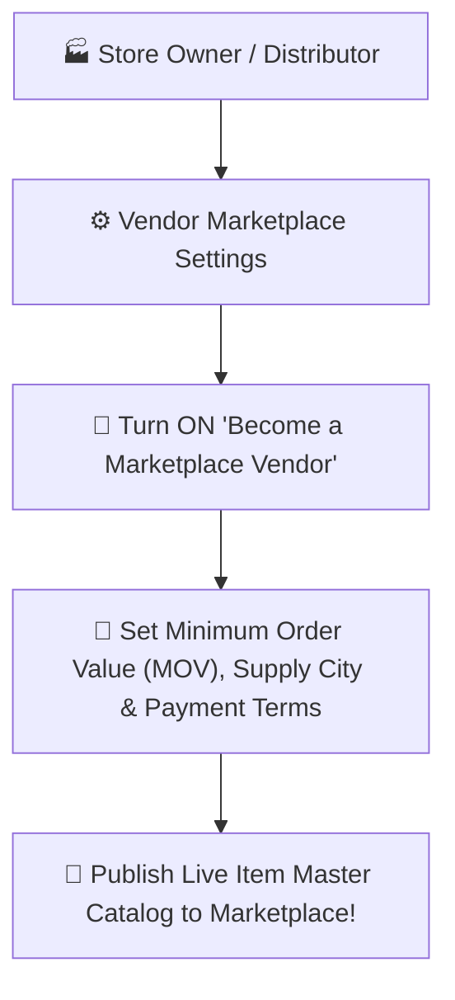

# 🛍️ User Guide: B2B Wholesale Marketplace & Vendor Portal

This guide explains how to buy inventory at wholesale prices directly from verified suppliers, convert catalog items into Purchase Orders with 1 click, and register your store as a wholesale vendor.

---

## 🏬 What is the B2B Marketplace?

The **B2B Marketplace** connects your store with verified wholesale distributors, manufacturers, and local suppliers:
- **For Shopkeepers & Retailers**: Find goods at wholesale prices, compare rates, and create Purchase Orders instantly without typing items manually.
- **For Wholesale Suppliers**: List your product catalog to get bulk orders from other retailers in your city or region.

---

## 🛒 Part 1: How to Buy Wholesale Stock (For Retailers)

### 1. Opening the Marketplace
1. On the left sidebar or top dashboard, click **"B2B Marketplace"** (or go to **Inventory ➔ B2B Wholesale Marketplace**).
2. The screen displays available wholesale suppliers in your region.

### 2. Filtering by City & Product Category
- **City Selector**: Choose your supply city (e.g., New York, Los Angeles, Chicago, Miami, Dallas, Austin, Seattle, San Francisco, Boston, or your local regional hub).
- **Category Tabs**: Filter by trade sectors:
  - 🍞 *Grocery & Staples*
  - 🥛 *Dairy & Frozen*
  - 🥐 *Bakery & Sweets*
  - 🥤 *Beverages*
  - 🧼 *Household & Cleaning*
  - 📱 *Electronics*

### 3. Browsing Vendor Catalogs
- Click on any vendor card to view their complete wholesale price list.
- Each vendor card shows:
  - **Vendor Name & Verification Badge** (Blue checkmark for verified suppliers)
  - **Minimum Order Value (MOV)** (e.g., *Min Order: $200.00*)
  - **Contact & WhatsApp Quick Links**
  - **Product List with Wholesale Pricing**

### 4. 1-Click Purchase Order Generation
1. In the vendor's catalog, enter the desired quantity for each item (e.g., `50` units of Milk, `20` bags of Rice).
2. Look at the bottom floating summary bar showing total quantity and total cost.
3. Click the **"Create Purchase Order (PO)"** button.
4. The system automatically:
   - ✅ Generates a formal **Purchase Order** in your inventory module.
   - ✅ Links the supplier to your vendor directory with sub-ledger balance tracking.
5. **Physical Receiving (Manual Only)**: When the delivery truck arrives, your warehouse receiver must open **Purchases ➔ Goods Receiving (GRN)**, physically count and verify the delivered boxes, and click **Save & Receive Stock** to add inventory to your live shop stock! *(GRNs are never created automatically)*.

---

## 🏭 Part 2: How to Become a Wholesale Vendor (For Suppliers)

If you manufacture goods, distribute wholesale products, or want other shop owners to buy from you in bulk:

### Step-by-step Setup:
1. Open **Settings ⚙️ ➔ Vendor Marketplace Settings** (or click **"Become a Vendor"** in the Marketplace screen).
2. Turn **ON** the toggle switch: **"Enable Wholesale Marketplace Vendor Profile"**.
3. Fill in your wholesale business details:
   - **Business Name**: Your trading or wholesale company name.
   - **Operating City / Regional Hub**: The city where you can supply orders.
   - **Minimum Order Value (MOV)**: The smallest bulk order amount you accept (e.g., `$100.00` or `₹5,000`).
   - **Accepted Payment Methods**: Check *Cash on Delivery (COD)*, *Credit Terms (7/15/30 Days)*, or *Bank Transfer / UPI*.
   - **Support Phone / WhatsApp**: Number where retailers can reach you.
4. Click **"Save & Publish Catalog to Marketplace"**.
5. Your active store inventory items with wholesale prices will now automatically appear for other shop owners in the B2B Marketplace!

---

## 💡 Pro Tips for Retailers & Vendors

> [!TIP]
> **Automatic Supplier Creation**: When you generate a PO from a vendor's catalog for the first time, our system automatically creates a supplier ledger account for them. You never have to manually enter their tax ID or contact details.

> [!TIP]
> **Instant Price Negotiation**: You can click the **"Chat with Vendor"** button right next to any product list to open a direct private message thread and ask for volume discounts!
