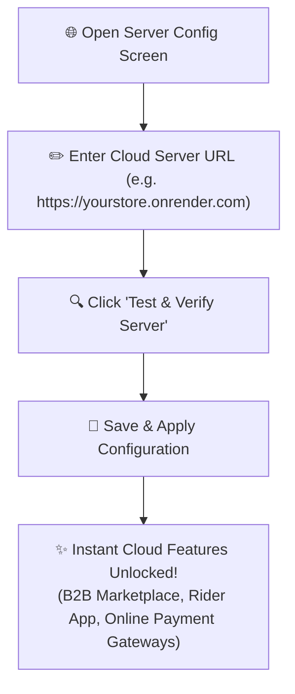

# ☁️ User Guide: Cloud Features & Server Configuration

This guide explains the difference between **Local Offline Mode** and **Online Cloud Mode**, which features are unlocked on Cloud, and how to configure your **Cloud Server URL**.

---

## 🧭 Offline Mode vs. Online Cloud Mode

Our ERP & POS system gives you the freedom to choose how you run your business:

| Capability | 💻 Local Offline Mode (Standalone PC) | 🌐 Online Cloud Hosted Mode |
| :--- | :---: | :---: |
| **High-Speed Counter Billing** | ✅ Yes (Superfast, no internet needed) | ✅ Yes |
| **Barcode Scanning & Receipt Printing**| ✅ Yes | ✅ Yes |
| **Inventory & Stock Tracking** | ✅ Yes | ✅ Yes |
| **Double-Entry Accounting & Daybook** | ✅ Yes | ✅ Yes |
| **Multi-Counter LAN Sync** | ✅ Yes (Within shop Wi-Fi / LAN) | ✅ Yes |
| **Access POS from Anywhere (Mobile / Web)** | ❌ Local shop only | ✅ Yes (Any phone, tablet, laptop) |
| **B2B Wholesale Marketplace** | 🔒 Cloud required | ✅ Unlocked |
| **B2B Direct Vendor Chat** | 🔒 Cloud required | ✅ Unlocked |
| **Delivery Rider App (`main_rider.dart`)** | 🔒 Cloud required | ✅ Unlocked |
| **Customer Self-Ordering App (`main_customer.dart`)** | 🔒 Cloud required | ✅ Unlocked |
| **Online Payment Gateways (Razorpay, Stripe, UPI)** | 🔒 Cloud required | ✅ Unlocked |
| **Automated Google Drive Cloud Backups** | 🔒 Cloud required | ✅ Unlocked |

---

## 🛡️ What is the Cloud Feature Gate?

When running in **Local Offline Mode**, if you click on a cloud-only feature (like B2B Marketplace, Rider Portal, or Online Payment Gateways), a friendly **Cloud Feature Notice** will appear:

```
+--------------------------------------------------------------------+
|  ☁️ Cloud Feature Notice                                           |
|                                                                    |
|  This feature (B2B Marketplace & Online Delivery) is available     |
|  when your store is connected to an Online Cloud Server.           |
|                                                                    |
|  [ 🌐 Configure Cloud Server URL ]    [ 🚀 1-Click Migration Wizard ] |
+--------------------------------------------------------------------+
```

You have two simple options:
1. **Configure Cloud Server URL**: If you or your organization already has a cloud server hosted on Render or your VPS, enter its address.
2. **1-Click Migration Wizard**: If you want to transfer all your local shop items, bills, and customers to the cloud automatically, click this button!

---

## 🌐 How to Configure Your Server URL

If your technical manager or Famalth support team provided you with a Cloud Server URL:



### Step-by-step Setup:
1. Go to the top app bar or sidebar and click **Server Config 🌐** (or go to **Settings ⚙️ ➔ Server Configuration**).
2. Look at the **Backend Server URL** field:
   - For **Local Offline**: `http://127.0.0.1:3000` (or your local cashier PC IP like `http://192.168.1.100:3000`).
   - For **Online Cloud**: `https://your-app-name.onrender.com` (or `https://api.yourcustomdomain.com`).
3. Click the **"Test Connection"** button.
   - 🟢 If reachable: Shows *Connected (v1.0.0, PostgreSQL Cloud Online)*.
   - 🔴 If unreachable: Check your internet connection or verify the URL spelling.
4. Click **"Save Server Configuration"**.
5. The application will immediately connect to your cloud server and unlock all cloud features!

---

## ❓ Common Questions

**Q: If my internet goes down while on Cloud mode, can I still bill customers?**  
*A: Yes! You can switch to Local mode using the **1-Click Migration / Offline Download** feature so your billing never stops during internet outages.*

**Q: How do my delivery drivers log in to the Rider App?**  
*A: Once your store is on Cloud, your delivery riders open the Rider App on their Android or iPhone, enter your Cloud Server URL, and log in with their driver phone number.*
