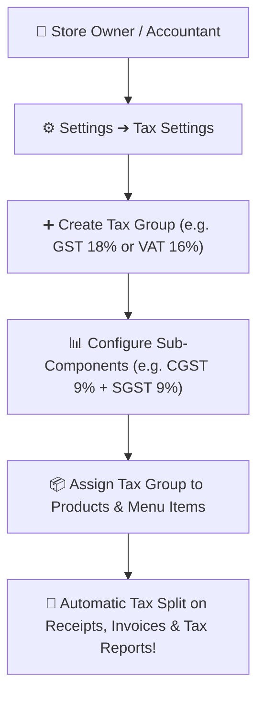

# 🌍 User Guide: Currency & Multi-Tax Setup (GST, VAT, CTL, CESS)

This guide explains how to set your store's **Currency** (USD, INR, EUR, GBP, KES, AED, etc.) and configure **Tax Rules** (Flat VAT, Indian GST, Compound Taxes, CTL, CESS, or Custom Taxes) without any accounting complexity.

---

## 💱 Part 1: Setting Up Your Store Currency

Whether you operate in the USA, India, UK, Europe, Kenya, UAE, or anywhere worldwide, you can customize how money and prices are displayed:

```
[ Step 1: Open Settings ⚙️ ➔ Property Configuration ]
                         ⬇
[ Step 2: Choose Currency Symbol & ISO Code ]
                         ⬇
[ Step 3: Choose Symbol Position & Decimal Places ]
                         ⬇
[ Step 4: Click 'Save Changes' ➔ Applied Everywhere! ]
```

### Step-by-step Setup:
1. Go to **Settings ⚙️ ➔ Property Configuration** tab.
2. Scroll to the **Currency & Formatting** section.
3. Configure the following fields:
   - **Currency Code**: Select your 3-letter currency code (e.g., `USD`, `INR`, `EUR`, `GBP`, `KES`, `AED`, `CAD`, `AUD`).
   - **Currency Symbol**: Enter your symbol (e.g., `$`, `₹`, `€`, `£`, `KSh`, `AED`).
   - **Symbol Position**:
     - *Before Amount*: `$100.00` / `₹100.00`
     - *After Amount*: `100.00 €` / `100.00 KSh`
   - **Decimal Places**: Set to `2` (standard), `0` (for whole numbers), or `3` (for fuel/grain wholesale).
4. Click **"Save Settings"**.
5. All bills, invoices, receipts, and reports will instantly format with your chosen currency!

---

## 🏛️ Part 2: Setting Up Taxes (VAT, GST, CTL, CESS)

Every country and province has different tax laws. Our system supports all major global tax models:

1. **Single Flat Tax (Standard VAT / Sales Tax)**: e.g., VAT 5%, VAT 16%, Sales Tax 8.25%.
2. **Dual Split Tax (Indian GST)**: e.g., GST 18% automatically split into CGST 9% + SGST 9% (or IGST 18% for interstate).
3. **Compound Multi-Tier Tax**: e.g., Commercial Tax (CTL) + VAT + Sanitation CESS.
4. **Custom Zero-Tax / Exempted**: For raw vegetables, books, or tax-free medical supplies.

---

## 🛠️ How to Create a New Tax Group



### Scenario A: Creating a Simple VAT Tax (e.g., VAT 16%)
1. Open **Settings ⚙️ ➔ Tax Settings**.
2. Click **"+ Add Tax Group"**.
3. **Tax Group Name**: `VAT 16%`
4. **Total Tax Rate**: `16.00%`
5. Click **"Save Tax Group"**.

---

### Scenario B: Creating an Indian GST Group (e.g., GST 18%)
1. In **Tax Settings**, click **"+ Add Tax Group"**.
2. **Tax Group Name**: `GST 18%`
3. **Total Tax Rate**: `18.00%`
4. Click **"+ Add Sub-Component"**:
   - Component 1: `CGST` ➔ Rate: `9.00%`
   - Component 2: `SGST` ➔ Rate: `9.00%`
5. Click **"Save Tax Group"**.
6. When billing customers, the thermal receipt and A4 invoice will clearly print the CGST and SGST breakdown for compliance.

---

### Scenario C: Creating a Multi-Tier Tax with CESS (e.g., CTL + VAT + CESS)
1. Click **"+ Add Tax Group"**.
2. **Tax Group Name**: `Luxury Beverages (CTL + VAT + CESS)`
3. **Total Tax Rate**: `28.00%`
4. Add Sub-Components:
   - `Commercial Tax (CTL)`: `10.00%`
   - `VAT`: `15.00%`
   - `Sanitation / State CESS`: `3.00%`
5. Click **"Save Tax Group"**.

---

## 📦 Part 3: Assigning Taxes to Products & Items

Once your tax groups are created, you can assign them to products in 2 clicks:

1. Go to **Inventory ➔ Item Master** (or click **Add Product**).
2. While creating or editing a product, locate the **Tax Group** dropdown.
3. Select your desired tax (e.g., `GST 18%`, `VAT 16%`, or `Tax Exempt 0%`).
4. Choose whether your selling price is:
   - **Tax Inclusive**: The sticker price already includes tax (e.g., Selling Price `$10.00` includes tax).
   - **Tax Exclusive**: Tax is calculated and added on top at the checkout counter (e.g., `$10.00 + $1.60 Tax = $11.60 Total`).
5. Click **"Save Product"**.

---

## 📊 Viewing Tax Reports for Accounting & Filing

At the end of the week or month, when filing your government taxes:
1. Go to **Reports ➔ GST / Tax Summary Report**.
2. Select your date range (e.g., *This Month*, *Last Quarter*).
3. The report will show:
   - **Total Taxable Sales**
   - **Total Tax Collected (Output Tax)**
   - **Total Tax Paid on Purchases (Input Tax Credit)**
   - **Net Tax Payable to Government**
4. Click **"Export to Excel / PDF"** to hand the report directly to your accountant!
