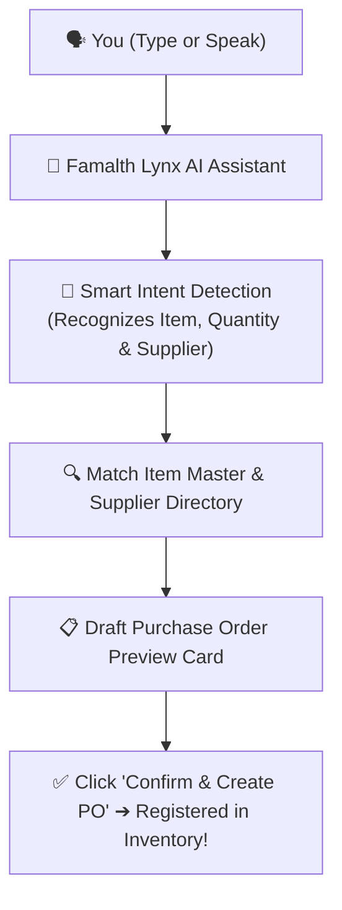

# 🤖 User Guide: Famalth Lynx AI Assistant & Fast Dashboard Search

This guide explains how to use the built-in **Famalth Lynx AI Assistant** and the **Universal Dashboard Search Bar** to manage your store using plain everyday language, voice commands, and instant shortcuts.

---

## 🌟 What is Famalth Lynx AI?

**Famalth Lynx AI** is your smart 24/7 store assistant. Instead of clicking through multiple screens, tabs, and complex reports, you can simply **type or speak** questions to Lynx.

### What Lynx AI Can Do For You:
- 📊 **Instant Business Analytics**: Check today's sales, weekly profit, or top-selling products.
- 📦 **Inventory & Stock Health**: Find low-stock items or check current balance of any product.
- 🛒 **1-Click Purchase Order Drafting**: Create complete purchase orders just by telling Lynx what to buy!
- 🎙️ **Voice Commands**: Speak hands-free at the billing counter to open screens or check prices.

---

## 🚀 Part 1: How to Open & Talk to Lynx AI

### Opening Lynx AI:
1. Look at the top app bar on your dashboard or POS screen.
2. Click the **Lynx AI 🤖** button (or press the floating AI assistant icon at the bottom right).
3. The **Lynx Assist Dialog** will pop up on your screen.

```
+----------------------------------------------------------------+
|  🤖 Famalth Lynx AI Assistant                      [ - ] [ X ] |
+----------------------------------------------------------------+
|  Lynx: Hello! How can I assist you with your store today?      |
|                                                                |
|  You: "What were my total sales today?"                         |
|                                                                |
|  Lynx: 📊 Today's Total Sales: $3,450.00 (48 Invoices)         |
|        Cash: $1,800.00 | Card/UPI: $1,650.00                   |
+----------------------------------------------------------------+
|  [ Type your question here...                       ] [ Send ] |
+----------------------------------------------------------------+
```

---

## 💬 Part 2: What You Can Ask Lynx (Example Questions)

You don't need any technical keywords. Just type or speak naturally:

### 1. Daily Sales & Revenue
- *"What were my total sales today?"*
- *"Show me yesterday's revenue and gross profit."*
- *"How many bills did we create this afternoon?"*

### 2. Stock & Inventory Queries
- *"Which products are running low in stock?"*
- *"How many units of Whole Wheat Bread do we have left?"*
- *"Show me expired or near-expiry batches."*

### 3. Customer & Supplier Balances
- *"How much balance is pending from customer John Doe?"*
- *"Show me top 5 best-selling items this week."*
- *"What is our total outstanding credit balance?"*

---

## 📝 Part 3: Creating Purchase Orders (PO) Just by Chatting!

One of the most powerful features of Lynx AI is **Conversational PO Generation**. You can generate a supplier order in 5 seconds without opening the purchase order form!



### Example Commands:
- *"Create a PO for 50 packets of Amul Butter from National Foods."*
- *"Order 100 bags of Basmati Rice 5kg."*
- *"Draft purchase order for 20 cases of Mineral Water 1L from Apex Beverages."*

Lynx will automatically:
1. Find the matching product in your item master.
2. Identify the correct supplier.
3. Calculate the total wholesale cost.
4. Show you a confirmation card with a **"Confirm & Create PO"** button.
5. Once clicked, the purchase order is immediately registered in your inventory system!

---

## 🔍 Part 4: Universal Dashboard Search Bar

At the very top center of your main dashboard, you'll find the **Universal Search Bar**.

### What You Can Search For:
- **Product Name or Barcode** (e.g., `Organic Tea`, `890123456789`) ➔ Instantly shows current stock and selling price.
- **Customer Name or Phone Number** (e.g., `Robert`, `+1 555-0199`) ➔ Shows customer profile, loyalty points, and credit ledger.
- **Screen or Feature Name** (e.g., `Tax Settings`, `KDS`, `Day End Audit`, `Expenses`) ➔ Jumps straight to that screen with 1 click.
- **Quick Lynx Commands** ➔ Type any question directly into the search bar and press Enter to open Lynx AI automatically!
