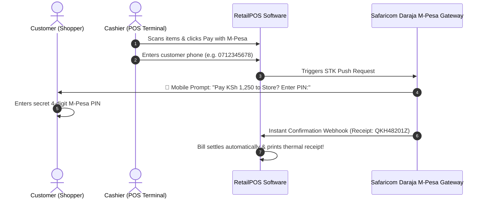

# 📱 M-Pesa & Mobile Money Payment Integration User Guide

This user guide is written for **store owners, retail cashiers, and restaurant managers in Kenya and East Africa**. Learn how to configure Safaricom M-Pesa STK Push (Express), collect instant cashless customer payments at checkout, and reconcile Till and Paybill transactions without coding!

---

## 📑 Table of Contents
1. [Overview & How M-Pesa STK Push Works](#1-overview--how-m-pesa-stk-push-works)
2. [Configuring M-Pesa in Software Settings](#2-configuring-m-pesa-in-software-settings)
   - [Till Number (Buy Goods) Setup](#till-number-buy-goods-setup)
   - [Paybill Number Setup](#paybill-number-setup)
   - [Daraja API Keys & Passkey](#daraja-api-keys--passkey)
3. [Testing M-Pesa STK Push Connectivity](#3-testing-m-pesa-stk-push-connectivity)
4. [Collecting M-Pesa Payments at POS Counter](#4-collecting-m-pesa-payments-at-pos-counter)
5. [M-Pesa Webhook Callbacks & Instant Reconciliation](#5-m-pesa-webhook-callbacks--instant-reconciliation)
6. [Troubleshooting & Frequently Asked Questions](#6-troubleshooting--frequently-asked-questions)

---

## 1. Overview & How M-Pesa STK Push Works

**M-Pesa Express (STK Push)** allows cashiers to trigger a secure payment prompt directly on the customer's mobile phone:

---

## 2. Configuring M-Pesa in Software Settings

To setup your Safaricom Daraja credentials:

1. Open the left sidebar and navigate to **Settings > M-Pesa Configuration**.
2. Toggle **Enable M-Pesa Integration** to `ON`.
3. Choose Environment:
   - **Sandbox**: For testing with simulated money before going live.
   - **Production (Live)**: For processing real customer transactions.
4. Select Account Type:
   - **Buy Goods / Till Number**: Standard retail counter Till (e.g., Till `123456`).
   - **Paybill Number**: Commercial Paybill with custom Business Shortcode and Account Number (e.g., Paybill `400200`).

### Daraja API Credentials (from Safaricom Developer Portal)
- **Shortcode / Till**: Your 5-to-7 digit M-Pesa Store Number.
- **Consumer Key**: 32-character API key from Daraja portal.
- **Consumer Secret**: 32-character secret key from Daraja portal.
- **Online Passkey**: LIPA NA M-PESA passkey provided by Safaricom.
5. Click **Save Configuration**.

---

## 3. Testing M-Pesa STK Push Connectivity

Before billing real customers, perform a simulated test:

1. In the **M-Pesa Configuration** screen, scroll to the **Test STK Push** card.
2. Enter your personal phone number (e.g., `254712345678` or `0712345678`).
3. Set Amount to `1.00` KSh.
4. Click **Send Test STK Push 📲**.
5. Check your mobile phone. An M-Pesa PIN prompt should appear on your screen within 2 seconds.
6. The test log will show `[SUCCESS] MerchantRequestID received`.

---

## 4. Collecting M-Pesa Payments at POS Counter

1. On the **Enterprise POS** or **Restaurant Billing** screen, scan items into the cart.
2. Click **Pay / Settle (F12)**.
3. Select **M-Pesa** as the payment mode.
4. Enter or confirm the customer's phone number.
5. Click **Request STK Push**.
6. Inform the customer: *"Please check your phone and enter your M-Pesa PIN."*
7. As soon as the customer enters their PIN:
   - The POS screen flashes green: **"Payment Received!"**
   - The unique M-Pesa Transaction Code (e.g., `RKH9283KLS`) is saved on the invoice.
   - The cash drawer stays closed, preventing cash shortages.
   - The receipt prints with full M-Pesa reference details!

---

## 5. M-Pesa Webhook Callbacks & Instant Reconciliation

- Every transaction is verified cryptographically via the webhook endpoint `/api/mpesa/callback`.
- If the customer cancels the prompt on their phone or has insufficient funds, the POS screen displays an immediate alert: *"Transaction Cancelled by Customer"* or *"Insufficient Balance"*, allowing the cashier to choose an alternate payment method.

---

## 6. Troubleshooting & Frequently Asked Questions

| Problem | Cause | Solution |
| :--- | :--- | :--- |
| **"Phone number format invalid"** | Entered number with spaces or symbols | Enter 10 digits starting with `07...` / `01...` or international `254...`. The software auto-normalizes the format. |
| **"STK Push timed out"** | Customer didn't enter PIN in 30 seconds | Click **Retry STK Push** on POS or collect via Cash/Card. |
| **"Invalid Credentials / 401 Unauthorized"** | Consumer Key or Secret has a typo | Re-copy credentials from the Safaricom Daraja portal and save settings. |

---

*Speed up checkout lines and eliminate cash handling errors with M-Pesa Express!*
