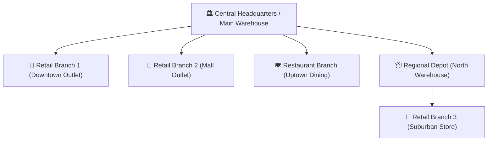

# 🏢 Multi-Outlet & Warehouse Hierarchy User Guide

This user guide is written for **multi-branch store owners, franchise directors, central warehouse managers, and regional supervisors**. Learn how to setup multiple retail branches, configure central distribution warehouses, link outlets hierarchically, define stock locations (aisles/racks/bins), and manage multi-outlet permissions step-by-step!

---

## 📑 Table of Contents
1. [Overview of Multi-Branch Architecture](#1-overview-of-multi-branch-architecture)
2. [Setting Up Outlets & Branch Profiles](#2-setting-up-outlets--branch-profiles)
3. [Outlet Hierarchy & Central Warehouse Linking](#3-outlet-hierarchy--central-warehouse-linking)
4. [Stock Locations (Warehouses, Shelves, Racks & Bins)](#4-stock-locations-warehouses-shelves-racks--bins)
5. [Outlet Setup Checklist & Onboarding Wizard](#5-outlet-setup-checklist--onboarding-wizard)
6. [Multi-Outlet User Access & Staff Scoping](#6-multi-outlet-user-access--staff-scoping)

---

## 1. Overview of Multi-Branch Architecture

The enterprise software allows you to run your entire retail and hospitality chain from one centralized database:

- **Independent Operations**: Each branch has its own cash drawers, thermal printers, staff shifts, and daily billing registers.
- **Centralized Visibility**: The business owner can view consolidated sales, branch comparison analytics, and global inventory from anywhere in real-time.

---

## 2. Setting Up Outlets & Branch Profiles

### Step 1: Create a New Branch Outlet
1. Log in as an **Enterprise Admin**.
2. Go to **Settings > Outlet Setup**.
3. Click **Add New Outlet ➕**.
4. Configure Branch Details:
   - **Outlet Name**: e.g., *'Downtown Flagship Store'*.
   - **Unique Outlet Code**: e.g., `OUTLET-DOWNTOWN-01`.
   - **Business Type**: *Retail*, *Supermarket*, *Restaurant*, *Bakery*, or *Central Warehouse*.
   - **Contact & Address**: Physical street address, phone number, GSTIN/Tax ID, receipt header text.
5. Click **Save Outlet**.

### Step 2: Modify Existing Outlet Details
- Go to **Settings > Outlet Detail Modification**.
- Select the branch and update operating hours, contact numbers, or receipt disclaimers anytime.

---

## 3. Outlet Hierarchy & Central Warehouse Linking

Define supply-chain parent-child relationships so branches know which warehouse to order stock from:

1. Go to **Settings > Outlet Hierarchy Linking**.
2. Select the **Child Branch** (e.g., *'Mall Outlet'*).
3. Select the **Parent Supplying Hub** (e.g., *'Central Distribution Warehouse'*).
4. Select default transfer transit time (e.g., *Same Day* or *24 Hours*).
5. Click **Link Hierarchy**.
6. **Benefit**: When branch cashiers click **Auto-Reorder** on low stock, the stock request is automatically routed to their assigned parent warehouse!

---

## 4. Stock Locations (Warehouses, Shelves, Racks & Bins)

Organize items inside each store or warehouse so pickers and stockers can locate goods in seconds:

1. Go to **Settings > Stock Location Master**.
2. Select the Outlet.
3. Click **Add Stock Location ➕**.
4. Configure:
   - **Location Code**: e.g., `AISLE-03-RACK-B-BIN-12`.
   - **Zone Type**: *Main Floor Shelf*, *Cold Storage / Freezer*, *Backroom Reserve*, *Damaged Goods Holding*.
   - **Capacity / Remarks**: Max volume or weight limits.
5. In **Item Master**, tag items with their specific shelf location. During order packing, the picking list displays exact aisle and bin coordinates!

---

## 5. Outlet Setup Checklist & Onboarding Wizard

When opening a brand new store location, follow the step-by-step **Outlet Setup Checklist**:

1. Open **Settings > Outlet Setup Checklist**.
2. Complete the 6 verification milestones:
   - [x] **1. Property Information & Legal Business Tax ID**
   - [x] **2. Cashier Users & Staff PIN Assignment**
   - [x] **3. Invoice Document Numbering Sequences (Prefix/Suffix)**
   - [x] **4. Thermal Receipt & A5 Laser Printer Templates**
   - [x] **5. Opening Inventory Stock Balance Inward**
   - [x] **6. Payment Modes Setup (Cash, Card, M-Pesa, UPI)**
3. Once all checkboxes turn green, the new outlet is officially ready for live customer billing!

---

## 6. Multi-Outlet User Access & Staff Scoping

Control which outlets staff members can access:
- **Branch Cashiers**: Restricted to their assigned branch only. They cannot view other stores' financial data or cash drawers.
- **Regional Supervisors**: Granted multi-outlet access to monitor 2 or more assigned branches.
- **Enterprise Owner**: Unrestricted global access to all branches with real-time consolidation.

---

*Expand your business across multiple locations with complete control and zero chaos!*
