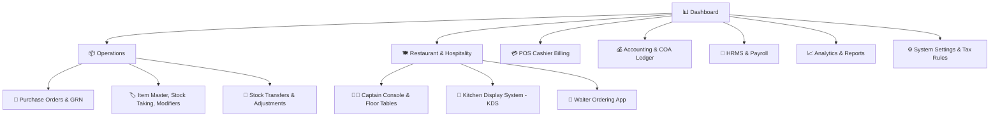

# User Guide: System Navigation & Clean Menu Structure

Welcome to the **System Navigation & Menu Structure Guide**. This document walks managers, cashiers, storekeepers, and captains through navigating the POS, Operations, Procurement, and Floor Management modules with ease.

---

## 📑 Table of Contents
1. [Overview & Cleaner Navigation Experience](#1-overview--cleaner-navigation-experience)
2. [Left Navigation Drawer & Sidebar Hierarchy](#2-left-navigation-drawer--sidebar-hierarchy)
3. [Operations & Procurement Menu](#3-operations--procurement-menu)
4. [Role-Specific Views (What Each Team Member Sees)](#4-role-specific-views-what-each-team-member-sees)
5. [Quick Navigation Shortcuts & Search](#5-quick-navigation-shortcuts--search)

---

## 1. Overview & Cleaner Navigation Experience

To ensure a streamlined, clutter-free workflow:
- **Zero Redundancy**: Duplicate entries (such as *Purchase Order* vs. *Vendor Purchase Order*) have been consolidated into a single, intuitive **Purchase Orders** section.
- **Permission-Based Display**: You will only see the menu items and actions relevant to your assigned role and outlet permissions.
- **Dynamic Module Awareness**: Retail, Restaurant, Supermarket, and Hospitality setups automatically tailor their menus to eliminate irrelevant tabs.

---

## 2. Left Navigation Drawer & Sidebar Hierarchy

The main navigation sidebar contains primary functional zones:

---

## 3. Operations & Procurement Menu

Under the **Operations** dropdown menu, you will find streamlined categories:

### 🛍️ Procurement (Vendor & Buying)
1. **Purchase Orders**: Create, view, approve, and send POs to suppliers. (Consolidated canonical screen)
2. **Goods Receiving (GRN)**: Operator-verified physical receiving, barcode checking, and COA bill generation.
3. **Supplier Master**: Manage vendor profiles, tax registrations, opening balances, and payment terms.

### 📦 Inventory & Stock
1. **Item Master & Barcodes**: Product catalogue, categories, sub-categories, MRP/Selling prices, Veg/Non-Veg dietary flags, barcode printing, and **Item Modifiers & Add-ons** (configured directly within dishes/items).
2. **Stock Taking & Audit**: Cycle count tool with variance calculation and reconciliation reporting.
3. **Stock Transfers**: Inter-outlet and central warehouse inventory movements.

---

## 4. Role-Specific Views (What Each Team Member Sees)

| Role | Default Landing Page | Visible Menus & Capabilities |
| :--- | :--- | :--- |
| **Admin / Store Owner** | Executive Dashboard | Full access to all menus: POS, Inventory, Procurement, HRMS, Accounting, Settings. |
| **Store Manager** | Operations / Dashboard | POS, Inventory, Purchase Orders, GRN, Stock Taking, Staff Attendance, and Sales Reports. |
| **Cashier / POS Operator** | POS Billing Terminal | High-speed billing, hold/recall orders, customer loyalty, daily cash shift close. |
| **Captain / Floor Manager**| Captain Console / Floor Plan | Table grid, guest seating, split-bill ordering, KOT firing, waiter assignment. |
| **Waiter** | Waiter Quick Order App | PIN login, assigned tables, instant KOT kitchen dispatch, modifier selection. |
| **Kitchen Chef (KDS)** | KDS Touchscreen | Live incoming orders, prep timers, bump bar / dish completion status. |
| **Storekeeper / Inventory**| Stock Taking & GRN | Physical count audit, PO receiving, supplier inwards, transfer dispatch. |

---

## 5. Quick Navigation Shortcuts & Search

- **Global Search Bar**: Press `Ctrl + F` or click the search magnifying glass to quickly jump to any screen or find a product/order ID.
- **Quick Switch Outlet**: Use the top-right outlet selector to switch branches without logging out (if multi-outlet access is granted).
- **Fast Lock / Change User**: Tap your profile avatar in the header to switch users or return to the fast PIN login screen.
