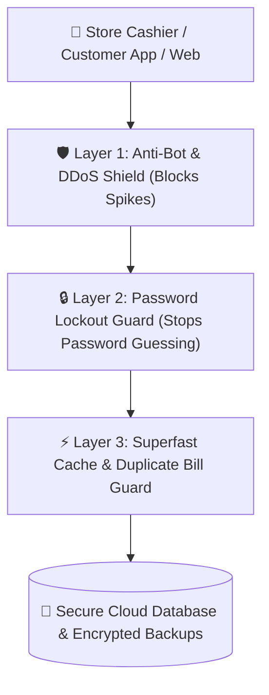

# 🛡️ User Guide: Store Security, Anti-Hacker & Data Protection

This guide explains how our ERP and POS system protects your store, your money, customer data, and sales records against hackers, fraud, and internet threats. **No coding or technical knowledge required!**

## 🛡️ How Store Security Shields Work

---

## 🔒 1. Bank-Grade Password & Staff Login Protection

To prevent unauthorized staff or outside intruders from guessing passwords:
- **Automatic Account Lockout (Anti-Brute Force)**: If someone enters the wrong password or PIN **10 times in a row**, the system automatically locks that login for **15 minutes**.
- **Role-Based Access Control**: Cashiers only see the billing screen, while owners and managers have access to profit reports, discounts, and inventory adjustments.
- **Encrypted Password Storage**: Passwords are never saved as plain text. They are scrambled using strong cryptographic hashing (`bcrypt`).

---

## 🤖 2. Anti-DDoS & Bot Attack Shield

When your store is connected to the Cloud, competitors or automated internet bots might try to overwhelm your server with thousands of fake requests.
- **DDoS Burst Shield**: Our built-in firewall automatically detects and drops abnormal traffic spikes (over 100 requests in 10 seconds from an unknown source).
- **Legitimate Customer Protection**: Your cashiers and online customers will continue billing smoothly without experiencing slow speeds or server crashes.

---

## ⚡ 3. High-Speed Smart Caching (Rush Hour Ready)

During busy festival sales, lunch rush hours, or high-volume checkout counters:
- **Instant Item & Price Lookup**: Product names, barcodes, and wholesale prices are stored in superfast memory cache so barcode scanning happens in milliseconds.
- **Duplicate Bill Prevention (Idempotency)**: If a cashier accidentally double-clicks the "Complete Sale" or "Pay with Card" button, the system recognizes the duplicate request and ensures the customer is charged and inventory deducted **only once**.

---

## ☁️ 4. Load Balancers & Cloud High Availability

If you run multiple branches or have thousands of online app users:
- **Automatic Traffic Balancing**: When you host your store on Cloud servers (e.g., Render, AWS, or your VPS), incoming orders are automatically distributed across server nodes so no single machine gets overloaded.
- **Zero-Downtime Updates**: When system updates or new features are deployed, the server switches traffic seamlessly without interrupting active cashier billing.

---

## 🛡️ 5. Hacker & Fraud Defense Matrix

| Protection Feature | How It Protects Your Store |
| :--- | :--- |
| **Anti-Clickjacking** | Prevents malicious websites from invisibly framing your POS to trick cashiers into clicking harmful links. |
| **Anti-Data Sniffing (MIME Guard)** | Blocks malicious file uploads disguised as images from executing viruses on your store server. |
| **Encrypted HTTPS (HSTS)** | Forces all communications between the POS terminal and Cloud server over encrypted channels (HTTPS / SSL). |
| **SQL Injection Guard** | Protects your customer phone numbers and financial ledgers from database hacking attempts. |
| **Encrypted System Configuration** | Store master license keys and database credentials are fully encrypted in `sysConfig.enc`. |

---

## ❓ Frequently Asked Questions (FAQ)

### What should I do if a cashier gets locked out?
Wait 15 minutes for the automatic security cooldown, or have the store Admin/Manager reset their password in **Settings ➔ User Management**.

### Why did I see a "Please wait a moment (Rate Limit)" message?
If someone rapidly clicks heavy report queries hundreds of times in a few seconds, the system momentarily protects the database CPU. Simply wait 5 to 10 seconds and click Apply again.
