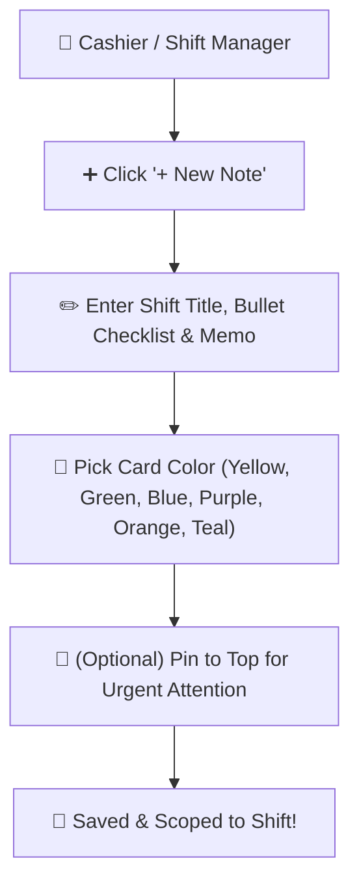

# 📝 User Guide: POS Sticky Notes & Shift Checklists

This guide explains how to use **Digital Sticky Notes** on your POS billing counter and dashboard to write shift reminders, hand over instructions between cashiers, track daily tasks, and organize shop notes.

---

## 📌 What are POS Sticky Notes?

Instead of using paper sticky pads around your monitor that get lost or thrown away, **POS Sticky Notes** are digital memo cards built right into your billing screen:
- **Color-Coded**: Organize tasks with Yellow, Green, Blue, Purple, Orange, Pink, and Teal cards.
- **Pinnable**: Keep urgent reminders pinned to the top of your list so they never get missed.
- **Private & Shift-Scoped**: Cashiers and managers have their own notes, keeping shift handovers clean.
- **Trash & Recovery**: Safely restore notes if you accidentally delete them.

---

## 🚀 How to Access Sticky Notes

1. On your Dashboard or POS screen, click the **Sticky Notes 📝** floating icon or top bar button.
2. The Sticky Notes panel slides open on your screen.

---

## ✨ 1. Creating a New Sticky Note

### Steps:
1. Click the **"+ New Note"** button.
2. Type a **Title** (e.g., *Morning Shift Checklist*, *Customer Pre-Order*, *Cash Drawer Notes*).
3. Type your content or bullet points:
   - *Check refrigerator temperature at 10 AM*
   - *Customer Smith reserved 5 bags of Charcoal for 4 PM*
   - *Count opening cash drawer: $250.00*
4. Select a background color from the color palette circle.
5. Click **"Save Note"**.

---

## 📌 2. Pinning Urgent Notes to the Top

If you have a note that requires immediate attention (e.g., *VIP Customer Delivery* or *End-of-Day Bank Deposit*):
1. Click the **Pin 📌** icon on the top right of the note card.
2. Pinned notes stay at the very top of your list with a highlighted border so you never forget them.
3. Click the pin icon again to unpin when the task is done.

---

## 📑 3. Copying & Duplicating Notes

If you have recurring daily shift checklists:
1. Click the options menu (`⋮`) on the note.
2. Select **"Duplicate / Copy Note"**.
3. A fresh copy of the note is instantly created for today's shift.

---

## 🗄️ 4. Archiving Completed Notes

When a task is finished and you don't want it cluttering your active view, but still want to keep it in records:
1. Click the options menu (`⋮`) on the note.
2. Click **"Archive 🗄️"**.
3. The note moves to the **"Archived Notes"** tab and can be viewed or unarchived at any time.

---

## 🗑️ 5. Deleting & Restoring Notes from Trash

Accidentally deleted a note with important customer numbers? Don't worry!

### Restoring a Deleted Note:
1. Open the Sticky Notes menu and switch to the **"Trash 🗑️"** tab.
2. Find your deleted note.
3. Click **"Restore ↩️"**.
4. The note immediately returns to your active notes screen.

### Emptying Trash:
- Click **"Empty Trash"** to permanently remove all deleted notes.

---

## 💡 Recommended Uses for Retail & Restaurant Staff

| Role | How to Use Sticky Notes |
| :--- | :--- |
| **Cashier Counter** | Note customer phone orders, change requests, or items awaiting return approval. |
| **Shift Manager** | Write morning and evening opening/closing balance checklists. |
| **Kitchen / Chef** | Note daily specials, out-of-stock ingredients, or VIP table preferences. |
| **Store Owner** | Keep supplier payment reminders, monthly rent dues, and urgent maintenance notes. |
