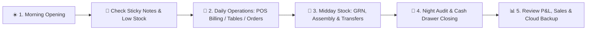

# 📖 Complete Store Operator & User Guide Portal

Welcome to the **Retail & Hospitality Management Software User Portal**! This guide is created specifically for **store owners, retail cashiers, restaurant staff, accountants, inventory managers, and logistics teams**. No programming or technical knowledge is needed!

---

## 🧭 Role-Based Quick Navigation

Choose your role below to jump directly to the relevant guides:

| Your Role | Recommended Daily Guides |
| :--- | :--- |
| 🧑‍💼 **Cashier / POS Operator** | [POS Operations & Billing](./User-Guide-POS-Operations-And-Inventory.md) • [Barcode Printing](./User-Guide-POS-Operations-And-Inventory.md#2-custom-barcode-designer--label-sticker-printing) • [Sticky Notes](./User-Guide-Sticky-Notes.md) • [Cashier FAQ](./User-Guide-FAQ.md) |
| 🍽️ **Restaurant Waiter / Captain / Chef** | [Restaurant & Hospitality Guide](./User-Guide-Restaurant-And-Hospitality.md) • [KOTs & KDS](./User-Guide-Restaurant-And-Hospitality.md#4-captain-dashboard--taking-table-orders-kot) • [Floor Plan](./User-Guide-Restaurant-And-Hospitality.md#3-visual-floor-plan--table-reservations) |
| 📦 **Store / Warehouse Manager** | [Stock Transfers & GRN](./User-Guide-POS-Operations-And-Inventory.md) • [Manufacturing & BOM](./User-Guide-Manufacturing-BOM-And-Assembly.md) • [B2B Wholesale Marketplace](./User-Guide-B2B-Marketplace-And-Vendor.md) |
| 💰 **Accountant / Bookkeeper** | [Accounting & Financial Ledger](./User-Guide-Accounting-And-Financial-Ledger.md) • [Taxes & Currency](./User-Guide-Currency-And-Taxes.md) • [Night Audit & EOD](./User-Guide-FAQ.md#7-accounting-cash-drawer--night-audit) |
| 👥 **HR & Payroll Supervisor** | [HRMS & Staff Payroll](./User-Guide-HRMS-And-Payroll.md) • [Attendance & Shifts](./User-Guide-HRMS-And-Payroll.md#4-daily-attendance--punch-in--punch-out) |
| 👑 **Store Owner / General Manager** | [Promotions & Loyalty](./User-Guide-Promotions-Loyalty-And-LuckyDraw.md) • [Lynx AI Assistant](./User-Guide-Lynx-AI-Assistant.md) • [Cloud Migration](./User-Guide-1Click-Cloud-Migration.md) • [Security & Recovery](./User-Guide-Security-And-Data-Protection.md) |

---

## 🌟 Master Index of All Dedicated User Guides

Click on any guide below for comprehensive step-by-step instructions:

| 📘 User Guide | What You Will Learn |
| :--- | :--- |
| ❓ **[Store & Cashier FAQ](./User-Guide-FAQ.md)** | Step-by-step non-technical answers to 50+ common questions on billing, hardware, refunds, shifts, and drawer balancing. |
| 🛒 **[POS Operations & Inventory](./User-Guide-POS-Operations-And-Inventory.md)** | Daily counter checkout, custom barcode sticker designer, purchase orders (PO), goods receiving (GRN), multi-branch stock transfers, and damages. |
| 🍽️ **[Restaurant & Hospitality](./User-Guide-Restaurant-And-Hospitality.md)** | Floor plan configurator, table booking, captain order tablet, kitchen display system (KDS), table merging, running orders, takeaway challans, and dining reports. |
| 💰 **[Accounting & Financial Ledger](./User-Guide-Accounting-And-Financial-Ledger.md)** | Chart of accounts tree, double-entry vouchers (Journal, Payment, Receipt, Contra), bank reconciliation, loan EMI tracker, Trial Balance, P&L, and Balance Sheet. |
| 👥 **[HRMS & Staff Payroll](./User-Guide-HRMS-And-Payroll.md)** | Employee directory, biometric/manual attendance, shift scheduling, leave approval, salary component setup, monthly payroll generation, and payslips. |
| ⚙️ **[Manufacturing, BOM & Assembly](./User-Guide-Manufacturing-BOM-And-Assembly.md)** | Bill of materials recipe builder, kit assembly production runs, automatic raw material deduction, finished goods stock inflow, and de-kitting. |
| 🎁 **[Promotions, Loyalty & Lucky Draw](./User-Guide-Promotions-Loyalty-And-LuckyDraw.md)** | Automated happy hour discounts, bill-value basket tiers, customer loyalty wallet with tiered points (Silver/Gold/Platinum), and lucky draw raffle campaigns. |
| 🛍️ **[B2B Wholesale Marketplace & Vendor](./User-Guide-B2B-Marketplace-And-Vendor.md)** | Browsing verified wholesale supplier catalogs, comparing bulk rates, 1-click PO conversion, and vendor portal registration. |
| 💬 **[B2B Community Hub & Direct Trade Chat](./User-Guide-B2B-Community-And-Chat.md)** | Messaging suppliers directly, negotiating bulk rates, sharing PO documents, and participating in regional retailer trade channels. |
| 🤖 **[Famalth Lynx AI Assistant & Search](./User-Guide-Lynx-AI-Assistant.md)** | Asking inventory and sales questions in plain English, drafting POs with conversational voice/text, and using predictive insights. |
| 📝 **[POS Sticky Notes & Shift Checklists](./User-Guide-Sticky-Notes.md)** | Color-coded digital notes, pinned memos on dashboard, cashier shift handover checklists, and recycling bin recovery. |
| 🌍 **[Currency & Multi-Tax Matrix Setup](./User-Guide-Currency-And-Taxes.md)** | Setting global store currency (\$, ₹, €, £, KSh, AED) and configuring multi-tier taxes (Flat VAT, Indian GST, Sales Tax, CESS). |
| 🚀 **[1-Click Cloud & Offline Store Migration](./User-Guide-1Click-Cloud-Migration.md)** | Migrating your local POS database to the cloud server or downloading your cloud store to local offline POS in 1 click. |
| ☁️ **[Cloud Features & Server Configuration](./User-Guide-Cloud-Features-And-Server-Config.md)** | Understanding Offline vs Cloud mode, unlocking the Rider Delivery App, Customer Online Shopping App, and Server URL setup. |
| 🛡️ **[Security & Data Protection](./User-Guide-Security-And-Data-Protection.md)** | Anti-hacker protection, failed login lockouts, duplicate invoice prevention, role permissions, and database backup safeguards. |
| 📱 **[M-Pesa & Mobile Money Integration](./User-Guide-Mpesa-Mobile-Money.md)** | Safaricom Daraja STK push configuration, Till/Paybill cashless counter billing, and instant payment reconciliation. |
| 🏢 **[Multi-Outlet & Warehouse Hierarchy](./User-Guide-Multi-Outlet-And-Warehouse-Hierarchy.md)** | Central distribution warehouse setup, multi-branch hierarchy linking, aisle/rack/bin stock locations, and setup wizard. |
| 📊 **[Reports & Business Intelligence Suite](./User-Guide-Reports-And-Business-Intelligence.md)** | Generating and analyzing 26+ reports across sales, cashiers, stock valuation, brand performance, commissions, and taxes. |

---

## 🚀 Daily Store Workflow (Start to Finish)

1. **Morning Opening**:
   - Turn on the POS computer and log in with your credentials.
   - Check **Sticky Notes 📝** for opening cash balance or shift reminders from yesterday.
   - Check **Lynx AI 🤖** or **Stock Balance** for low inventory alerts.
2. **During the Shift**:
   - **Retail Store**: Scan barcodes, apply discounts, collect payments (Cash/Card/UPI), and hand over receipts.
   - **Restaurant**: Take table reservations, captains fire KOTs from tablets, kitchen chefs view KDS, settle table bills.
3. **Midday Stocking & Assembly**:
   - Receive supplier shipments via **Goods Receiving (GRN)**.
   - Run **Assembly Batches** to package finished combo kits.
4. **End of Day / Night Audit**:
   - Count physical cash in cash drawer.
   - Open **Night Audit / Cashier Handover** and reconcile actual cash vs recorded sales.
   - Execute Day-End closing and print the daily summary report.
   - Cloud backup synchronizes automatically.

---

## 🛠️ System Administration & Setup References

- ⚙️ **[Settings Guide](./Settings-Guide.md)** — Thermal printer layouts, invoice numbering sequences, and company legal info.
- 📥 **[Retailer Installation & Update Guide](./Retailer-Installation-Guide.md)** — Installing new cashier terminals and software updates.
- 🛡️ **[Owner Recovery & Data Safety Guide](./Owner-Recovery-Sync-Data-Protection-Guide.md)** — Master PIN recovery, OTP login resets, and Google Drive backups.
- 📁 **[Config and Sync Files Guide](./Config-And-Sync-Files-Guide.md)** — Client configuration reference for `server_config.json`.

---

*Need immediate help? Click **Lynx AI 🤖** at the top right of your software screen and ask your question in plain English!*
