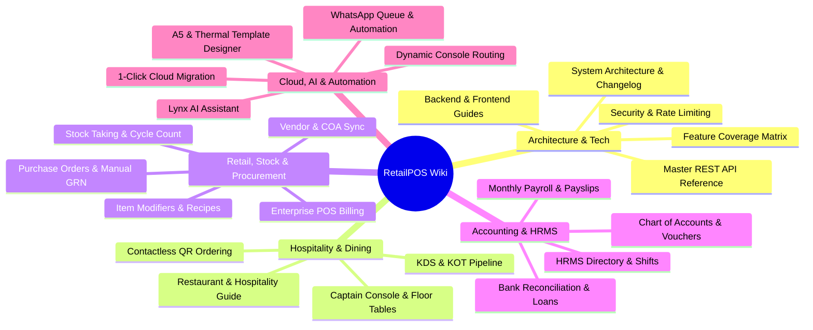
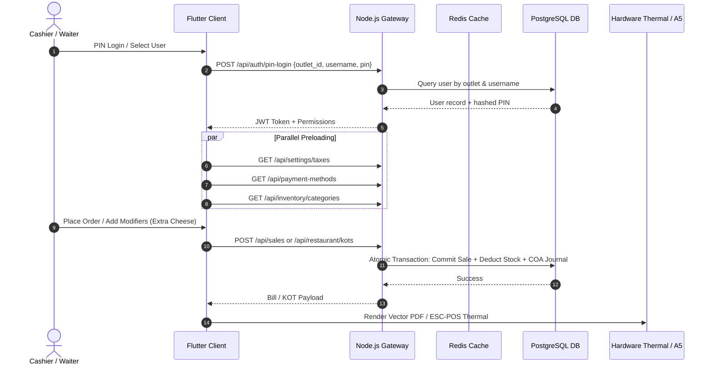

# 📖 RetailPOS ERP & POS Suite — Master Documentation Wiki

Welcome to the **RetailPOS ERP & POS Suite Master Wiki**. This wiki serves as the central documentation portal for store owners, cashiers, kitchen staff, accountants, system administrators, and software engineers.

---

## 🧭 Master Wiki Table of Contents

---

## 1. 🚀 Quick Start, Deployment & Infrastructure

| Document | Audience | Purpose | Link |
| :--- | :--- | :--- | :--- |
| **System Overview & Readme** | Everyone | Project introduction, stack overview, screenshots & quick setup | [README.md](../README.md) |
| **Retailer Installation Guide** | Store Owners | Automated Windows installation for backend & billing clients | [Retailer-Installation-Guide.md](./Retailer-Installation-Guide.md) |
| **Windows Installer Dev Guide** | Engineers | Building production Inno Setup exe installers | [Windows-Installer-Developer-Guide.md](./Windows-Installer-Developer-Guide.md) |
| **Web Deployment Guide** | SysAdmins | Compiling Flutter web and hosting on Node.js/Render | [Web-Deployment-Guide.md](./Web-Deployment-Guide.md) |
| **Render Cloud Deployment** | DevOps | Deploying PostgreSQL and backend services on Render.com | [Render-Cloud-Deployment-Guide.md](./Render-Cloud-Deployment-Guide.md) |
| **Own Server Deployment** | DevOps | Self-hosting on private VPS (Ubuntu/Debian/Windows Server) | [Own-Server-Online-Deployment-Guide.md](./Own-Server-Online-Deployment-Guide.md) |
| **Google Gmail OAuth2 Setup** | Admins | Setting up OAuth2 credentials for secure OTP/bill emailing | [Google-Gmail-OAuth2-Setup-Guide.md](./Google-Gmail-OAuth2-Setup-Guide.md) |
| **Settings & Config Guide** | Admins | Configuration options and multi-tenant parameters | [Settings-Guide.md](./Settings-Guide.md) |

---

## 2. 👤 Store Operator & Cashier Guides (No Coding Required)

Step-by-step illustrated workflows written for store operators, cashiers, restaurant captains, and inventory managers.

### 🔐 Authentication, Navigation & Fast Login
- ⚡ **[Fast Staff Login & PIN Access User Guide](./User-Guide-Fast-Login-And-PIN-Access.md)**: Dropdown quick-login, 4-digit staff PIN, and rapid post-login preloading.
- 👤 **[Staff PIN Configuration & Mobile Login](./User-Guide-Staff-PIN-And-Quick-Login.md)**: Enabling quick login in User Management and setting personal staff PINs.
- 🧭 **[System Navigation & Clean Menu Structure](./User-Guide-Navigation-And-Menu-Structure.md)**: Cleaned-up left sidebar, deduplicated Operations menu, and role-based permissions.

### 🍽️ Restaurant, Dining & Floor Management
- 🍽️ **[Captain Console & Floor Table Management User Guide](./User-Guide-Captain-Console-Table-Management.md)**: Multi-client separate table orders, assigning tables to waiters, and bulk Excel table import.
- 📱 **[Contactless QR Table Ordering User Guide](./User-Guide-QR-Table-Ordering.md)**: Printing table standees, tent cards, and managing incoming digital orders.
- 🍳 **[Restaurant & Hospitality Operations Guide](./User-Guide-Restaurant-And-Hospitality.md)**: Visual floor plan, KDS kitchen screens, course management, and bill splitting.

### 🛒 Retail POS, Procurement & Inventory
- 🛒 **[POS Operations & Inventory Management Guide](./User-Guide-POS-Operations-And-Inventory.md)**: High-speed barcode scanning, holding carts, receipt printing, and transfers.
- 📦 **[Stock Taking, Modifiers & GRN Verification User Guide](./User-Guide-Stock-Taking-Modifiers-And-GRN-Verification.md)**: Cycle counts, extra cheese add-ons, dietary tags, and strictly manual GRN verification.
- 💼 **[Vendor Purchasing & Supplier Payments User Guide](./User-Guide-Vendor-Purchase-And-Payments.md)**: International vendors (optional state), opening balance COA sync, VAT rounding & custom payment methods.
- 🏭 **[Manufacturing BOM & Product Assembly User Guide](./User-Guide-Manufacturing-BOM-And-Assembly.md)**: Bill of Materials recipes, raw material consumption, and batch packaging.

### 💰 Accounting, HRMS & Promotions
- 💰 **[Accounting & Financial Ledger User Guide](./User-Guide-Accounting-And-Financial-Ledger.md)**: Double-entry vouchers (JV, PV, RV, CV), bank reconciliation, and balance sheets.
- 👥 **[HRMS & Staff Payroll User Guide](./User-Guide-HRMS-And-Payroll.md)**: Employee profiles, daily attendance punch, overtime, shift setups, and monthly payslips.
- 🎁 **[Promotions, Loyalty & Lucky Draw User Guide](./User-Guide-Promotions-Loyalty-And-LuckyDraw.md)**: Happy hour rules, bill-value promotions, loyalty point rules, and raffle campaigns.

### 🖨️ Invoicing, Tax & Workstations
- 🖨️ **[A5 Invoice & Template Designer User Guide](./User-Guide-A5-Invoice-And-Template-Designer.md)**: Half-page A5 invoice printing, thermal receipts, and header/footer customization.
- 🌐 **[Auto-Tax Seeding & Regional Tax Integrity](./User-Guide-Auto-Tax-Seeding-And-Tax-Integrity.md)**: International tax setups (GST, VAT, Sales Tax) and safe tax group replacement.
- 🔀 **[Dynamic Workstation Console Routing Guide](./User-Guide-Dynamic-Console-Routing.md)**: Directing orders to Captain, Retailer, and Rider consoles.

### 🤖 AI, B2B Trade & Cloud
- 🤖 **[Famalth Lynx AI Assistant User Guide](./User-Guide-Lynx-AI-Assistant.md)**: Natural language store insights, voice queries, and automatic PO draft creation.
- 📝 **[POS Sticky Notes & Shift Scratchpad](./User-Guide-Sticky-Notes.md)**: Color-coded shift checklists and pinned store reminders.
- 🛍️ **[B2B Marketplace & Vendor Portal User Guide](./User-Guide-B2B-Marketplace-And-Vendor.md)**: Supplier discovery, B2B wholesale orders, and catalog publishing.
- 💬 **[B2B Community Hub & Trade Chat User Guide](./User-Guide-B2B-Community-And-Chat.md)**: Direct trade messaging and group channels.
- 🚀 **[1-Click Cloud Migration User Guide](./User-Guide-1Click-Cloud-Migration.md)**: 2-way offline-to-online and online-to-offline store cloning.
- ☁️ **[Cloud Features & Server Config User Guide](./User-Guide-Cloud-Features-And-Server-Config.md)**: Configuring VPS and verifying cloud licenses.
- 🛡️ **[Security & Disaster Recovery User Guide](./User-Guide-Security-And-Data-Protection.md)**: Master PIN recovery and database backups.
- ❓ **[Complete Store Operations FAQ](./User-Guide-FAQ.md)**: Universal troubleshooting manual.

---

## 3. 🛠️ Developer & Technical Architecture Guides

In-depth technical references featuring data models, state machines, Sequence Diagrams, and core system invariants.

### Core Architecture Reference Documents:
- 📋 **[Master Feature & Documentation Coverage Matrix](./Feature-Coverage-Checklist.md)**: Comprehensive 100% audit of all 85+ screens and 38 backend routes.
- 📜 **[System Architecture Upgrades & Changelog (Sept–Oct 2026)](./System-Architecture-And-Changelog.md)**: Technical timeline of major refactors, cloud migrations, and optimizations.
- 📡 **[Master REST API Endpoint Reference](./Endpoint-Reference.md)**: Complete parameter, header, and response schema definitions for all backend endpoints.
- ⚡ **[Fast Login & Preloading Architecture Guide](./Developer-Guide-Fast-Login-And-Preloading.md)**: Parallel cache warming, asynchronous startup, and benchmark optimizations.
- 👤 **[Staff PIN & Quick Login Architecture Guide](./Developer-Guide-Staff-PIN-And-Quick-Login.md)**: Multi-user PIN collision handling and outlet-scoped authentication.
- 🍽️ **[Captain Console & Table Management Architecture](./Developer-Guide-Captain-Console-Table-Management.md)**: Multi-client table session schemas, waiter bindings, and Excel parser algorithms.
- 📱 **[QR Table Ordering & Digital Dining Architecture](./Developer-Guide-QR-Table-Ordering.md)**: Vector QR geometry designer, public ordering gateway, and real-time KDS dispatch.
- 🍳 **[Restaurant & Hospitality Technical Architecture](./Developer-Guide-Restaurant-Hospitality.md)**: Floor state machines, KOT item lifecycle, and bill merging algorithms.
- 🧭 **[Navigation Hierarchy & Menu Deduplication Architecture](./Developer-Guide-Menu-Layout-And-Deduplication.md)**: Dynamic drawer filtering and route deduplication protocols.
- 💼 **[Vendor Lifecycle, Purchase Engine & COA Integration](./Developer-Guide-Vendor-Purchase-And-COA-Integration.md)**: Opening balance double-entry automation, VAT integer rounding, and payment method COA mappings.
- 📦 **[Stock Taking, Modifier Recipes & GRN Verification Architecture](./Developer-Guide-Stock-Taking-Modifiers-And-GRN-Verification.md)**: Variance audit journals, raw material deductions, and operator-only manual GRN doctrine.
- 🛒 **[POS Engine, Inventory State Machine & BOM Manufacturing](./Developer-Guide-POS-Inventory-Manufacturing.md)**: Concurrency-safe stock ledger, barcode generation, and assembly production.
- 💰 **[Financial Accounting, COA & Double-Entry Ledger](./Developer-Guide-Accounting-Finance.md)**: Balanced voucher validation, amortized loan calculations, and real-time financial reporting.
- 👥 **[HRMS, Shift Scheduling & Payroll Processing Engine](./Developer-Guide-HRMS-Payroll.md)**: Biometric punch algorithms, shift rules, overtime tiers, and payslip calculation.
- 🤖 **[AI Framework, Autonomous Background Agents & Lynx](./Developer-Guide-AI-Autonomous-Agents.md)**: Autonomous agent loops, tool declarations, and recommendation engines.
- 🧩 **[Plugins, Workflows & WhatsApp Queue Architecture](./Developer-Guide-Plugins-Workflows-Automation.md)**: Event hooks, isolated VM sandbox runtimes, and WhatsApp queue worker with adaptive backoff.
- 🖨️ **[A5 Invoice Rendering Pipeline & Template Schema](./Developer-Guide-A5-Invoice-And-Template-Designer.md)**: JSON template schema, vector PDF generation, and thermal ESC/POS commands.
- 🌐 **[Auto-Tax Seeding & Tax Integrity Engine](./Developer-Guide-Auto-Tax-Seeding-And-Tax-Integrity.md)**: Country-specific seeders and relational foreign key replacement guards.
- 🔀 **[Dynamic Workstation Console Routing Architecture](./Developer-Guide-Dynamic-Console-Routing.md)**: Multi-workstation message routing and event dispatching.
- 🛡️ **[Developer Security, Anti-DDoS, Rate Limiting & Load Balancer Guide](./Developer-Security-Cache-LoadBalancer-Guide.md)**: Redis sliding-window limiters, token buckets, and cryptographic storage.
- 🚀 **[1-Click Relational Store Migration Architecture](./One-Click-Cloud-Migration-Guide.md)**: In-memory relational ID translation engine and sequence re-alignment.
- 🛍️ **[B2B Wholesale Marketplace & Community Chat Architecture](./B2B-Marketplace-And-Community-Guide.md)**: WebSocket chat protocols, vendor discovery, and direct PO translation.
- 🤖 **[Lynx AI, Sticky Notes & Currency Engine Architecture](./Lynx-AI-StickyNotes-Currency-Tax-Guide.md)**: Natural language parser, draggable sticky notes model, and multi-currency exchange matrix.
- 💻 **[Backend Developer Guide](./Backend-Guide.md)** & **[Frontend Developer Guide](./Frontend-Guide.md)**: Codebase layout, styling conventions, and controller standards.

---

## 4. 🌐 Web Application & Public Portals

- **Web Release Output**: `backend/public/`
- **Customer Self-Ordering Portal**: `http://<server-ip>:3000/#/dining?outlet_id=1&table_id=5`
- **Delivery Rider Portal**: `http://<server-ip>:3000/#/rider`
- **Retailer Operations Console**: `http://<server-ip>:3000/#/retailer`

---

## 5. 🤝 Contributing & Community Standards

- **[Contributing Guidelines](../CONTRIBUTING.md)**: Git branching model, pull request guidelines, and TypeScript/Flutter formatting rules.
- **[Code of Conduct](../CODE_OF_CONDUCT.md)**: Community standards and participant expectations.
- **[Security Policy](../SECURITY.md)**: Responsible vulnerability disclosure process.

---

*Wiki Maintained by Famalth Technologies Engineering Team. Last Updated: October 2026.*
